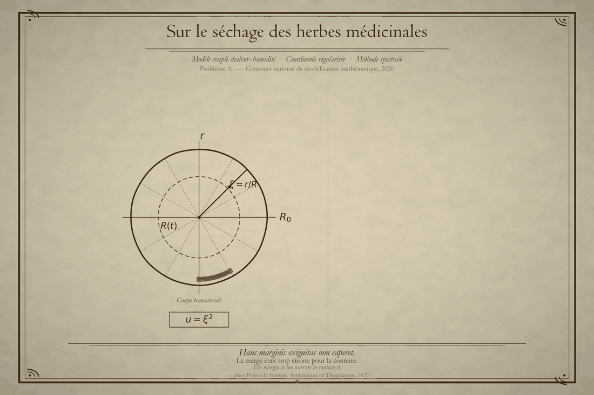

# 2026 高教社杯全国大学生数学建模竞赛 A 题 —— 思路、代码与全部尝试记录

**题目**：A 题《药材的烘干问题》
**时间跨度**：2026 年 9 月 9 日 — 9 月 13 日

---

## 序



> *Cuius rei demonstrationem mirabilem sane detexi.*
> *Hanc marginis exiguitas non caperet.*
>
> —— Pierre de Fermat, 1637


---

## 一、题目与主要结果

### 题目条件

圆柱状中药材（长 L = 25 cm、半径 R_0 = 2 cm），初始温度 T_0 = 28 °C、干基含水率 C_0 = 2.55 kg/kg。
烘房温度与含湿量由附件 1 给出（0–14400 s，241 点），烘干过程中半径变化由附件 2 给出（0–259200 s，145 点）。
附录 2/3/4 分别给出问题 1、问题 2–3、问题 4 所需的物性经验关系。

### 四个问题的答案

| 问题 | 内容 | 结果 |
| --- | --- | --- |
| 问题 1 | 预热平衡阶段（0–1800 s）的温度与含水率分布 | T(0,1800) = 34.0425 °C，T(R_0,1800) = 37.1989 °C，C(R_0,1800) = 1.5109 kg/kg |
| 问题 2 | 全过程（2–3 天）变物性模型 | T(0,3 h) = 49.9051 °C，C(0,3 h) = 1.7673 kg/kg，C(R_0,3 h) = 1.0083 kg/kg |
| 问题 3 | 按「各处含水率 ≤ 0.15 kg/kg」确定烘干时长 | t_dry = 205574.5 s = 57.1040 h（生产网格 N = 64；连续极限 205575.5 s） |
| 问题 4 | 考虑尺寸收缩（附件 2 + 附录 4）确定烘干时长 | t_dry = 182778.3 s = 50.7717 h |

### 三族独立方法的互证

| 量 | A：闭式解析解 | B：谱配置法 | C：均匀网格守恒型有限体积 |
| --- | --- | --- | --- |
| T(0,1800) | 34.0424989 | 34.042499 | 34.042498 |
| T(R_0,1800) | 37.1989220 | 37.198922 | 37.198921 |
| C(R_0,1800) | —— | 1.51091810 | 1.51091918 |

三族互差不超过 2×10⁻⁶。谱解与闭式解的最大偏差 1.14×10⁻¹⁰ K；
六种积分器与容差配置给出的烘干时长极差仅 **0.007 s**。

### 灵敏度

12 组参数扰动表明，活化温度 E = 3850 K 是主导参数：
±2% 扰动使烘干时长变化 +23.9%/-18.6%。
对流换热系数 h 的影响小于 0.01%（因为温度在 2 h 内即达准平衡）。

---

## 二、主技术路线

**一套方程、一套求解框架、四组参数。** 四个问题共用同一套控制方程，差别只在物性关系、环境口径与几何是否收缩：

| 问题 | 物性 | 环境 | 几何 |
| --- | --- | --- | --- |
| 1 | 附录 2（常数） | 附件 1 前 30 min | 固定 R_0 |
| 2、3 | 附录 3（随 C,T 变） | 完整两阶段 | 固定 R_0 |
| 4 | 附录 4 | 完整两阶段 | 按附件 2 收缩 R(t) |

核心方法有三点：

1. **坐标正则化**。取 u = (r/R)^2，圆柱 Laplace 算子化为

   (1)/(r)(∂)/(∂ r)(ra(∂φ)/(∂ r)) = (4)/(R^2)(∂)/(∂ u)(ua(∂φ)/(∂ u))

   在轴心 u = 0 处完全正则，端点不需要任何特殊控制体处理。

2. **谱配置 + 通量形式**。Chebyshev–Gauss–Lobatto 节点上做谱配置；
   方程写成通量散度形式后，表面节点的通量直接替换为 Robin 条件的物理值，
   D 被精确约掉，边界条件以物理通量的身份精确进入离散。

3. **三族独立验证**。主求解器之外，另写两套技术完全不同的有限体积格式
   （节点中心 FV + 定步长 θ 法；均匀网格守恒型 FV + 后向欧拉 + Picard 迭代），
   在坐标、空间离散、时间格式、非线性处理四个维度上全都不同。

---

## 三、四种方法

同一道题我们并行做了四套方案，下面按方法本身依次介绍。

| 编号 | 方法概述 |
| --- | --- |
| 方案 1 | 有限体积法一维轴对称耦合传热传质 |
| 方案 2 | 节点中心有限体积 + Crank–Nicolson + Richardson 外推 |
| 方案 3 | 坐标正则化 u = (r/R)^2 + Chebyshev 谱配置 + 自适应 BDF + Bessel–Duhamel 闭式解 |
| 方案 4 | 材料坐标 + 分级谱元弱形式（SEM）+ 自适应 BDF/Radau |

---

### 方案 1：有限体积法一维轴对称耦合传热传质

**方法。** 用节点中心有限体积离散一维轴对称的耦合传热传质方程。
除主模型外，另配三类独立检验：解析解比对、守恒性检验、由实测数据反演参数的检验。

**结果。** 求解器准确到 10⁻⁵ °C 量级（以第三方精确基准为准）；
交付的 `result1.xlsx` 与其论文表 1 相差最大 0.0058 °C。

---

### 方案 2：节点中心有限体积 + Crank–Nicolson + Richardson 外推

**方法。** 空间用节点中心有限体积，时间用 Crank–Nicolson（二阶），
再对时间步做 Richardson 外推以消去低阶误差项。

**结果。** 结果被两个独立实现复现。
按题面要求输出了 `result2` 的全时长结果（0–259200 s，其余三家为 0–3 h）；
判据在 1601 个节点 × 259200 个时刻上逐点验证过「中心即最大值」。

---

### 方案 3：坐标正则化谱配置法（本仓库的主方案）

**方法。** 最终交付采用的方法，也是 `delivery/` 与 `method/` 下各文档详细讲解的那一套：

- 坐标取 u = (r/R)^2 使圆柱算子在轴心正则
- 空间用 Chebyshev–Gauss–Lobatto 谱配置，写成通量散度形式
- 表面通量由 Robin 条件精确替换，D 被约掉
- 时间用自适应变阶隐式 BDF，非线性由隐式迭代自动吸收
- 问题 1 的常物性温度场另有 Bessel–Duhamel 闭式解作为绝对基准
- 两套对照格式（节点中心 FV + θ 法；均匀网格守恒型 FV + 后向欧拉 + Picard）做交叉验证

**结果。** 谱收敛达 1.1×10⁻¹⁰ K；t_dry 对 4 种积分器 × 4 个容差稳定到 0.007 s；
全部数字可从零复跑（271 秒跑完，逐位复现）。

---

### 方案 4：材料坐标 + 分级谱元弱形式（SEM）

**方法。** 用材料坐标 σ = r/R(t) 把移动域固定，空间用分级谱元弱形式
（偶数 Legendre 基，解析对角质量矩阵），时间用自适应 BDF/Radau，
并建立了非均匀收缩的自洽模型。

**结果。** 问题 1 经第三方精确基准确认；问题 3、问题 4 与其余三家在 10⁻⁴ 内一致。

---

## 四、目录说明

```
.
├── delivery/      最终交付物
│   └── A题_药材烘干_正式交付/
│       ├── 论文/论文_最终版.pdf   最终论文（电子版，77 页）
│       ├── code/                 13 个 Python 模块
│       ├── result/               result1-4.xlsx
│       ├── figure/               26 张插图
│       ├── 中间数据/              解缓存、验证数据、灵敏度原始输出
│       └── 附件/                 赛题附件 1、2
├── exploration/   早期探索
│   ├── A题_题目理解与问题清单    读题阶段的问题拆解
│   ├── 推导详解/                逐步推导的详解文档（含 LaTeX 源与构建脚本）
│   ├── methodB_spectral/        方法 B：独立解法
│   └── paper_tex/               早期论文 TeX 稿
├── method/        方法开发与讲解
│   ├── 药材烘干问题_正则化谱方法/  最终方法的独立实现（代码 + 结果 + 报告源）
│   ├── 详解/                    六部分讲解文档（详解.pdf 184 页 + LaTeX 源码）
│   └── 图解析/                  插图的逐张解析（源文件）
└── comparison/    四种方法
    └── 方案1/ ~ 方案4/          四套候选成果（代码、数据、文档）
```

### 关于 PDF

本仓库只公开**两份 PDF**：

| 文件 | 说明 |
| --- | --- |
| `delivery/A题_药材烘干_正式交付/论文/论文_最终版.pdf` | 最终论文（电子版，77 页） |
| `method/详解/详解.pdf` | 讲解教材《药材烘干问题的数学推导与代码解释》（184 页，写给完全没有基础的读者） |

其余 PDF（各方案的论文、插图解析、学习讲义等）与 `支撑材料.rar` 均未发布。

`详解.pdf` 的 **LaTeX 源文件就在同一个目录里**（`详解.tex` 与 `part1.tex`—`part6.tex`，
六部分分别讲数学基础、数值方法原理、代码逐行解释、结果验证、其余程序、闭式解完整推导），
可以自行编译：

```bash
cd method/详解 && xelatex 详解.tex && xelatex 详解.tex
```

---

## 五、时间线

| 日期 | 阶段 | 产出 |
| --- | --- | --- |
| 9/9 | 读题与拆解 | 题目理解与问题清单；附件数据核对 |
| 9/10–9/11 | 建模与推导 | 控制方程推导、无量纲分析、坐标变换；方法 B 独立解法；逐步推导详解 |
| 9/11 | 早期论文稿 | 材料坐标谱元法论文（TeX 版） |
| 9/12 | 方法定型与实现 | 正则化谱方法完整实现（三族离散 + 闭式解基准）；图表；四套方案整理 |
| 9/12–9/13 | 讲解文档 | 《药材烘干建模详解》六部分（数学基础 → 数值方法 → 代码逐行 → 验证 → 其余程序 → 闭式解推导） |
| 9/13 | 定稿与整理 | 终稿交付包；代码部分按最终交付版更新 |

---

## 六、复现方式

最终交付包的复现（需要 Python 3.9+ 与 numpy、scipy、openpyxl；重绘插图还需 matplotlib ≥ 3.5）：

```bash
cd delivery/A题_药材烘干_正式交付/code
python run_all.py                    # 全部结果与验证，约 4.5 分钟，写出复跑报告
python make_results.py               # 生成 result1-4.xlsx
python sensitivity.py                # 12 组参数扰动
python verify_data.py --recompute    # 重建图 22/23 的验证数据（约 22 分钟）
python make_figures.py               # 重新生成全部插图
```

`common.py` 会在包内目录树中自动搜索附件路径，整个包可以直接搬移后运行。

讲解文档的编译（需要 MiKTeX 或 TeX Live，用 xelatex 连续编译两遍）：

```bash
cd method/详解
xelatex 详解.tex && xelatex 详解.tex
```

---

## 七、作者与贡献者

本仓库由**三人**协作完成。四套方案、讲解教材与全部文档均为三人共同产出。

| 成员 | GitHub | 主要负责 |
| --- | --- | --- |
| 待填 | 待填 | 待填 |
| 待填 | 待填 | 待填 |
| 待填 | 待填 | 待填 |

**想加入协作？** 完整步骤见 [CONTRIBUTING.md](CONTRIBUTING.md)：
如何加入组织、怎样提交才能被计入贡献者列表（关键是提交邮箱要绑定 GitHub 账号）、
以及用 `Co-authored-by` 标记共同作者的方法。

---

## 八、许可

本仓库中由本队产出的内容采用 MIT 许可，见 [LICENSE](LICENSE)。
第三方材料的来源与许可情况见 [NOTICE.md](NOTICE.md)。
