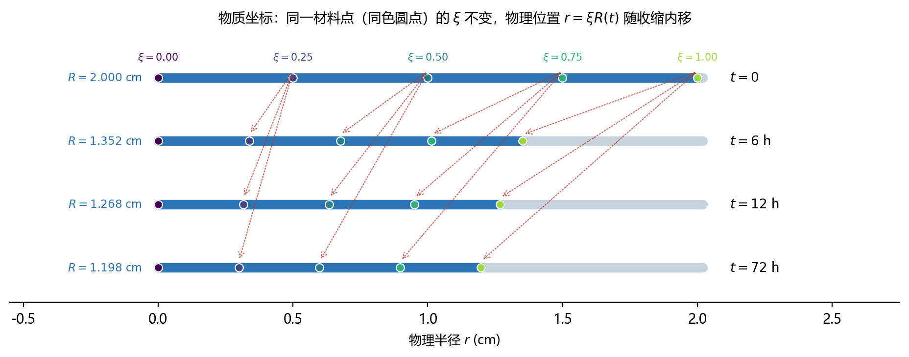
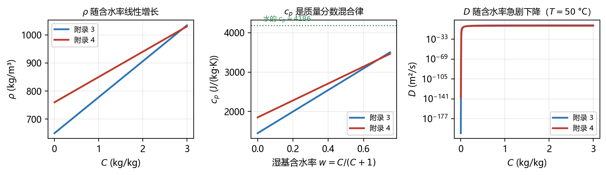
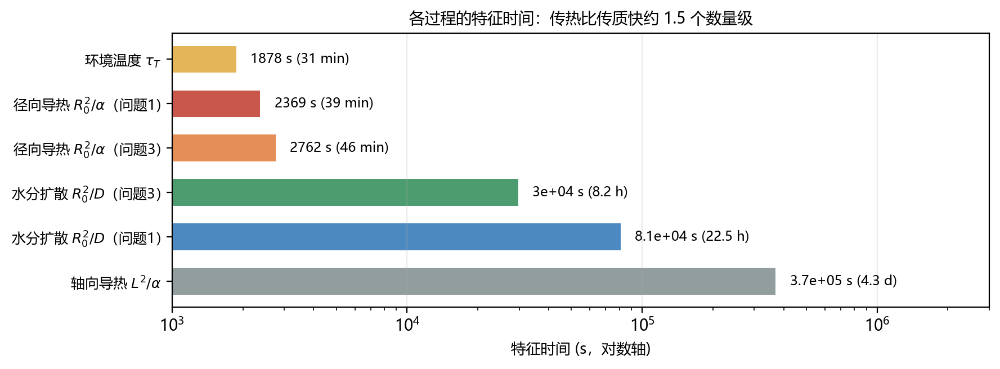

::: rawhtml
<div class="cover">
  <div class="t1">药材烘干模型<br>推导逐步骤详解</div>
  <div class="rule"></div>
  <div class="t2">论文第 5.1 – 5.8 节的完整推导过程</div>
  <div class="t3">传热控制方程　传质控制方程　边界与初始条件</div>
  <div class="t3">物质坐标变换　物性经验关系　无量纲分析　数值格式</div>
  <div class="meta">
    2026 高教社杯全国大学生数学建模竞赛　A 题　药材的烘干问题<br>
    对应版本：paper_electronic.pdf（最新版）<br>
    全文 12 章、4 个附录，含 10 项独立数值验证<br>
    不要求读者学过传热学、流体力学或数值分析
  </div>
</div>
<div class="pagebreak"></div>
:::

<!--TOC-->

\newpage

## 第 0 章　读前必读

### 0.1 本材料的范围与内容

论文第五章以控制体守恒的形式给出药材烘干模型的控制方程组，即式 (1) 至式 (12)。此类推导在文献中通常高度压缩：从守恒律的物理表述到微分方程之间的中间环节，包括控制体的选取、界面通量的泰勒展开、极限过程以及各物理量的约简，往往以「整理可得」一语概括。对于已具备传热传质基础的读者，这些环节可以自行补齐；而对初次接触偏微分方程建模的读者，被省略的部分恰恰构成理解方程的障碍。

本材料的目的在于补足这部分内容。第 3 章与第 4 章分别以能量守恒和水分质量守恒为出发点，逐步导出式 (1) 与式 (2)，其中的代数运算与约分过程不作省略；第 6 章以同样的粒度展开收缩问题的四个关键式子 (7)(8)(9)(10)；推导所依赖的数学工具，包括圆柱坐标下的散度算子、干基含水率与湿基含水率的换算关系、随体导数与局部导数的区别等，集中列于第 1 章，并视需要在使用处重述。

除推导本身外，本材料还包含三项论文正文未展开的内容。其一，第 10 章以独立编制的程序，对论文的推导链、物性参数、无量纲数、离散格式与外部数据校验逐项复算，共 10 项；其二，第 9 章指出 §5.8 关于界面扩散系数平均方式的表述与交付代码不一致，并给出两种做法对烘干时长的影响；其三，附录 D 汇总核对过程中发现的问题与建议。

::: tip 阅读建议
第一遍通读时，可只关注各节开头的说明与结尾的结论框，公式细节暂予略过。
第二遍宜逐式复推。若在某一步受阻，通常表明前一节的结论尚未掌握，建议回退一节重新阅读，不必强行推进。
第三遍可阅读第 10 章的验证结果与第 11 章的问答，用以检验对模型适用范围的理解。
:::

### 0.2 需要的预备知识（几乎为零）

读者需要掌握的是：

| 需掌握 | 具体是什么 | 在哪用到 |
|---|---|---|
| 导数 | 函数变化快慢，$\mathrm{d}f/\mathrm{d}x$ | 全文 |
| 偏导数 | 多元函数对其中一个变量求导 | 全文 |
| 链式法则 | $\mathrm{d}f(g(x))/\mathrm{d}x=f'(g)g'(x)$ | §1.5、§6.12 |
| 泰勒展开（一阶） | $f(x+\Delta x)\approx f(x)+f'(x)\Delta x$ | §1.7、§3.4 |
| 热量守恒、质量守恒 | 初中物理水平 | 第 3、4 章 |
| 量纲分析意识 | 等式两边单位必须相同 | 全文 |

**不需要**：不需要学过传热学、流体力学、数值分析、张量分析。凡是超出上表的工具，都会在使用处现推。

### 0.3 记号约定

| 记号 | 含义 | 单位 |
|---|---|---|
| $r$ | 到药材中心轴的距离（径向坐标） | m |
| $t$ | 时间 | s |
| $R_0$ | 药材初始半径，$R_0=0.02$ m | m |
| $R(t)$ | 药材半径随时间的变化（收缩时用） | m |
| $T(r,t)$ | 药材内部温度 | °C 或 K（涉及 Arrhenius 时用 K） |
| $C(r,t)$ | 干基含水率，即每千克干物质含多少千克水 | kg/kg |
| $\rho$ | 湿药材的体积密度（含水的整体密度） | kg/m³ |
| $\rho_d$ | 单位湿体积内的**干物质**质量 | kg/m³ |
| $c_p$ | 定压比热容 | J/(kg·K) |
| $k$ | 导热系数 | W/(m·K) |
| $D$ | 水分扩散系数 | m²/s |
| $h$ | 对流换热系数 | W/(m²·K) |
| $h_m$ | 对流传质系数 | m/s |
| $\xi$ | 物质坐标（归一化半径）$\xi=r/R(t)$ | 无量纲 |
| $q_r$ | 径向热流密度 | W/m² |
| $j_r$ | 径向水分质量流密度 | kg/(m²·s) |

::: tip 关于两个密度
题目附录给的是 $\rho$（湿药材的整体密度，如附录 3 的 $\rho=650+128C$）。但水分守恒必须用**干物质**做参照，所以要引入 $\rho_d$。两者的关系 $\rho_d=\rho/(1+C)$ 会在 §4.2 完整推导——这是全文第一个容易踩坑的地方。
:::

### 0.4 为什么值得这么较真

很多同学写论文时的做法是：直接抄一个圆柱非稳态导热方程，把参数代进去，跑出结果就交。这在 90% 的情况下能拿到分，但会在两个地方翻车：

1. **问题 4 的收缩**。收缩会让求解区域随时间变化，绝大多数教材里的方程都不适用。如果不知道式 (10) 是怎么来的，就不敢用，或者用错（比如把半径固定成 2 cm——论文算过，这会把烘干时间高估 2.5 倍）。
2. **答辩提问**。"你这个方程里的 $\rho_d$ 为什么不见了？""为什么水分方程里可以不含干物质的密度散度项？"——这两个问题的答案都在 §4.5，而且是一段非常漂亮的约分。

目标是让读者能不看论文，自己从头把式 (1) 到式 (12) 推出来。

\newpage

## 第 1 章　预备知识

本章不涉及本题的任何具体内容，只做一件事：把推导中会反复用到的 7 件工具讲清楚。已经熟悉的读者可以直接跳到第 3 章。

### 1.1 控制体：守恒律的万能写法

物理学里所有的守恒律，写成数学都长一个样：

$$
\left(\text{某区域内某物理量的变化率}\right)=\left(\text{单位时间净流入该区域的量}\right)+\left(\text{区域内部自己产生的量}\right) \tag{1.1}
$$

区域就是我们人为圈出来的一小块空间，叫**控制体**（control volume）。圈法有两种，两种在下面都会用到：

- **欧拉式（空间固定）**：控制体钉死在空间里，流体/材料从中间穿过。第 3 章、第 4 章用它。
- **拉格朗日式（随材料运动）**：控制体跟着材料一起动，里面装的干物质质量始终不变。§6.5 处理收缩时用它。

::: key 这是全文最重要的一句话
同一个物理过程，用不同的控制体去写，会得到**形式完全不同**的方程（一个带对流项，一个不带），但它们描述的是同一件事。论文 §5.5 的「对流项严格为零」，说的就是「换用拉格朗日控制体以后，方程里自动少了一项」。
:::

### 1.2 三个经验定律

推导里出现的所有通量，都由下面三条经验定律给出。注意每条定律里的**负号**，它们不是装饰，而是方向的约定。

**（1）Fourier 导热定律**——热量从高温流向低温：

$$
q_r=-k\frac{\partial T}{\partial r} \tag{1.2}
$$

$q_r$ 是**沿 $r$ 正方向**的热流密度（单位 W/m²）。如果温度沿 $r$ 方向升高（$\partial T/\partial r>0$），热量实际是往负方向流的，所以要加负号。

**（2）Fick 扩散定律**——物质从高浓度流向低浓度。本题的水分用干基浓度 $C$ 描述，但扩散的驱动力是**单位体积里水的质量**，所以定律要写成（§4.3 会详细解释为什么多一个 $\rho_d$）：

$$
j_r=-\rho_d D\frac{\partial C}{\partial r} \tag{1.3}
$$

**（3）Newton 对流换热定律**——固体表面与流体之间的换热：

$$
q_{\text{表面}}=h\left(T_{\text{air}}-T_s\right) \tag{1.4}
$$

$T_s$ 是表面温度，$T_{\text{air}}$ 是环境温度，$h$ 是对流换热系数。这条定律是表面边界条件的来源。

::: ask 为什么这三条都叫经验定律？
因为它们不是从更基本的原理推出来的，而是从实验里总结出来、再被无数工程实践验证的**唯象**关系。它们的地位相当于欧姆定律：好用，但要知道它的适用范围。本题中三者的适用性由题面直接给定，不需要我们论证。
:::

### 1.3 圆柱坐标下的散度：为什么是 $\frac{1}{r}\frac{\partial}{\partial r}(r\,\cdot)$

这是初学者最困惑的一个符号。为什么不是简单的 $\partial/\partial r$，而要凭空多出一个 $\frac{1}{r}$ 和一个乘进去的 $r$？

我们用薄壳来理解。考虑半径 $r$、厚度 $\mathrm{d}r$、长度 $L$ 的一个圆环形薄壳。

**第一步：算它的体积。** 半径 $r$ 处的圆周长是 $2\pi r$，乘上厚度 $\mathrm{d}r$ 和长度 $L$：

$$
V_{\text{壳}}=\underbrace{2\pi r}_{\text{周长}}\cdot\underbrace{\mathrm{d}r}_{\text{厚}}\cdot\underbrace{L}_{\text{长}}=2\pi rL\,\mathrm{d}r \tag{1.5}
$$

**第二步：算从内表面进来的量。** 内表面的面积是 $2\pi rL$（周长 × 长），流进来的量 = 通量 × 面积：

$$
\text{内表面流入}=q_r(r)\cdot2\pi rL \tag{1.6}
$$

**第三步：算从外表面出去的量。** 外表面在 $r+\mathrm{d}r$ 处，面积是 $2\pi(r+\mathrm{d}r)L$：

$$
\text{外表面流出}=q_r(r+\mathrm{d}r)\cdot2\pi(r+\mathrm{d}r)L \tag{1.7}
$$

::: key 注意这一步的要点
外表面的面积比内表面**大**。这就是圆柱坐标里那个多出来的 $r$ 的来源——通量密度相同，但通过的通流的面积变宽了。直角坐标里没有这个问题，因为门一样宽。
:::

**第四步：算净流入。**

$$
\text{净流入}=2\pi L\left[r\,q_r(r)-(r+\mathrm{d}r)q_r(r+\mathrm{d}r)\right] \tag{1.8}
$$

**第五步：泰勒展开并取极限**（见 §1.7）：

$$
r\,q_r(r)-(r+\mathrm{d}r)q_r(r+\mathrm{d}r)\;\xrightarrow[\mathrm{d}r\to0]{}\;-\frac{\partial(rq_r)}{\partial r}\mathrm{d}r \tag{1.9}
$$

**第六步：所以**

$$
\text{净流入}=-2\pi L\frac{\partial(rq_r)}{\partial r}\mathrm{d}r \tag{1.10}
$$

**第七步：把单位体积提出来。** 用式 (1.5) 除一下：

$$
\frac{\text{净流入}}{V_{\text{壳}}}=\frac{-2\pi L\,\partial(rq_r)/\partial r\,\mathrm{d}r}{2\pi rL\,\mathrm{d}r}=-\frac{1}{r}\frac{\partial(rq_r)}{\partial r} \tag{1.11}
$$

于是我们得到了圆柱坐标下散度的：

$$
\nabla\cdot\mathbf{q}\Big|_{\text{圆柱}}=\frac{1}{r}\frac{\partial(rq_r)}{\partial r} \tag{1.12}
$$

::: tip 记住这个式子的一种读法
"$\frac{1}{r}\frac{\partial}{\partial r}(r\cdot)$"＝先乘上面积因子 $r$，求导，再除回去。凡是"在圆柱里做守恒"的方程，最后都会长出这个形状。式 (1)、(2)、(10)、(11) 全都是这个形状，不是巧合。
:::

### 1.4 干基含水率 $C$ 到底是什么

题目里说的"水分浓度（即干基含水率）2.55 kg/kg"，意思是：

$$
C=\frac{m_w}{m_d}=\frac{\text{水的质量}}{\text{干物质的质量}} \tag{1.13}
$$

单位 kg/kg 不是无量纲的意思，而是每千克干物质含几千克水。$C=2.55$ 表示 1 kg 干药材上挂着 2.55 kg 水。

与之相对的是工程上常用的**湿基含水率**（含水率百分数）：

$$
w=\frac{m_w}{m_w+m_d} \tag{1.14}
$$

两者的换算（这个换算后面反复要用）：

$$
C=\frac{w}{1-w},\qquad w=\frac{C}{1+C} \tag{1.15}
$$

::: ask 为什么水分方程要用 $C$，而不是用湿基 $w$ 或水的密度 $\rho_w$？
因为 **$m_d$ 不变**。干燥过程中水会走、体积会缩，但干物质既不走也不生。用一个不变量做分母，方程会简单得多。这一点在处理收缩时（第 6 章）是决定性的：如果一开始就用湿基浓度，那么每个控制体里的参照物本身都在变，方程会立刻变得一团糟。
:::

::: warn 一个常见的低级错误
把 $\rho_d$ 当成常数 820 kg/m³（题目附录 2 的 $\rho$）。注意附录 2 给的 820 是**湿药材的密度** $\rho$，不是干物质密度。在 $C=2.55$ 时：

$$\rho_d=\frac{\rho}{1+C}=\frac{820}{1+2.55}=231.0\ \mathrm{kg/m^3}$$

差 3.55 倍。§4.2 给出这个式子的完整推导。
:::

### 1.5 两种时间导数：$\partial/\partial t|_r$ 与 $\partial/\partial t|_\xi$

这是理解第 6 章（收缩）的钥匙，务必看懂。

想象药材里有一个材料点（比如某根纤维上的一小撮干物质）：

- **$\left.\dfrac{\partial T}{\partial t}\right|_r$**：站在空间固定位置 $r$ 上，观察经过这里的材料的温度如何变化。这是欧拉视角。
- **$\left.\dfrac{\partial T}{\partial t}\right|_\xi$**：跟着这个材料点走，观察**它自己**的温度如何变化。这是拉格朗日视角，也叫**物质导数**。

两者由链式法则联系。设 $T=T(r,t)$，而材料点的位置 $r=r(t)$，则

$$
\frac{\mathrm{d}}{\mathrm{d}t}T(r(t),t)=\frac{\partial T}{\partial t}+\frac{\partial T}{\partial r}\frac{\mathrm{d}r}{\mathrm{d}t} \tag{1.16}
$$

即

$$
\underbrace{\left.\frac{\partial T}{\partial t}\right|_{\text{材料点}}}_{\text{跟着材料走}}=\underbrace{\left.\frac{\partial T}{\partial t}\right|_{\text{固定位置}}}_{\text{站在原地看}}+\underbrace{\frac{\partial T}{\partial r}\cdot v}_{\text{对流项}} \tag{1.17}
$$

其中 $v=\mathrm{d}r/\mathrm{d}t$ 是材料点的运动速度。

::: key 第 6 章的全部秘密
收缩时材料点会向轴心移动，$v\neq0$，所以式 (1.17) 右边多出一个对流项。论文 §5.5 说「对流项严格为零」，意思是：**如果一开始就用拉格朗日视角写方程，这一项根本不会出现**——不是把它算成零，而是它压根就没被生出来。
:::

### 1.6 边界条件的三种类型

一个偏微分方程只描述内部演化，必须配上边界条件才能定解。最常见的三种：

| 类型 | 数学形式 | 物理含义 | 本题用在哪 |
|---|---|---|---|
| 第一类（Dirichlet） | 给定边界上的值 $T\big|_{r=R}=T_s$ | 边界温度被强行钉住 | 本题**不用** |
| 第二类（Neumann） | 给定边界上的通量 $\left.\partial T/\partial r\right|_{r=R}=0$ | 边界是绝热的 | 中心对称条件式 (3) 属于这一类 |
| 第三类（Robin） | 通量与边界值与环境之差成正比 | 边界与外界对流换热 | 表面条件式 (4) |

::: ask 为什么表面用 Robin 而不是 Dirichlet？
因为药材表面**不是**被强行钉在烘房温度上的。热风要把热量通过对流到表面，这个输送有阻力（$1/h$）；热量送到表面后还要靠导热进内部，这个也有阻力（$R/k$）。两个阻力谁大谁小，决定了表面温度更接近烘房温度还是更接近药材内部温度。这个竞争关系正是热 Biot 数 $Bi=hR_0/k$ 的含义（第 8 章）。

如果强行用 Dirichlet（令表面温度 = 风温），就等于假设 $h\to\infty$，在本题里会造成明显的偏差。
:::

### 1.7 泰勒展开与取极限

控制体法里最标准的动作是：把外表面的量（下标 $+1$）用内表面的量（下标 $0$）表示出来。工具就是泰勒展开：

$$
f(x+\Delta x)=f(x)+f'(x)\Delta x+\frac{1}{2}f''(x)\Delta x^2+\cdots \tag{1.18}
$$

在本题里 $\Delta x$ 就是 $\mathrm{d}r$，而 $\mathrm{d}r$ 最终会趋于 0，所以二阶及以上的项都可以丢掉（它们除以 $\mathrm{d}r$ 之后仍是 $\mathrm{d}r$ 的量级，会一起归零）。

::: warn 这一步最容易被含糊过去
「反正 $\mathrm{d}r$ 很小」不是理由。正确的逻辑是：

1. 先保留 $\Delta x$，得到的是**有限厚度**控制体的精确守恒式；
2. 再除以控制体体积，两边都出现 $\Delta x$；
3. 最后令 $\Delta x\to0$，凡是还带有 $\Delta x$ 的项**严格**等于 0。

这样得到的方程才是精确的微分方程，而不是。
:::

::: tip 本章小结
- 守恒律 = 变化率 = 净流入（内部无源时）；
- 通量由 Fourier / Fick / Newton 三条经验定律给出；
- 圆柱几何会把 $\partial_r$ 变成 $\frac{1}{r}\partial_r(r\cdot)$，因为随着 $r$ 变宽；
- 干基含水率 $C=m_w/m_d$ 用一个不变量做参照；
- 固定位置与跟随材料是两种不同的时间导数，差别就是对流项；
- 表面用 Robin 条件，因为外部对流是有阻力的。
:::

## 第 2 章　几何简化：三维问题怎么变成一维

### 2.1 物理对象

题目给的药材是圆柱形：长 $L=25$ cm $=0.25$ m，半径 $R_0=2$ cm $=0.02$ m。

用柱坐标 $(r,\theta,z)$ 描述：$z$ 沿轴向，$r$ 沿径向，$\theta$ 是绕轴的角度。温度一般应写成 $T(r,\theta,z,t)$——四个自变量，太难了。论文 §5.1 把它砍成 $T(r,t)$，理由是三条：

1. **轴对称**：药材是圆的，烘房送风沿轴向均匀，没有任何方向是特殊的，所以 $\theta$ 方向没有梯度，$\partial T/\partial\theta=0$，$\theta$ 这个自变量消失。
2. **轴向可忽略**：这个需要算一下，见下。
3. **横向尺寸小**：$R_0/L=2/25=0.08$，径向扩散距离短。

### 2.2 轴向到底能不能忽略：算一遍特征时间

特征时间是一个很好用的估算工具：**扩散距离的平方除以扩散系数**。

$$
\tau\sim\frac{(\text{距离})^2}{\text{扩散系数}} \tag{2.1}
$$

**径向**。热扩散系数（也叫导温系数）

$$
\alpha=\frac{k}{\rho c_p}=\frac{0.36}{820\times2600}=\frac{0.36}{2.132\times10^{6}}=1.689\times10^{-7}\ \mathrm{m^2/s} \tag{2.2}
$$

径向特征时间：

$$
\tau_R=\frac{R_0^2}{\alpha}=\frac{(0.02)^2}{1.689\times10^{-7}}=\frac{4.0\times10^{-4}}{1.689\times10^{-7}}=2369\ \mathrm{s}=39.5\ \mathrm{min} \tag{2.3}
$$

**轴向**。用全长 $L=0.25$ m：

$$
\tau_L=\frac{L^2}{\alpha}=\frac{0.0625}{1.689\times10^{-7}}=3.70\times10^{5}\ \mathrm{s}=4.28\ \mathrm{day} \tag{2.4}
$$

两者之比：

$$
\frac{\tau_L}{\tau_R}=\left(\frac{L}{R_0}\right)^2=12.5^2=156 \tag{2.5}
$$

::: key 与原文对照
论文 §5.1 现在写的是："轴向导热特征时间为 $L^2/\alpha=0.25^2/1.6886\times10^{-7}\approx3.70\times10^5$ s（约 4.3 天），径向为 $R_0^2/\alpha\approx2369$ s，两者之比为 $(L/R_0)^2=156$，即相差约 2.2 个数量级"。

- 径向的 $2369$ s 与式 (2.3) **完全一致**；
- 轴向的 $3.70\times10^5$ s 与式 (2.4) 的一致到三位有效数字 ✓
- 倍数比 156 与式 (2.5) 一致 ✓

**结论成立**：轴向时间尺度是径向的 156 倍，端面效应确实可以忽略，模型假设 1 成立。
:::

### 2.3 简化结果

于是所有未知量只依赖于 $r$ 和 $t$：

$$
T=T(r,t),\qquad C=C(r,t),\qquad 0\le r\le R(t),\ t\ge0 \tag{2.6}
$$

求解区域是一个**一维线段**（半径方向），这让后面的有限体积离散变得非常简单。

::: tip 这类算特征时间的手法值得记住
当你在建模时犹豫某个方向能否忽略，不要凭感觉，算两个特征时间比一下。$\tau\sim L^2/\alpha$ 这个公式在热传导、扩散、渗流中到处都用得上。
:::

\newpage

## 第 3 章　传热控制方程（论文式 (1)）

本节把论文式 (1)

$$
\rho(C)c_p(C)\frac{\partial T}{\partial t}=\frac{1}{r}\frac{\partial}{\partial r}\left(r\,k(C)\frac{\partial T}{\partial r}\right) \tag{1}
$$

从零推出来。全过程分 **8 步**，每一步只做一件事。

### 3.1 第 1 步：取控制体

在半径 $r$ 处，取一个**圆环形薄壳**：

- 内边界：半径 $r$
- 外边界：半径 $r+\mathrm{d}r$
- 轴向长度：$L$（整根药材的长度）

::: tip 为什么取而不是取？
因为几何是圆柱。如果取小方块，它的内外面不是等温面，还会有侧向的热流，方程会多出 $\theta$ 方向的项。取环壳的好处是：**内外两个面都是等温面**，热量只能沿 $r$ 方向进出，问题自然是一维的。
:::

这个壳层的体积（式 1.5 已经算过）：


$$
V_{\text{壳}}=2\pi rL\,\mathrm{d}r \tag{3.1}
$$

内表面积与外表面：

$$
A_{\text{内}}=2\pi rL,\qquad A_{\text{外}}=2\pi(r+\mathrm{d}r)L \tag{3.2}
$$

### 3.2 第 2 步：写出能量守恒这句话

论文的原话是："**壳层内能的时变率等于净导入的导热热流**"。翻成公式：

$$
\underbrace{\frac{\partial(\text{内能})}{\partial t}}_{\text{壳层里储存的热量变化多快}}=\underbrace{\text{内表面流入}-\text{外表面流出}}_{\text{净导入}} \tag{3.3}
$$

**壳层里的内能**是多少？内能 = 质量 × 比热 × 温度 = $(\rho V_{\text{壳}})\cdot c_p\cdot T$，所以

$$
\text{内能}=\rho c_p T\cdot 2\pi rL\,\mathrm{d}r \tag{3.4}
$$

于是式 (3.3) 的左边是

$$
\frac{\partial}{\partial t}\Big(\rho c_pT\cdot2\pi rL\,\mathrm{d}r\Big) \tag{3.5}
$$

::: warn 这里有一个的假设
严格的写法需要对整个乘积求导：

$$\frac{\partial(\rho c_pT)}{\partial t}=\rho c_p\frac{\partial T}{\partial t}+T\frac{\partial(\rho c_p)}{\partial t}$$

论文只保留了第一项，也就是默认 $\rho c_p$ 随时间的变化可以忽略。这在**本题**是合理的（干燥过程缓慢，且 $\rho c_p$ 的变化主要影响温度响应的快慢而非最终分布），但它确实是论文式 (1) 背后没有写出来的一条隐含假设。若被问到时，可以这样解释：失水导致单位体积热容从 $3.36\times10^6$ 降到约 $1.65\times10^6$ J/(m³·K)，是一个**缓慢单调**的变化，最快发生在干燥前期，而前期温度场本身变化更快，两类效应时间尺度不同。
:::

### 3.3 第 3 步：用 Fourier 定律写出两个面的热流

由式 (1.2)，径向热流密度 $q_r=-k\partial T/\partial r$。乘上各自面积：

$$
\text{内表面流入}=q_r(r)\cdot 2\pi rL=\left(-k\frac{\partial T}{\partial r}\right)_{r}\cdot2\pi rL \tag{3.6}
$$

$$
\text{外表面流出}=q_r(r+\mathrm{d}r)\cdot 2\pi(r+\mathrm{d}r)L=\left(-k\frac{\partial T}{\partial r}\right)_{r+\mathrm{d}r}\cdot2\pi(r+\mathrm{d}r)L \tag{3.7}
$$

::: ask 内表面为什么是流入、外表面为什么是流出？
因为我们约定 $q_r$ 的正方向是 $+r$（从轴心指向表面）。在 $r$ 处，正值 $q_r$ 表示热量**进入**壳层；在 $r+\mathrm{d}r$ 处，正值 $q_r$ 表示热量**离开**壳层。这正是流入减流出的形式。

这也是为什么论文写成 $-\left[q_r\cdot2\pi rL\right]_{r}^{r+\mathrm{d}r}$ ——那个 $[\cdot]_r^{r+\mathrm{d}r}$ 是的记号：

$$-\left[f\right]_r^{r+\mathrm{d}r}=-(f(r+\mathrm{d}r)-f(r))=f(r)-f(r+\mathrm{d}r)$$

也就是流入减流出，和我们的写法完全一致。
:::

### 3.4 第 4 步：泰勒展开

为了把外表面的量换算到内表面，用式 (1.18)。先处理**通量项**：

$$
\left(-k\frac{\partial T}{\partial r}\right)_{r+\mathrm{d}r}
=\left(-k\frac{\partial T}{\partial r}\right)_{r}
+\frac{\partial}{\partial r}\left(-k\frac{\partial T}{\partial r}\right)_{r}\mathrm{d}r
+O(\mathrm{d}r^2) \tag{3.8}
$$

再处理**面积因子**：

$$
2\pi(r+\mathrm{d}r)L=2\pi rL+2\pi L\,\mathrm{d}r \tag{3.9}
$$

### 3.5 第 5 步：代入，得到有限厚度的精确式

把式 (3.4)(3.6)(3.7) 代进式 (3.3)：

$$
\frac{\partial(\rho c_pT)}{\partial t}\,2\pi rL\,\mathrm{d}r
=\left(-k\frac{\partial T}{\partial r}\right)_{r}\!\!2\pi rL
-\left(-k\frac{\partial T}{\partial r}\right)_{r+\mathrm{d}r}\!\!2\pi(r+\mathrm{d}r)L \tag{3.10}
$$

现在把式 (3.8)(3.9) 代进右边第二项。记 $F=-k\partial T/\partial r$，则

$$
F(r+\mathrm{d}r)\cdot2\pi(r+\mathrm{d}r)L
=\Big(F+\frac{\partial F}{\partial r}\mathrm{d}r\Big)\big(2\pi rL+2\pi L\,\mathrm{d}r\big) \tag{3.11}
$$

展开（$F$ 是热流密度）：

$$
=F\cdot2\pi rL+\underbrace{F\cdot2\pi L\,\mathrm{d}r}_{\text{面积增量贡献}}+\underbrace{\frac{\partial F}{\partial r}\mathrm{d}r\cdot2\pi rL}_{\text{通量梯度贡献}}+\underbrace{\frac{\partial F}{\partial r}\mathrm{d}r\cdot2\pi L\,\mathrm{d}r}_{O(\mathrm{d}r^2)} \tag{3.12}
$$

代回式 (3.10)，第一项 $F\cdot2\pi rL$ 与左边的流入完全抵消：

$$
\frac{\partial(\rho c_pT)}{\partial t}\,2\pi rL\,\mathrm{d}r
=-\Big(F\cdot2\pi L\,\mathrm{d}r+\frac{\partial F}{\partial r}2\pi rL\,\mathrm{d}r\Big)+O(\mathrm{d}r^2) \tag{3.13}
$$

::: key 式 (3.12) 里这一项，就是圆柱几何的全部特殊性
在直角坐标里这一项不存在（门一样宽），此时式 (3.13) 会退化成 $\partial_t T\propto-\partial_x F$，也就是标准的 $\partial_x(k\partial_xT)$。圆柱里多出来的 $F\cdot2\pi L\mathrm{d}r$ 正是 §1.3 里说的通流面积变宽。
:::

### 3.6 第 6 步：两边同除 $2\pi L\,\mathrm{d}r$

$$
\frac{\partial(\rho c_pT)}{\partial t}\,r=-\Big(F+\frac{\partial F}{\partial r}r\Big) \tag{3.14}
$$

### 3.7 第 7 步：取极限 $\mathrm{d}r\to0$

式 (3.13) 残下的 $O(\mathrm{d}r^2)$ 除以 $\mathrm{d}r$ 后仍是 $O(\mathrm{d}r)$，令 $\mathrm{d}r\to0$ 后**严格为零**。于是式 (3.14) 两边都已经是有限量，不需要再取极限，直接得到：

$$
\rho c_p\frac{\partial T}{\partial t}=-\frac{1}{r}\Big(F+r\frac{\partial F}{\partial r}\Big) \tag{3.15}
$$

注意括号里的组合正好是一个乘积的导数：

$$
F+r\frac{\partial F}{\partial r}=\frac{1}{?}\ \cdots\qquad\text{更直接地：}\quad \frac{1}{r}\frac{\partial(rF)}{\partial r}=\frac{F}{r}+\frac{\partial F}{\partial r} \tag{3.16}
$$

两边乘 $r$ 核对一下：$\partial(rF)/\partial r=F+r\partial F/\partial r$ ✓。所以式 (3.15) 可以写成

$$
\rho c_p\frac{\partial T}{\partial t}=-\frac{1}{r}\frac{\partial(rF)}{\partial r} \tag{3.17}
$$

### 3.8 第 8 步：把 $F=-k\partial T/\partial r$ 代回去

$$
\rho c_p\frac{\partial T}{\partial t}=-\frac{1}{r}\frac{\partial}{\partial r}\left(r\cdot\Big(-k\frac{\partial T}{\partial r}\Big)\right)
=\frac{1}{r}\frac{\partial}{\partial r}\left(rk\frac{\partial T}{\partial r}\right) \tag{3.18}
$$

两个负号相消，与论文式 (1) **逐字一致** ∎

::: key 式 (1) 到手了
$$\rho(C)c_p(C)\frac{\partial T}{\partial t}=\frac{1}{r}\frac{\partial}{\partial r}\left(r\,k(C)\frac{\partial T}{\partial r}\right)$$

其中 $\rho,c_p,k$ 都写成含 $C$ 的形式，是因为题目附录 3、附录 4 把它们给成了含水率的函数（§7.1）。它们**不含 $r$ 和 $t$ 的显式依赖**，只是通过 $C(r,t)$ 间接依赖。
:::

### 3.9 物理意义与量纲检查

**物理意义**：左边是这一小块材料升温的快慢（热量存起来），右边是从内部导进来与导出去的热量之差（净流入）。没有热源项，是因为假设 3（无内热源）。

**量纲检查**（单位 m、s、kg、K）：

| 位置 | 表达式 | 单位 | 结果 |
|---|---|---|---|
| 左 | $\rho c_p\partial_tT$ | $\dfrac{\mathrm{kg}}{\mathrm{m^3}}\cdot\dfrac{\mathrm{J}}{\mathrm{kg\cdot K}}\cdot\dfrac{\mathrm{K}}{\mathrm{s}}$ | $\dfrac{\mathrm{W}}{\mathrm{m^3}}$ |
| 右 (内层) | $k\partial_rT$ | $\dfrac{\mathrm{W}}{\mathrm{m\cdot K}}\cdot\dfrac{\mathrm{K}}{\mathrm{m}}$ | $\dfrac{\mathrm{W}}{\mathrm{m^2}}$ |
| 右 (中层) | $r\cdot k\partial_rT$ | $\mathrm{m}\cdot\dfrac{\mathrm{W}}{\mathrm{m^2}}$ | $\dfrac{\mathrm{W}}{\mathrm{m}}$ |
| 右 (整体) | $\dfrac{1}{r}\partial_r(\cdot)$ | $\dfrac{1}{\mathrm{m}}\cdot\dfrac{\mathrm{W}}{\mathrm{m^2}}$ | $\dfrac{\mathrm{W}}{\mathrm{m^3}}$ |

两边都是 W/m³ ✓。**如果量纲对不上，一定是某一步抄错了。**

### 3.10 关于 $\rho(C)c_p(C)$ 的两个细节

**细节一：这里用 $\rho$ 而不是 $\rho_d$。** 因为内能是单位体积湿药材储存的热量，参照的是**湿体积**，所以用湿药材的密度 $\rho$。这与水分方程要用 $\rho_d$ 恰好相反，别记混。

**细节二：$\rho c_p$ 的量级。** 代附录 3 在 $C=2.55$：

$$
\rho=650+128\times2.55=976.4\ \mathrm{kg/m^3},\quad
c_p=1450+2736\times\frac{2.55}{3.55}=3415.3\ \mathrm{J/(kg\cdot K)}
$$

$$
\rho c_p=976.4\times3415.3=3.335\times10^{6}\ \mathrm{J/(m^3\cdot K)} \tag{3.19}
$$

意思是：把这 1 m³ 药材整体升高 1 °C 需要 3.3 MJ 的热量。作为对照，同体积的水需要 $1000\times4186=4.2$ MJ——药材的单位体积热容比水略小，符合含水多孔物料的直觉。

### 3.11 反过来验算：把式 (1) 写成通量形式

如果抛开上面的推导，直接对式 (1) 做，也应该回到 $-k\nabla^2T$ 的形式。练习一下（这一步能帮你确认自己真的看懂了那个 $\frac{1}{r}$）：

$$
\frac{1}{r}\frac{\partial}{\partial r}\left(rk\frac{\partial T}{\partial r}\right)
=\frac{k}{r}\frac{\partial T}{\partial r}+k\frac{\partial^2T}{\partial r^2}
=k\left(\frac{\partial^2T}{\partial r^2}+\frac{1}{r}\frac{\partial T}{\partial r}\right)
=k\,\nabla^2T \tag{3.20}
$$

（这里把 $k$ 当成常数才能这么写；若 $k$ 随 $C$ 变化，必须保留 $\partial_r(rk\partial_rT)$ 的形式，不能拆开。）括号里的 $\partial_{rr}T+\frac{1}{r}\partial_rT$ 就是**圆柱坐标下只含径向的拉普拉斯算子**。

::: tip 本章小结
| 步骤 | 做了什么 |
|---|---|
| 1 | 取环形壳层控制体，体积 $2\pi rL\mathrm{d}r$ |
| 2 | 内能时变率 = 净导入热流 |
| 3 | 用 Fourier 定律写两面的热流 |
| 4 | 泰勒展开把外表面换算到内表面 |
| 5 | 代入，抵消首项，留下两项 |
| 6 | 除以 $2\pi L\mathrm{d}r$ |
| 7 | 取极限，把两项合成 $\frac{1}{r}\partial_r(r\cdot)$ |
| 8 | 代回 $q_r=-k\partial_rT$，得到式 (1) |

**整章只有一个技巧**：把两个面的通量之差用泰勒展开变成一个导数。这个技巧在第 4 章、第 6 章会一模一样地再用两次。
:::

## 第 4 章　传质控制方程（论文式 (2)）

本节推出论文式 (2)

$$
\frac{\partial C}{\partial t}=\frac{1}{r}\frac{\partial}{\partial r}\left(r\,D(C,T)\frac{\partial C}{\partial r}\right) \tag{2}
$$

推导方法和第 3 章**完全一样**，但有两个地方必须格外小心：**用哪个密度**、**通量怎么用 $C$ 表示**。这两处是本章的全部难点。

### 4.1 第 1 步：先搞清楚 $C$ 是每千克什么

$C$ 的定义是式 (1.13)：$C=m_w/m_d$。它的参照物是**干物质质量**，而干物质在干燥过程中既不产生也不消失、也不迁移（假设 5）。这个不变量是本章所有化简的基础。

### 4.2 第 2 步：$\rho_d=\rho/(1+C)$ 的完整推导

题目附录给的是湿药材的密度 $\rho$（如附录 3 的 $\rho=650+128C$），而水分守恒需要的是**单位湿体积里的干物质质量** $\rho_d$。

取 1 m³ 湿药材，设其中：

- 干物质质量 = $\rho_d$（kg）——这正是 $\rho_d$ 的定义；
- 水分质量 = $\rho_d C$（kg）——因为每千克干物质配 $C$ 千克水。

两者相加就是这 1 m³ 的总质量，而总质量的定义就是 $\rho$：

$$
\rho=\rho_d+\rho_d C=\rho_d(1+C) \tag{4.1}
$$

解出 $\rho_d$：

$$
\boxed{\ \rho_d=\frac{\rho}{1+C}\ } \tag{4.2}
$$

对照检查：单位湿体积里的水分质量 $\rho_w=\rho_dC=\dfrac{\rho C}{1+C}$，干物质 $+$ 水 $=\rho\dfrac{1+C}{1+C}=\rho$ ✓。

::: tip 顺便得到一个有用的关系
湿基含水率 $w=\dfrac{\rho_w}{\rho}=\dfrac{C}{1+C}$，与式 (1.15) 一致——两种方法都对上了，说明推导没错。
:::

**数值感受**（附录 3）：

| $C$ (kg/kg) | $\rho$ (kg/m³) | $\rho_d$ (kg/m³) | 说明 |
|---|---|---|---|
| 2.55（初始） | 976.4 | 275.0 | 1 m³ 湿药材里只有 275 kg 是干物质 |
| 0.15（结束） | 669.2 | 581.9 | 水走了，湿体积缩小，干物质密度反而**变大** |

::: warn 常见错误
写成 $\rho_d=\rho\cdot(1+C)$ 或 $\rho_d=\rho(1-w)$。前者量纲虽然也对，但物理上荒谬（水越多干物质越多）；后者的数值恰好等于 $\rho C/(1+C)=\rho_w$，那是**水**的密度，不是干物质的。**只有 $\rho/(1+C)$ 是对的。**
:::

### 4.3 第 3 步：Fick 定律在干基下长什么样

题目给的扩散系数 $D$ 是水分浓度扩散系数，配的浓度变量是 $C$（kg/kg）。要让 Fick 定律 $j=-D\nabla(\text{浓度})$ 的量纲变成标准的质量通量 kg/(m²·s)，浓度必须换成**单位体积的水分质量** $\rho_w=\rho_dC$。

但论文写的是：

$$
j_r=-\rho_dD\frac{\partial C}{\partial r} \tag{4.3}
$$

这与 $j_r=-D\dfrac{\partial(\rho_dC)}{\partial r}=-D\Big(\rho_d\dfrac{\partial C}{\partial r}+C\dfrac{\partial\rho_d}{\partial r}\Big)$ 相比，少了第二项。所以式 (4.3) 成立的前提仍然是同一句话：**$\rho_d$ 在空间上均匀**（这样 $C\partial_r\rho_d=0$）。

换句话说，以 $C$ 为变量、以 $\rho_dD$ 为系数这一套写法，本身就已经把 $\rho_d$ 当成了常数。本章 §4.5 会看到，正是这个假设让式 (2) 成立。

### 4.4 第 4 步：控制体内水分的守恒

和 §3.1 一样取环形壳层 $[r,r+\mathrm{d}r]$。但这次我们用**含有固定干物质质量的壳层**来做控制体（这是论文 §5.3 的原话）。

**这个控制体里有多少水？** 定义直接给出：

$$
\text{水量}=\text{干物质质量}\times C=\big(\rho_d\cdot2\pi rL\,\mathrm{d}r\big)\cdot C \tag{4.4}
$$

**这个干物质质量随时间变吗？** 不变。因为干物质不迁移、不产生、不消失（假设 5）。这正是论文说"注意到壳层内的干物质质量 $2\pi rL\rho_d\mathrm{d}r$ 不随时间变化"的意思。

**水分的守恒式**：

$$
\frac{\partial}{\partial t}\Big(\rho_dC\cdot2\pi rL\,\mathrm{d}r\Big)=\text{内表面流入}-\text{外表面流出} \tag{4.5}
$$

### 4.5 第 5 步：套用第 3 章的同一套步骤

第 3 章的式 (3.6)–(3.18) 是一个**通用模板**：只要把 $F$ 换成质量通量 $j_r$、把 $\rho c_pT$ 换成 $\rho_dC$，整台机器可以原封不动地再跑一遍。跑出来的结果是：

$$
\frac{\partial(\rho_dC)}{\partial t}=\frac{1}{r}\frac{\partial}{\partial r}\big(r\,j_r\big) \tag{4.6}
$$

把式 (4.3) 的 $j_r=-\rho_dD\partial C/\partial r$ 代进去：

$$
\frac{\partial(\rho_dC)}{\partial t}=\frac{1}{r}\frac{\partial}{\partial r}\left(r\cdot\Big(-\rho_dD\frac{\partial C}{\partial r}\Big)\right)
=-\frac{1}{r}\frac{\partial}{\partial r}\left(r\rho_dD\frac{\partial C}{\partial r}\right) \tag{4.7}
$$

**现在到了最关键的一步：约掉 $\rho_d$。**

先看左边。因为假设 $\rho_d$ **不随时间变化**（干物质不迁移，且没有收缩时体积也不变）：

$$
\frac{\partial(\rho_dC)}{\partial t}=\rho_d\frac{\partial C}{\partial t} \tag{4.8}
$$

再看右边。因为假设 $\rho_d$ **不随位置变化**（在剖面上均匀），它可以提到导数外面：

$$
-\frac{1}{r}\frac{\partial}{\partial r}\left(r\rho_dD\frac{\partial C}{\partial r}\right)
=-\frac{\rho_d}{r}\frac{\partial}{\partial r}\left(rD\frac{\partial C}{\partial r}\right) \tag{4.9}
$$

两边都有 $\rho_d$，直接约掉：

$$
\rho_d\frac{\partial C}{\partial t}=-\frac{\rho_d}{r}\frac{\partial}{\partial r}\left(rD\frac{\partial C}{\partial r}\right)
\ \Longrightarrow\
\frac{\partial C}{\partial t}=\frac{1}{r}\frac{\partial}{\partial r}\left(rD\frac{\partial C}{\partial r}\right) \tag{2}
$$

**得到论文式 (2)** ∎

::: key 干物质密度的散度项为什么不见了——三句话回答
1. 控制体是含固定干物质质量的，所以**左端**水量就是对 $m_dC$ 求导，$m_d$ 是常数，不会被求导——这就是论文说的不含干物质密度的散度项；
2. 右端的通量 $\rho_dD\partial_rC$ 里**也**带着一个 $\rho_d$；
3. 两边的 $\rho_d$ 恰好抵消。

**但第 3 句能成立，靠的是一条附加条件：$\rho_d$ 在剖面上均匀（且不随时间变化）。** 论文在 §5.5 的适用条件里正是把这条写了出来。这是全文中一个容易被漏掉、但在答辩时很可能会被追问的点。
:::

### 4.6 如果 $\rho_d$ 不均匀，方程应该怎么写？

题目给的 $\rho_d=\rho(C)/(1+C)$ 会随含水率变化：附录 3 下从 275 kg/m³（$C=2.55$）变到 582 kg/m³（$C=0.15$）。所以严格地说，剖面上一旦出现含水率梯度，$\rho_d$ 就不再均匀。此时保留式 (4.8)(4.9) 的**一般形式**：

$$
\boxed{\ \frac{\partial C}{\partial t}=\frac{1}{r\rho_d}\frac{\partial}{\partial r}\left(r\rho_dD\frac{\partial C}{\partial r}\right)\ } \tag{4.10}
$$

两式之差为

$$
\text{式(4.10)}-\text{式(2)}=\frac{D}{r\rho_d}\frac{\partial(r\rho_d)}{\partial r}\frac{\partial C}{\partial r}
\approx D\frac{\partial\ln\rho_d}{\partial r}\frac{\partial C}{\partial r} \tag{4.11}
$$

也就是一个**正比于 $\partial_r(\ln\rho_d)\cdot\partial_rC$ 的附加项**：只有当密度梯度和浓度梯度同时很大时才明显。

::: tip 这算不算论文的错？
不算。**干燥文献中 $\partial X/\partial t=\nabla\cdot(D\nabla X)$（$X$ 为干基含水率）是标准写法**，它的经典前提就是干物质的表观密度不变。论文在 §5.5 明确列出了这条前提，属于已知近似、已在正文声明。§10.7 把这个近似的实际量级算了出来，可供答辩时引用。
:::

### 4.7 干基 vs 湿基：两套写法对照

| | 干基写法 | 湿基写法 |
|---|---|---|
| 变量 | $C=m_w/m_d$ | $\rho_w=\rho_dC$ |
| 方程 | $\partial_tC=\frac{1}{r}\partial_r(rD\partial_rC)$ | $\partial_t\rho_w=\frac{1}{r}\partial_r(rD\partial_r\rho_w)$ |
| 参照物是否变化 | 干物质质量不变 ✓ | 湿体积会缩 ✗ |
| 收缩时的表现 | 只需换坐标（第 6 章） | 需额外处理密度散度项 |
| 本题采用 | ✓（论文式 2） | — |

### 4.8 量纲检查

| 位置 | 表达式 | 单位 |
|---|---|---|
| 左 | $\partial_tC$ | $\mathrm{(kg/kg)/s}$ |
| 右 (内) | $D\partial_rC$ | $\mathrm{(m^2/s)(kg/kg)/m}$ |
| 右 (整体) | $\frac{1}{r}\partial_r(r\cdot)$ | $\mathrm{(kg/kg)/s}$ |

两边一致 ✓

::: tip 本章小结
- 干基含水率 $C$ 的参照物是不变的干物质，这是它好用的根本原因；
- $\rho_d=\rho/(1+C)$，不是 $\rho(1+C)$；
- 通量 $j_r=-\rho_dD\partial_rC$ 已经隐含了$\rho_d$ 均匀；
- 水分方程与传热方程**共用同一台同一套步骤**，只是把 $T$ 换成 $C$、把 $k$ 换成 $\rho_dD$；
- $\rho_d$ 两边约掉需要 $\rho_d$ 在剖面上均匀——这是式 (2) 的一条附加前提。
:::

\newpage

## 第 5 章　边界条件与初始条件（论文式 (3)(4)(5)）

偏微分方程只说内部如何演化，还需要边界和初始时刻的信息才能定解。本章把式 (3)(4)(5) 逐条讲清楚，重点是**每一个正负号的方向约定**。

### 5.1 中心对称条件（式 3）

$$
\left.\frac{\partial T}{\partial r}\right|_{r=0}=0,\qquad
\left.\frac{\partial C}{\partial r}\right|_{r=0}=0 \tag{3}
$$

**为什么？** 有三条理由，任一条都足以说明：

**理由一（对称性）**：药材是圆的。沿任意方向从中心往外走，看到的物理状态都一样。如果 $T$ 写成 $r$ 的函数，那么在中心附近 $T(r)=T(-r)$（偶函数），偶函数在原点的一阶导数为零：

$$
\left.\frac{\partial T}{\partial r}\right|_{r=0}=0 \tag{5.1}
$$

**理由二（否则方程会爆炸）**：把式 (1) 展开成式 (3.20) 的形式：

$$
\rho c_p\frac{\partial T}{\partial t}=k\left(\frac{\partial^2T}{\partial r^2}+\frac{1}{r}\frac{\partial T}{\partial r}\right)
$$

如果 $\partial_rT\big|_{r=0}\neq0$，那么 $\frac{1}{r}\partial_rT$ 在 $r\to0$ 时**发散到无穷**，温度变化率会是无穷大——物理上不可能。所以为了让方程在中心有意义，$\partial_rT$ 必须以比 $r$ 更快的速度趋于 0。

**理由三（离散实现）**：在有限体积格式里，这条条件等价于轴心处的面通量为零，即 §5.8 里的 $g_{-1/2}=0$。代码里写一行就够，见 §9.1。

::: warn 一个容易搞混的地方
式 (3) 是**两条**条件：温度一条、浓度一条。它们的形式一样，但物理来源不同——温度是没有热量从中心穿过，浓度是没有水分从中心穿过。二者都源于同一个几何事实：中心是一条线，不是一堵墙。
:::

### 5.2 表面 Robin 条件·热量（式 4 左半）

$$
-k\left.\frac{\partial T}{\partial r}\right|_{r=R}=h\left(T_{\text{air}}(t)-T_s\right),\qquad T_s=T(R,t) \tag{4a}
$$

**逐项读一遍：**

| 符号 | 含义 | 正方向约定 |
|---|---|---|
| $-k\partial_rT\big|_R$ | 从药材**内部**流向表面的导热热流密度 | $+r$（向外） |
| $h(T_{\text{air}}-T_s)$ | 从热风**传给**表面的对流热流密度 | 传给药材为正 |
| $h$ | 对流换热系数 | 由气流决定，假设 4 取常数 25 W/(m²·K) |

**物理含义**：在表面这一层的地方，热量不能堆积。内部导出来的热量必须恰好等于对流带进来的热量。这是一个**能量通量连续条件**。

**正负号自检**：假设药材比风冷（$T_s<T_{\text{air}}$）。此时右侧为正，于是左侧也必须为正，即 $\partial_rT\big|_R<0$——温度从内向外**递减**，热量确实是从表面往里流。✓ 反过来，若药材比风热，$T_s>T_{\text{air}}$，右侧为负，$\partial_rT\big|_R>0$，温度向外递增，热量从表面散出去 ✓。

### 5.3 表面 Robin 条件·水分（式 4 右半）

$$
-D\left.\frac{\partial C}{\partial r}\right|_{r=R}=h_m\left(C_s-C_{\text{air}}(t)\right),\qquad C_s=C(R,t) \tag{4b}
$$

::: warn 为什么热用 $(T_{\text{air}}-T_s)$，而水分用 $(C_s-C_{\text{air}})$？顺序反了！
这不是笔误，而是因为两条式子的**左边约定完全一致**（都是沿 $+r$ 方向、由内部指向外界的通量），而右边的物理方向不同：

- **热量**：是从风**流入**药材（风热药材冷）。所以驱动力写在右边时，正的流入意味着 $T_{\text{air}}>T_s$，写作 $(T_{\text{air}}-T_s)$。
- **水分**：是从药材**流出**到风里（药材湿风干）。正的流出意味着 $C_s>C_{\text{air}}$，写作 $(C_s-C_{\text{air}})$。

换句话说，两条式子的左边都表示向外，括号里的顺序则各自保证了向外为正。如果觉得别扭，可以统一记成：

$$\text{向外通量}=h\times(\text{内侧的值}-\text{外侧的值})$$

热：向外通量 $=h(T_s-T_{\text{air}})$，但因为左边写的是 $-k\partial_rT$，而 $-k\partial_rT=h(T_{\text{air}}-T_s)$，两边差一个负号——**热是唯一需要注意方向的一项**，因为它通常是从外往里流。
:::

**数值自检**：初始时刻 $C_s=2.55$，$C_{\text{air}}\approx0.0196$，差值为正，所以水分确实从药材表面往风里跑 ✓。

### 5.4 初始条件（式 5）

$$
T(r,0)=28\ ^\circ\mathrm{C},\qquad C(r,0)=2.55\ \mathrm{kg/kg},\qquad 0\le r\le R_0 \tag{5}
$$

**为什么初始条件是均匀的？** 因为药材在进烘房之前放在室温环境里足够久，内部已经平衡。题目直接给了这两个数（"烘干开始时，药材的温度为 28 °C，水分浓度为 2.55 kg/kg"）。

**注意** $0\le r\le R_0$：初始时刻还没有收缩，域是 $[0,R_0]$。在问题 4 里，之后域会缩成 $[0,R(t)]$。物质坐标的一个好处是，初始条件写成 $C(\xi,0)=2.55$ 对任何 $t$ 都成立。

::: warn 初始条件与边界条件的冲突
在 $t=0^+$ 的瞬间：

- 表面**边界**要求 $C_s$ 满足 $-D\partial_rC\big|_R=h_m(C_s-C_{\text{air}})$；
- **初始**条件又要求 $C(R,0)=2.55$。

两者一般不能同时满足——表面浓度会瞬间跳变（本题里 $C_{\text{air}}=0.0196$ 远小于 $2.55$，所以表面会立刻开始下降）。这不是模型错误，而是真实物理：环境**突然**改变时，表面必然出现间断。

**但这个间断会带来数值麻烦**：Crank–Nicolson 格式对最高频模态几乎不衰减，会产生非物理振荡，所以论文前 4 步改用 $\theta=1$（Rannacher 启动），见 §9.3。
:::

### 5.5 为什么不能把表面当成平衡边界

有人会想：既然有热风一直在吹，干脆假设表面温度就等于风温 $T_s=T_{\text{air}}$（Dirichlet 条件），多省事。

这样做的代价可以用 Biot 数量化（详见第 8 章）：

$$
Bi=\frac{hR_0}{k}=\frac{25\times0.02}{0.36}=1.389 \tag{5.2}
$$

$Bi$ 的含义是外部对流阻力与内部导热阻力之比：

- $Bi\ll1$（如 $<0.1$）：内部导热很快，表面温度基本等于风温，可以用 Dirichlet；
- $Bi\gg1$：内部导热是瓶颈，表面温度接近药材自身温度；
- $Bi\sim1$（本题 1.389）：**两个阻力相当**，表面温度介于两者之间，必须用 Robin。

同理，传质 Biot 数（问题 1）为

$$
Bi_m=\frac{h_mR_0}{D}=\frac{8\times10^{-7}\times0.02}{4.94\times10^{-9}}=3.24 \tag{5.3}
$$

也是 $O(1)$，说明**表面蒸发阻力与内部扩散阻力相当**，同样不能把表面当成瞬间平衡。

::: key 两条先验结论（第 8 章会详细展开）
1. 表面必须保留 Robin 条件，因为 $Bi\sim Bi_m\sim O(1)$；
2. 温度比水分先达到准平衡，因为 $Fo_D\ll Fo_T$（问题 1 在 1800 s 时 $Fo_T=0.760$ 而 $Fo_D=0.0222$，相差 34 倍）。
:::

::: tip 本章小结
| 式 | 位置 | 类型 | 一句话 |
|---|---|---|---|
| (3) | $r=0$ | Neumann（零通量） | 中心是对称轴，没有东西穿过去 |
| (4) | $r=R$ | Robin | 表面通量 = 系数 ×（内外之差） |
| (5) | $t=0$ | 初始条件 | 进烘房前是均匀的 28 °C / 2.55 kg/kg |
:::

## 第 6 章　收缩问题与物质坐标变换（论文式 (6)–(12)）

这是全文最重要、也最容易讲不清楚的一章。前面第 3、4 章处理的都是药材尺寸不变的情形；问题 4 里，药材会从半径 2 cm 一路缩到 1.198 cm（缩小 40%），这时候前面所有方程都要重新审视。

::: tip 先看一眼 §5.5 的推导路线
论文 §5.5 把它拆成了**四步、四个编号公式**：

| 式号 | 内容 | 作用 |
|---|---|---|
| (7) | $\rho_d(\xi,t)R(t)^2=\rho_d(\xi,0)R_0^2$ | 干物质守恒 ⟹ 干基密度是材料不变量 |
| (8) | $2\pi R^2\int_0^\xi\rho_d\xi'\partial_tC\,\mathrm{d}\xi'=2\pi\xi\rho_dD\partial_\xi C$ | 对固定材料区域做水分衡算（积分形式） |
| (9) | $\partial_tC=\dfrac{1}{\xi R^2\rho_d}\partial_\xi(\xi\rho_dD\partial_\xi C)$ | 求导后的**一般形式** |
| (10) | $\partial_tC=\dfrac{1}{\xi R^2}\partial_\xi(\xi D\partial_\xi C)$ | 约去 $\rho_d$ 后的**实际使用形式** |

本章就按这四步走，每一步都补上论文省略的中间环节。
:::

### 6.1 收缩带来的三个麻烦

**麻烦一：求解区域会变。** 原来的定义域是 $0\le r\le R_0$，固定在 2 cm；现在变成 $0\le r\le R(t)$，边界在动。数值上要不断调整网格。

**麻烦二：材料点在动。** 收缩意味着材料点向轴心移动（表面附近移动最快）。如果用固定的空间网格去看，就会看到材料从外面流入，方程里必须加**对流项** $v\partial_rC$（回忆式 1.17）。

**麻烦三：物性在变。** 水走了，$C$ 变了，$\rho,c_p,k,D$ 全都跟着变。

::: key 论文的解法：换一套坐标
不去动方程，而是**换一个坐标系**——用材料标签当坐标。换完之后：

- 求解区域固定成 $\xi\in[0,1]$（$R(t)$ 被吸收进坐标定义）；
- 对流项**自动消失**（不是算成零，而是根本不会出现）；
- $R(t)$ 只剩下一个系数的角色，直接代进公式即可。

这就是式 (6) 到式 (10) 的全部内容。
:::

### 6.2 第 1 步：定义物质坐标（式 6）

$$
\xi=\frac{r}{R(t)}\in[0,1],\qquad r=\xi R(t) \tag{6}
$$

**怎么理解 $\xi$？它是材料标签。** 想象在药材刚进烘房时（$t=0$，$R=R_0$），在半径 $r_0$ 处画一个记号，令 $\xi=r_0/R_0$。之后无论药材怎么缩，这个记号始终满足

$$
r(t)=\xi R(t) \tag{6.1}
$$

也就是说，**$\xi$ 跟着材料走，永远不变**；变的是它的物理位置 $r$。图 6.1 画的就是这件事。



::: warn 式 (6.1) 是一条假设，不是恒等式
同一个材料点始终满足 $r=\xi R(t)$就是论文的**假设 6（各向同性收缩）**。它的意思是：药材在各处的收缩比例相同，内层和外层按同一个比例缩。

如果实际药材是外层先结壳、内层后缩，式 (6.1) 就不成立，本章的所有结论都要重新推。论文在局限性一节也提到了这一点。
:::

对于题目附件 2 的数据，$R(t)$ 从 $R(0)=2$ cm 单调降到 $R(72\,\mathrm{h})=1.198$ cm：

$$
\frac{R(72\,\mathrm{h})}{R_0}=\frac{1.198}{2}=0.599,\qquad
\left(\frac{R}{R_0}\right)^3=0.215 \tag{6.2}
$$

即半径缩到 59.9%，体积缩到 21.5%。这个幅度相当大，绝不是小扰动。

### 6.3 第 2 步：干物质守恒 ⟹ $\rho_dR^2$ 是材料不变量（式 7）

**推导的出发点是一句大白话**：干物质既不迁移、也不产生、也不消失，所以**任何一块材料里的干物质质量都不随时间变**。

**（a）取一块材料。** 取物质坐标区间 $[\xi,\xi+\mathrm{d}\xi]$ 内的材料（$\mathrm{d}\xi$ 固定，所以这永远对应**同一批**材料）。它在时刻 $t$ 占据的物理半径范围是 $[\xi R,\ (\xi+\mathrm{d}\xi)R]$。

**（b）算它的体积。** 单位长度下的体积元是

$$
\mathrm{d}V=2\pi r\,\mathrm{d}r
=2\pi\cdot(\xi R)\cdot(R\,\mathrm{d}\xi)
=2\pi R(t)^2\xi\,\mathrm{d}\xi \tag{6.3}
$$

（第二步用了 $r=\xi R$，故 $\mathrm{d}r=R\,\mathrm{d}\xi$。）

**（c）算它的干物质质量。**

$$
\mathrm{d}m_d=\rho_d\,\mathrm{d}V=\rho_d(\xi,t)\cdot 2\pi R(t)^2\xi\,\mathrm{d}\xi \tag{6.4}
$$

**（d）令它守恒。** $\mathrm{d}\xi$ 是固定标签，所以只有 $\rho_dR^2$ 可能随时间变。于是

$$
\frac{\partial}{\partial t}\Big(\rho_d\,\xi R^2\Big)\Big|_{\xi}=0
\quad\Longrightarrow\quad
\boxed{\ \rho_d(\xi,t)\,R(t)^2=\rho_d(\xi,0)\,R_0^2\ } \tag{7}
$$

::: key 式 (7) 在说什么
**干基密度与半径平方的乘积是一个材料不变量。** 同一块材料，不论干燥到什么时候，$\rho_dR^2$ 永远等于它初始时刻的值。

这是移动边界问题在物质坐标下的一个关键性质——它把密度如何变化这件事，完全交给了几何量 $R(t)$ 去承担。
:::

**物理直觉**：水走了，药材变小；干物质总量不变，但它被进更小的体积里。$R$ 变成 $0.599R_0$ 时，$R^2$ 变成 $0.359R_0^2$，所以 $\rho_d$ 放大 $1/0.359=2.79$ 倍。

**数值**（按附录 4）：初始 $\rho_{d0}=\dfrac{760+90\times2.55}{1+2.55}=278.7$ kg/m³，若收缩到 $R/R_0=0.599$ 就要涨到 $776.9$ kg/m³；而附录 4 的密度式在 $C=0$ 时也只给到 760 kg/m³。**这个差额本身就是一个重要结论**——见 §6.9。

### 6.4 第 3 步：对固定材料区域做水分衡算（式 8）

**（a）控制体。** 取物质坐标区间 $[0,\xi]$ 内的全部材料（从轴心到 $\xi$）。它的特点：**里面的干物质质量永远不变**，而且只有一个——外表面 $\xi$。

**（b）控制体里的水有多少。** 水分含量按干基定义就是，所以（单位长度）

$$
W(t)=\int_0^{\xi}C\,\mathrm{d}m_d=2\pi R(t)^2\!\!\int_0^{\xi}\rho_d(\xi',t)\,\xi'\,C(\xi',t)\,\mathrm{d}\xi' \tag{6.5}
$$

**（c）它的变化率。** 积分上限 $\xi$ 是**材料标签**、不随时间变，所以可以直接把时间导数搬进积分号（这一句是整章的关键，见下面的框）：

$$
\frac{\mathrm{d}W}{\mathrm{d}t}=2\pi R(t)^2\!\!\int_0^{\xi}\rho_d\,\xi'\,\frac{\partial C}{\partial t}\,\mathrm{d}\xi' \tag{6.6}
$$

::: key 对流项为零的真正来源就在这里
如果积分上限是**物理位置** $r$，它会随时间变，求导时会多出一项 $(\mathrm{d}r/\mathrm{d}t)\times(\text{被积函数})$——那**就是对流项**。

而这里的上限是 $\xi$，是材料标签，**不随时间变**，所以那一项压根不会被写出来。这不是计算得到零，而是从未出现。
:::

**（d）水从哪里跑掉。** 只从 $\xi$ 处的材料面跑掉。算这个面通量：

- 以干物质计的扩散质流密度（论文 §5.5 原文）：$j_r=-\rho_dD\dfrac{\partial C}{\partial r}$；
- 用链式法则把 $\partial_r$ 换成 $\partial_\xi$：由 $\xi=r/R$ 得 $\dfrac{\partial C}{\partial r}=\dfrac{1}{R}\dfrac{\partial C}{\partial\xi}$，所以

$$
j_r=-\rho_dD\frac{1}{R}\frac{\partial C}{\partial\xi} \tag{6.7}
$$

- 材料面的面积（单位长度）$=2\pi r=2\pi\xi R$，于是

$$
\text{向外的水分流量}=j_r\cdot2\pi\xi R
=\Big(-\frac{\rho_dD}{R}\frac{\partial C}{\partial\xi}\Big)\cdot2\pi\xi R
=-2\pi\xi\rho_dD\frac{\partial C}{\partial\xi} \tag{6.8}
$$

::: tip 那个 $R$ 又约掉了
注意式 (6.3) 里的 $R^2$ 与式 (6.8) 里的 $R$ 幂次不同，但 (6.7) 里因为 $\partial_r=(1/R)\partial_\xi$ 又带了一个 $1/R$，正好与面积里的 $R$ 相消。**这是物质坐标关键之处**：所有关于 $R$ 的幂次最后都整理得干干净净。
:::

**（e）写出守恒式。** "区域内水分的减少率 = 从材料面流出的流量"：

$$
2\pi R^2\!\!\int_0^{\xi}\rho_d\,\xi'\,\frac{\partial C}{\partial t}\,\mathrm{d}\xi'
=-\Big[j_r\cdot2\pi\xi R\Big]
=2\pi\xi\rho_dD\frac{\partial C}{\partial\xi} \tag{8}
$$

**这就是论文的式 (8)** ∎

### 6.5 第 4 步：两边对 $\xi$ 求导，得一般形式（式 9）

式 (8) 是一个**积分方程**（对每个 $\xi$ 都成立）。要变成微分方程，两边对 $\xi$ 求导即可。左边用微积分基本定理：

$$
\frac{\partial}{\partial\xi}\left[2\pi R^2\!\!\int_0^{\xi}\rho_d\,\xi'\,\frac{\partial C}{\partial t}\,\mathrm{d}\xi'\right]
=2\pi R^2\rho_d(\xi,t)\,\xi\,\frac{\partial C}{\partial t} \tag{6.9}
$$

右边：

$$
\frac{\partial}{\partial\xi}\left[2\pi\xi\rho_dD\frac{\partial C}{\partial\xi}\right]
=2\pi\frac{\partial}{\partial\xi}\left(\xi\rho_dD\frac{\partial C}{\partial\xi}\right) \tag{6.10}
$$

两边约去公因子 $2\pi$：

$$
R(t)^2\rho_d\,\xi\,\frac{\partial C}{\partial t}
=\frac{\partial}{\partial\xi}\left(\xi\rho_dD\frac{\partial C}{\partial\xi}\right) \tag{6.11}
$$

把 $R^2\rho_d\xi$ 除过去：

$$
\boxed{\ \left.\frac{\partial C}{\partial t}\right|_{\xi}
=\frac{1}{\xi R(t)^2\rho_d}\frac{\partial}{\partial\xi}\left(\xi\rho_dD\frac{\partial C}{\partial\xi}\right)\ } \tag{9}
$$

**这就是论文的式 (9)，也是物质坐标下水分的一般形式**：它对**任意**的 $\rho_d$ 分布都成立 ∎

### 6.6 第 5 步：约掉 $\rho_d$，得到实际使用的形式（式 10）

式 (9) 里 $\rho_d$ 出现了两次：分母上一次、导数括号里一次。能不能约掉？

**关键在于 $\rho_d$ 是否与 $\xi$ 有关。** 论文的论证分两句：

1. 由式 (7)，$\rho_d(\xi,t)R(t)^2=\rho_d(\xi,0)R_0^2$。右边与 $t$ 无关 ⟹ **$\rho_d$ 沿 $\xi$ 的分布不随时间改变**；
2. 初始时刻 $C\equiv2.55$ kg/kg 处处相等，所以 $\rho_d(\xi,0)=\dfrac{\rho(C_0)}{1+C_0}$ 是常数 ⟹ $\rho_d$ 在干燥全程都与 $\xi$ 无关。

既然与 $\xi$ 无关，就可以从导数括号里提出来：

$$
\frac{\partial}{\partial\xi}\left(\xi\rho_dD\frac{\partial C}{\partial\xi}\right)
=\rho_d\frac{\partial}{\partial\xi}\left(\xi D\frac{\partial C}{\partial\xi}\right) \tag{6.12}
$$

代回式 (9)，分子分母上的 $\rho_d$ **完全约掉**：

$$
\frac{\partial C}{\partial t}
=\frac{1}{\xi R^2\rho_d}\cdot\rho_d\cdot\frac{\partial}{\partial\xi}\left(\xi D\frac{\partial C}{\partial\xi}\right)
=\frac{1}{\xi R^2}\frac{\partial}{\partial\xi}\left(\xi D\frac{\partial C}{\partial\xi}\right) \tag{10}
$$

$$
\boxed{\ \frac{\partial C}{\partial t}=\frac{1}{\xi R(t)^2}\frac{\partial}{\partial\xi}\left(\xi D\frac{\partial C}{\partial\xi}\right)\ } \tag{10}
$$

**这就是论文的式 (10)，也是全部计算实际使用的方程** ∎

::: key 式 (10) 的三个特征
1. **定义域固定**：$\xi\in[0,1]$，与时间无关；
2. **不含 $\dot R$**：$R(t)$ 只出现在系数 $1/R^2$ 里——这就是「对流项严格为零」的具体含义；
3. **与式 (2) 同构**：把 $R(t)\equiv R_0$ 代进去，就得到 $\dfrac{1}{\xi R_0^2}\partial_\xi(\xi D\partial_\xi C)$，而这正是式 (2) 在坐标变换 $\xi=r/R_0$ 下的形式（§6.8 验证）。
:::
### 6.7 「对流项严格为零」的严格证明（第二种方法）

§6.4 已经从积分上限不随时间变化证明了这一点。下面再给一个**正面的代数证明**：从含对流项的欧拉方程出发，逐项做坐标变换，看那一项是怎么被消掉的。

**出发点：物理坐标下的守恒方程。** 记 $P=\rho_dC$ 为单位湿体积的水分质量，材料点速度为

$$
v(r,t)=\left.\frac{\mathrm{d}r}{\mathrm{d}t}\right|_{\xi}=\frac{\mathrm{d}}{\mathrm{d}t}\big(\xi R(t)\big)=\xi\dot R=\frac{\dot R}{R}\,r \tag{6.13}
$$

水分的守恒（欧拉形式）为

$$
\frac{\partial P}{\partial t}+\frac{1}{r}\frac{\partial(rPv)}{\partial r}=\frac{1}{r}\frac{\partial}{\partial r}\left(r\rho_dD\frac{\partial C}{\partial r}\right) \tag{6.14}
$$

左边第二项就是**对流项**——如果不知道物质坐标这个工具，就必须老老实实处理它。

**逐项变换到 $(\xi,t)$。** 记 $\kappa=\rho_dR^2$（由式 7，它与 $t$ 无关），于是 $P=\kappa C/R^2$。

**第 1 项**（局部时间导数，用链式法则，注意 $\left.\partial_t\xi\right|_r=-\xi\dot R/R$）：

$$
\left.\frac{\partial P}{\partial t}\right|_{r}
=\left.\frac{\partial P}{\partial t}\right|_{\xi}+\frac{\partial P}{\partial\xi}\left.\frac{\partial\xi}{\partial t}\right|_{r}
=\frac{\kappa}{R^2}\left.\frac{\partial C}{\partial t}\right|_{\xi}-\frac{2\kappa C\dot R}{R^3}-\frac{\kappa\xi\dot R}{R^3}\frac{\partial C}{\partial\xi} \tag{6.15}
$$

**第 2 项**（对流项）：

$$
\frac{1}{r}\frac{\partial(rPv)}{\partial r}
=\frac{1}{\xi R}\cdot\frac{1}{R}\frac{\partial}{\partial\xi}\left(\xi R\cdot\frac{\kappa C}{R^2}\cdot\frac{\dot R}{R}\xi R\right)
=\frac{\kappa\dot R}{R^3}\left(2C+\xi\frac{\partial C}{\partial\xi}\right) \tag{6.16}
$$

**把两项相加：**

$$
\underbrace{-\frac{2\kappa C\dot R}{R^3}}_{\text{(6.15) 第二块}}+\underbrace{\frac{2\kappa C\dot R}{R^3}}_{\text{(6.16) 第一块}}=0,\qquad
\underbrace{-\frac{\kappa\xi\dot R}{R^3}\frac{\partial C}{\partial\xi}}_{\text{(6.15) 第三块}}+\underbrace{\frac{\kappa\xi\dot R}{R^3}\frac{\partial C}{\partial\xi}}_{\text{(6.16) 第二块}}=0 \tag{6.17}
$$

**四项两两精确抵消**，式 (6.14) 左边只剩

$$
\left.\frac{\partial P}{\partial t}\right|_{r}+\frac{1}{r}\frac{\partial(rPv)}{\partial r}=\frac{\kappa}{R^2}\left.\frac{\partial C}{\partial t}\right|_{\xi} \tag{6.18}
$$

**右边**（扩散项）同样变换：

$$
\frac{1}{r}\frac{\partial}{\partial r}\left(r\rho_dD\frac{\partial C}{\partial r}\right)
=\frac{\kappa}{R^2}\cdot\frac{1}{\xi R^2}\frac{\partial}{\partial\xi}\left(\xi D\frac{\partial C}{\partial\xi}\right) \tag{6.19}
$$

**两边同时约掉 $\dfrac{\kappa}{R^2}$**，得到式 (10)。**证毕。** ∎

::: key 这个证明说明了什么
对流项为零的准确含义是：**在物质坐标下，方程中不出现 $\dot R$（材料点速度）**。$R(t)$ 仍然出现在方程里，但它只作为系数 $1/R^2$ 出现——这就是论文说的"只需把 $R(t)$ 代入 Laplacian 的系数即可，无需引入网格运动或 ALE 对流项"。

从式 (6.17) 还能看出一个更细的结论：对流项与局部时间导数的坐标修正项是**成对抵消**的。这意味着如果你在物质坐标下**漏掉**了坐标修正，或者**多加**了 ALE 对流项，就会重复计算或漏算这部分——这正是很多收缩模型的错误来源。
:::

### 6.8 退化检验：$R(t)\equiv R_0$ 时式 (10) 是否回到式 (2)？

这是最省事、也最有力的自检。令 $R(t)=R_0$，式 (10) 变成

$$
\frac{\partial C}{\partial t}=\frac{1}{\xi R_0^2}\frac{\partial}{\partial\xi}\left(\xi D\frac{\partial C}{\partial\xi}\right) \tag{6.20}
$$

而式 (2) 在坐标变换 $\xi=r/R_0$（$R_0$ 是常数，此时它只是把 $r$ 无量纲化）下，由 $\partial_r=\frac{1}{R_0}\partial_\xi$：

$$
\frac{1}{r}\frac{\partial}{\partial r}\left(rD\frac{\partial C}{\partial r}\right)
=\frac{1}{\xi R_0}\cdot\frac{1}{R_0}\frac{\partial}{\partial\xi}\left(\xi R_0\cdot\frac{D}{R_0}\frac{\partial C}{\partial\xi}\right)
=\frac{1}{\xi R_0^2}\frac{\partial}{\partial\xi}\left(\xi D\frac{\partial C}{\partial\xi}\right) \tag{6.21}
$$

两者**逐字相同** ✓

::: tip 这就是论文说的「问题 1–4 可用同一套代码框架求解」
把 $R(t)$ 作为参数传进去：$R(t)\equiv R_0$ 时跑的是问题 1–3，$R(t)$ 取附件 2 的插值时跑的是问题 4。方程形式完全一样，只是系数不同。
:::

### 6.9 适用前提一：干基密度与 $\xi$ 无关

论文列出的第一条前提是：

> **（一）干基密度与 $\xi$ 无关。** 这不是近似，而是式 (7) 的直接推论。

**为什么？** 因为式 (7) 是从干物质守恒**严格**推出来的，它只依赖一条物理事实（干物质不迁移）和一条几何假设（各向同性收缩）。只要这两条成立，$\rho_d$ 沿 $\xi$ 的分布就冻结在初始状态；而初始含水率均匀，所以它处处相等。

**那 $\rho_d$ 变化吗？** 变化，而且变化很大：按附录 4，$C$ 由 2.55 降到 0 时 $\rho(C)/(1+C)$ 由 **278.7 升到 760 kg/m³**。但这个变化**只依赖 $R(t)$**（$\rho_d=\rho_{d0}R_0^2/R^2$），在式 (9) 里被 $\rho_d$ 约掉了，所以不影响式 (10)。

::: warn 另一种读法会怎样？（逐点 $\rho_d$读法）
如果把 $\rho_d$ 理解成"按**局部**含水率逐点计算"，即 $\rho_d=\rho(C(\xi,t))/(1+C(\xi,t))$，那么 $\rho_d$ 就与 $\xi$ 有关，式 (9) 相对式 (10) 会多出一项

$$
\frac{D}{R^2}\frac{\partial C}{\partial\xi}\frac{\partial\ln\rho_d}{\partial\xi} \tag{6.22}
$$

**论文明确否定了这种读法**，理由是：它与附件 2 的实测 $R(t)$ **不相容**——论文 §10.6 用逐点 $\rho_d$ 反推半径，得到的 $R_{\text{pred}}$ 在 $t=7$ h 处比实测大 **+17.8%**。也就是说，逐点读法会推出一根收缩不足的药材，与实测矛盾。

因此论文的结论是：**在本工况下式 (10) 是精确的**（在各向同性收缩、初始含水率均匀的前提下）。
:::

**独立数据**（§10.7、§10.9）：

| 检验 | 结果 |
|---|---|
| 用逐点 $\rho_d$ 算出的剖面非均匀度（max/min） | 2 h 1.66、6 h 1.68、12 h 1.42 |
| 用逐点 $\rho_d$ 反推半径 $R_{\text{pred}}$ 与实测的偏差 | $t=6$ h $+17.0\%$、$t=7$ h $+17.1\%$、$t=24$ h $+8.9\%$、$t=72$ h $+5.4\%$ |
| 终态严格守恒所需的均匀干密度 $\rho_{d0}(R_0/R)^2$ | 776.8 kg/m³ |
| 附录 4 的 $\rho_d$ 全场最大值（$C=0$） | 760.0 kg/m³ |

**与论文 §10.6 的对照**：论文给出峰值 $+17.80\%$（$t=7.0$ h，6 h 处 $+17.75\%$）、$t>24$ h 后 $+8.9\%$ 单调回落到 $t=72$ h 的 $+5.4\%$，所需均匀干密度 776.8 kg/m³。独立复算的偏差为 $+17.09\%$（7 h）、$+8.88\%$（24 h）、$+5.36\%$（72 h），干密度 776.8 kg/m³——**逐项吻合** ✓

**这从数学上支持了论文的判断：附件 2 与附录 4 在严格质量守恒意义下不相容，逐点 $\rho_d$的读法应当排除。**

::: tip 答辩时怎么回答"你的干基密度假设合理吗"
三句话：

1. $\rho_d$ 与 $\xi$ 无关**不是假设**，是式 (7) 干物质守恒的直接推论，只要各向同性收缩与初始均匀成立；
2. 另一种逐点 $\rho_d$的读法**会与附件 2 的实测收缩矛盾**（$R_{\text{pred}}$ 峰值偏大 17.8%），所以不能用；
3. 题面要求"根据附件 2 确定烘干时长"，因此直接使用实测 $R(t)$，附录 4 的 $\rho(C)$ 只在热容项 $\rho c_p$ 中使用。
:::

### 6.10 适用前提二：能量方程中的单位体积热容

论文的第二条前提：**本文直接取附录 4 的 $\rho(C)c_p(C)$ 作为式 (11) 的系数。**

**严格说会多出什么？** 固定干物质质量的物质元，其显热是 $\mathrm{d}m_d(1+C)c_pT$，随含水率下降而减小，所以温度方程还会出现与 $\partial_tC$ 有关的**附加显热项**（与 $R$ 有关的体积项则自动相消）。论文一并略去。

**误差多大？** 论文用两个变体算例界定：

| 变体 | $N=400$ | $N=1600$ | 相对变化 |
|---|---|---|---|
| 基准 | 50.7856 h | 50.7691 h | — |
| $\rho c_p$ 乘 $(R_0/R)^2$ | 50.8133 h | 50.7968 h | $+0.055\%$ |
| 加入体积项 | — | — | $-0.24\%$ |

论文的判断是："二者远小于 $D(C,T)$ 标定的 $\pm24\%$——因为水分场在 2 h 后已准平衡，这些项只改变温度的响应速率，不改变准平衡分布。"

§10.6 用独立的耦合求解器复算了第一行：$\rho c_p$ 乘 $(R_0/R)^2$ 使 $t_{dry}$ 增加 $+50.0$ s（$+0.028\%$）——与论文的 $+99.7$ s（$+0.055\%$）同号、同量级 ✓

::: tip 两条前提一句话总结
- **前提一**（$\rho_d$ 与 $\xi$ 无关）：**严格成立**，是式 (7) 的推论；另一种读法与实测收缩矛盾。
- **前提二**（$\rho c_p$ 直接取附录 4）：**是近似**，影响 $+0.055\%\sim-0.24\%$，远小于参数标定误差 $\pm24\%$，可忽略。

两者的性质完全不同，论文把它们分开写是对的。
:::

### 6.11 第 6 步：传热方程与表面条件在物质坐标下的形式

**（a）传热方程式 (11)。** 推导方法与式 (10) **完全一样**。更直接的做法是：**式 (10) 与式 (11) 是同一条方程换了因变量**。对照一下：

| | 式 (10)（水分） | 式 (11)（热量） |
|---|---|---|
| 守恒量 | $C$（每千克干物质的水量） | $T$（温度） |
| 守恒量密度 | $\rho_dC$ | $\rho c_pT$ |
| 通量 | $-\rho_dD\partial_rC$ | $-k\partial_rT$ |
| 控制体 | 固定干物质质量 | 固定体积 |
| 时间导数项 | $\dfrac{\partial(\rho_dC)}{\partial t}$ | $\dfrac{\partial(\rho c_pT)}{\partial t}$ |
| 结果 | 两边约掉 $\rho_d$ | $\rho c_p$ 留在系数里 |

把 §6.4 的推导原样抄一遍，只是把 $D\to k$、$C\to T$、$\rho_d\to1$（因为热量是按体积而不是按干物质计的），得到

$$
\rho(C)c_p(C)\frac{\partial T}{\partial t}=\frac{1}{\xi R(t)^2}\frac{\partial}{\partial\xi}\left(\xi k(C)\frac{\partial T}{\partial\xi}\right) \tag{11}
$$

**与论文式 (11) 一致** ✓

::: warn 注意式 (10) 与式 (11) 的不对称
式 (10) 左边是 $\partial_tC$（干净），式 (11) 左边是 $\rho c_p\partial_tT$（带系数）。这个不对称不是笔误，而是因为两者选的守恒量的参照物不同：

- 水分按**干物质质量**归一化 → 参照物是不变的 → 系数被约掉；
- 热量按**体积**计 → 体积随收缩变 → 系数留下来了。

这也是 §6.10 里那条 $(R_0/R)^2$ 前提的来源。
:::

**（b）表面条件式 (12)。** 物理坐标下式 (4) 是

$$
-k\left.\frac{\partial T}{\partial r}\right|_{r=R}=h(T_{\text{air}}-T_s),\qquad
-D\left.\frac{\partial C}{\partial r}\right|_{r=R}=h_m(C_s-C_{\text{air}}) \tag{4}
$$

只需把 $\partial_r$ 换成 $\partial_\xi$。由链式法则

$$
\frac{\partial}{\partial r}=\frac{\partial\xi}{\partial r}\frac{\partial}{\partial\xi}=\frac{1}{R}\frac{\partial}{\partial\xi} \tag{6.23}
$$

代入：

$$
-\frac{k}{R}\left.\frac{\partial T}{\partial\xi}\right|_{\xi=1}=h(T_s-T_{\text{air}}) \tag{12a}
$$

$$
-\frac{D}{R}\left.\frac{\partial C}{\partial\xi}\right|_{\xi=1}=h_m(C_s-C_{\text{air}}) \tag{12b}
$$

**与论文式 (12) 一致** ✓（论文把热的那条写成了 $h(T_s-T_{\text{air}})$，即把负号移到了右边，与式 4 等价。）

::: key 注意表面条件里出现了一个 $1/R$
式 (10)(11) 内部的系数是 $1/R^2$，而表面条件是 $1/R$。这不是笔误：

- 内部的 $1/R^2$ 来自"体积元 $\propto R^2$"；
- 表面的 $1/R$ 来自"面积元 $\propto R$"。

在数值实现里，这正是 §5.8 中"表面通量 $g_{N+1/2}=-Rh_m(C_N-C_{\text{air}})$"那个 $R$ 因子的来源（§9.1 会重新推一遍）。
:::

::: tip 本章小结
| 式号 | 内容 | 关键点 |
|---|---|---|
| (6) | $\xi=r/R(t)$ | $\xi$ 是材料标签，不随时间变 |
| (7) | $\rho_dR^2=\rho_d(\xi,0)R_0^2$ | 干物质守恒；$\rho_dR^2$ 是材料不变量 |
| (8) | 积分形式的水分衡算 | 积分上限是标签 ⟹ 不产生对流项 |
| (9) | 一般形式（含 $\rho_d$） | 对任意 $\rho_d$ 分布都成立 |
| (10) | 实际使用形式 | 初始均匀 ⟹ $\rho_d$ 与 $\xi$ 无关 ⟹ 约掉 |
| — | 对流项为零 | 两种证明：积分上限固定 / 逐项对消 |
| (11) | 传热方程 | 与 (10) 同构，但系数 $\rho c_p$ 留下 |
| (12) | 表面条件 | $\partial_r\to\frac1R\partial_\xi$ |
:::

## 第 7 章　物性经验关系（论文 §5.6）

### 7.1 三套物性

题目给了三套参数，用在哪一问是规定好的：

| 用于 | 依据 |
|---|---|
| 问题 1 | 附录 2：常数物性（$\rho=820$、$c_p=2600$、$k=0.36$、$D=7\times10^{-9}e^{-0.89/C}$） |
| 问题 2、3 | 附录 3 的经验式 |
| 问题 4 | 附录 4 的经验式 |

附录 3、附录 4 的经验式并列如下：

| 量 | 附录 3（问题 2、3） | 附录 4（问题 4） |
|---|---|---|
| 密度 $\rho$ (kg/m³) | $650+128C$ | $760+90C$ |
| 比热容 $c_p$ (J/(kg·K)) | $1450+2736\dfrac{C}{C+1}$ | $1850+2150\dfrac{C}{C+1}$ |
| 导热系数 $k$ (W/(m·K)) | $0.21+0.38\dfrac{C}{C+1}$ | $0.12+0.20\dfrac{C}{C+1}$ |
| 扩散系数 $D$ (m²/s) | $2.4\times10^{-3}e^{-0.45/C}e^{-3850/T}$ | $4.2\times10^{-4}e^{-0.30/C}e^{-3850/T}$ |

其中 $T$ **必须取绝对温度**（K），$C$ 的单位是 kg/kg。

### 7.2 这些公式该怎么读

**（1）$\dfrac{C}{C+1}$ 就是湿基含水率。** 由式 (1.15)，$\dfrac{C}{C+1}=w$。所以 $c_p$ 和 $k$ 的公式可以统一写成

$$
c_p=c_{p,d}+\big(c_{p,w}-c_{p,d}\big)w,\qquad k=k_d+(k_w-k_d)w \tag{7.1}
$$

这是一个**按质量分数加权的混合律**：干燥物料的值 $+$ 水的值 $\times$ 水的质量分数。验证一下附录 3：

$$
c_{p,d}=1450,\qquad c_{p,w}=1450+2736=4186\ \mathrm{J/(kg\cdot K)}
$$

$4186$ 正是**液态水的比热容**（$4.186$ kJ/(kg·K)）——系数是这么标定出来的 ✓

$$
k_d=0.21,\qquad k_w=0.21+0.38=0.59\ \mathrm{W/(m\cdot K)}
$$

也接近水的导热系数（约 $0.6$ W/(m·K)）✓

::: tip 这类其实都有物理来历
看到 $1450+2736\frac{C}{C+1}$ 这种式子，不要死记。把它改写成式 (7.1) 的混合律形式，两个系数立刻有了意义：一个是干料的值，一个是水的值。附录 4 的数（$1850$ 与 $4000$，$0.12$ 与 $0.32$）是另一套标定，量级同样合理。
:::

**（2）极限行为。** 用 $w=C/(C+1)$ 判断：

| $C$ | $w$ | 附录 3 的 $c_p$ | 附录 3 的 $k$ | 物理场景 |
|---|---|---|---|---|
| $0$ | $0$ | 1450 | 0.21 | 绝干药材 |
| $0.15$ | $0.130$ | 1806.9 | 0.2596 | 干燥终点 |
| $2.55$ | $0.718$ | 3415.3 | 0.4830 | 初始状态 |
| $\to\infty$ | $\to1$ | 4186 | 0.59 | 全是水 |

**（3）密度的读法。** $\rho$ 随 $C$ **线性增长**（这是经验拟合，没有特别的物理定律）。真正有物理意义的是**干基密度**：



$$
\rho_d=\frac{\rho}{1+C}=\frac{650+128C}{1+C}=128+\frac{522}{1+C} \tag{7.2}
$$

| $C$ | $\rho$ | $\rho_d=\rho/(1+C)$ |
|---|---|---|
| $0$ | 650 | 650 |
| $1$ | 778 | 389 |
| $2.55$ | 976.4 | **275.0** |
| $5$ | 1290 | 215 |
| $\to\infty$ | $\to\infty$ | $\to128$ |

物理上说得通：水越多，**单位湿体积里的干物质越少**（被水了）✓

### 7.3 Arrhenius 因子与活化能

$D$ 里的第二项 $e^{-3850/T}$ 是**阿伦尼乌斯（Arrhenius）因子**。它的标准形式是

$$
D=D_0\exp\left(-\frac{E_a}{R_gT}\right) \tag{7.3}
$$

其中 $E_a$ 是活化能（J/mol），$R_g=8.314$ J/(mol·K) 是气体常数，$T$ 是绝对温度。对照题目给的 $e^{-3850/T}$：

$$
\frac{E_a}{R_g}=3850\ \mathrm{K}\ \Longrightarrow\
E_a=3850\times8.314=3.20\times10^{4}\ \mathrm{J/mol}=32.0\ \mathrm{kJ/mol} \tag{7.4}
$$

::: key 为什么这一步值得写出来
$32$ kJ/mol 落在**植物性多孔物料水分有效扩散活化能的常见范围（20–40 kJ/mol）**内。这说明题目给的系数不是随便编的，量级可信。答辩时如果能说出这一点，会显得对参数有判断力，而不是。

物理含义：水分子要被吸附的状态才能迁移，需要一个能量门槛 $E_a$。温度越高，能越过门槛的分子越多，扩散越快。这就是**热风烘干温度越高、干得越快**的定量来源。
:::

### 7.4 $e^{-a/C}$ 这一项：降速干燥的来源

第一项 $e^{-a/C}$（附录 3 里 $a=0.45$）描述的是"**含水率越低，扩散越困难**"。算一下它有多强（固定 $T=50$ °C，只看这一项）：

| $C$ | $e^{-0.45/C}$ | 相对 $C=2.55$ 的倍数 |
|---|---|---|
| $2.55$ | $e^{-0.1765}=0.8382$ | 1（基准） |
| $1.00$ | $e^{-0.45}=0.6376$ | 0.76 |
| $0.50$ | $e^{-0.90}=0.4066$ | 0.49 |
| $0.15$ | $e^{-3.0}=0.04979$ | **0.059** |

也就是说，从 $C=2.55$ 降到 $C=0.15$，$D$ 只有原来的 **5.9%**，**下降 16.8 倍**（论文写下降 17 倍 ✓）。

::: warn 这个公式在 $C\to0$ 时会失效
当 $C\to0$ 时 $e^{-a/C}\to0$，也就是 $D\to0$。数学上没问题，物理上荒谬：完全干燥的物料里水分扩散系数不可能是零（总还剩一点点结合水在扩散）。

论文的处理是："本文据此在程序中设 $C\ge10^{-3}$ kg/kg 的下限保护"。这是一个**必要**的数值保护措施——如果不加，$C$ 很小时 $D$ 会小到让方程变成刚性方程，时间步长被迫取到极小。

**适用范围说明**：题目没有给出这些经验式的标定区间。从物理上判断，它们最可信的区间大约是 $C\in[0.1,3]$；本题的 $C$ 正好落在 $[0.15,2.55]$，是最可信的区间 ✓
:::

### 7.5 复算核对表

下面是论文 §5.6、§5.7 中每一个数字的独立复算结果。**全部 14 项通过**。

| 量 | 论文值 | 独立复算 | 判定 |
|---|---|---|---|
| $D_3(2.55,\ 50\,{}^\circ\mathrm{C})$ | $1.35\times10^{-8}$ m²/s | $1.3471\times10^{-8}$ | ✓ |
| $D_3(0.15,\ 50\,{}^\circ\mathrm{C})$ | $8.0\times10^{-10}$ m²/s | $8.001\times10^{-10}$ | ✓ |
| $D$ 下降倍数 | $17$ | $16.84$ | ✓ |
| 活化能 $E_a$ | $32.0$ kJ/mol | $32.01$ | ✓ |
| 问题 1：$Bi$ | $1.389$ | $1.38889$ | ✓ |
| 问题 1：$Bi_m$ | $3.24$ | $3.2404$ | ✓ |
| 问题 1：$Le$ | $2.9\times10^{-2}$ | $2.924\times10^{-2}$ | ✓ |
| 问题 1：$Fo_T(1800)$ | $0.760$ | $0.75985$ | ✓ |
| 问题 1：$Fo_D(1800)$ | $0.0222$ | $0.022219$ | ✓ |
| 问题 3：$D$ | $1.347\times10^{-8}$ m²/s | $1.3471\times10^{-8}$ | ✓ |
| 问题 3：$\alpha$ | $1.448\times10^{-7}$ m²/s | $1.4483\times10^{-7}$ | ✓ |
| 问题 3：$Le$ | $0.093$ | $0.0930$ | ✓ |
| 问题 3：$Bi_m$ | $1.19$ | $1.18774$ | ✓ |
| $\rho_d(C=2.55)$ | $278.7$ kg/m³ | $278.73$ | ✓ |

**问题 3 的 $\alpha$ 复算过程**（用附录 3 在 $C=2.55$、$T=50$ °C）：

$$
\rho=650+128\times2.55=976.4,\quad
c_p=1450+2736\times\tfrac{2.55}{3.55}=3415.30,\quad
k=0.21+0.38\times\tfrac{2.55}{3.55}=0.482958
$$

$$
\alpha=\frac{k}{\rho c_p}=\frac{0.482958}{976.4\times3415.30}=\frac{0.482958}{3.3347\times10^{6}}=1.4483\times10^{-7}\ \mathrm{m^2/s} \tag{7.5}
$$

于是

$$
Le=\frac{D}{\alpha}=\frac{1.3471\times10^{-8}}{1.4483\times10^{-7}}=0.0930 \tag{7.6}
$$

::: key 与原文对照
论文 §5.7 现在写的是："问题 3（取 $C=2.55$、$T=50$ °C）：$D=1.347\times10^{-8}$ m²/s，$\alpha=k/(\rho c_p)=0.4830/(976.4\times3415.3)=1.448\times10^{-7}$ m²/s，$Le=D/\alpha=0.093$，$Bi_m=h_mR_0/D=1.19$。"

与式 (7.5)(7.6) 逐位一致 ✓
:::

::: tip 顺便说：这类复算值得养成习惯
$Bi$、$Bi_m$、$Fo$、$Le$ 这些无量纲数一旦算错，直接决定要不要用 Robin 边界要不要做准等温近似这些建模判断。花十分钟复算一遍，比事后返工便宜得多。

复算脚本见 `verify/verify_all.py` 的 `part_B()`，可一键重跑。
:::

::: tip 第 7 章小结
- 附录 3 的 $c_p$、$k$ 公式本质是**质量分数加权混合律**，端点值是干料和水的真实物性；
- $e^{-3850/T}$ 是 Arrhenius 因子，$E_a=32$ kJ/mol，落在植物物料常见区间；
- $e^{-0.45/C}$ 使 $D$ 在干燥后期下降约 17 倍，是降速干燥的定量来源，并且在 $C\to0$ 时病态（需要下限保护）；
- 论文 §5.6、§5.7 的全部数值经独立复算**逐项通过**。
:::

\newpage

## 第 8 章　无量纲分析（论文 §5.7）

### 8.1 为什么要做无量纲分析

一个方程里有 8 个带量纲的参数（$\rho,c_p,k,D,h,h_m,R_0,t$），靠试错去理解它们的相对重要性几乎不可能。无量纲化的作用是：**把它们组合成少数几个无量纲数**，每个数代表一种物理效应的竞争关系。

好处有三个：

1. **判断哪些物理过程重要**（比如表面阻力与内部阻力谁大）；
2. **预估时间尺度**（30 分钟内水分会不会动？）；
3. **确定数值方法**（要不要用隐式格式？网格要取多密？）。

### 8.2 传热方程的无量纲化（逐步）

**第 1 步：写出方程。** 取式 (11)（物资坐标下，$R$ 是常数时与式 (1) 等价）：

$$
\rho c_p\frac{\partial T}{\partial t}=\frac{1}{\xi R^2}\frac{\partial}{\partial\xi}\left(\xi k\frac{\partial T}{\partial\xi}\right) \tag{8.1}
$$

**第 2 步：选参考量。** 温度用从初值到环境值的跨度做尺度：

$$
\Theta=\frac{T-T_0}{T_{\text{air}}-T_0} \tag{8.2}
$$

（这样 $\Theta$ 从 0 出发，最终趋于 1。）时间用一个待定的特征时间 $t_c$：

$$
\tau=\frac{t}{t_c} \tag{8.3}
$$

$\xi$ 已经是无量纲的，不用改。

**第 3 步：逐个换算导数。**

$$
\frac{\partial T}{\partial t}=\frac{T_{\text{air}}-T_0}{t_c}\frac{\partial\Theta}{\partial\tau},\qquad
\frac{\partial T}{\partial\xi}=(T_{\text{air}}-T_0)\frac{\partial\Theta}{\partial\xi} \tag{8.4}
$$

**第 4 步：代入。**

$$
\rho c_p\frac{T_{\text{air}}-T_0}{t_c}\frac{\partial\Theta}{\partial\tau}
=\frac{k(T_{\text{air}}-T_0)}{\xi R^2}\frac{\partial}{\partial\xi}\left(\xi\frac{\partial\Theta}{\partial\xi}\right) \tag{8.5}
$$

**第 5 步：两边约掉 $(T_{\text{air}}-T_0)$，把系数移到右边。**

$$
\frac{\partial\Theta}{\partial\tau}=\underbrace{\frac{k\,t_c}{\rho c_pR^2}}_{\text{唯一的组合}}\cdot\frac{1}{\xi}\frac{\partial}{\partial\xi}\left(\xi\frac{\partial\Theta}{\partial\xi}\right) \tag{8.6}
$$

**第 6 步：选 $t_c$ 让它等于 1。** 令

$$
t_c=\frac{\rho c_pR^2}{k}=\frac{R^2}{\alpha} \tag{8.7}
$$

就得到**没有参数的**方程：

$$
\frac{\partial\Theta}{\partial\tau}=\frac{1}{\xi}\frac{\partial}{\partial\xi}\left(\xi\frac{\partial\Theta}{\partial\xi}\right) \tag{8.8}
$$

**第 7 步：无量纲时间就是 Fourier 数。**

$$
\tau=\frac{t}{t_c}=\frac{\alpha t}{R^2}\equiv Fo \tag{8.9}
$$

**第 8 步：边界条件里还剩什么？** 把式 (8.2)(8.4) 代进式 (10a)：

$$
-\frac{k}{R}(T_{\text{air}}-T_0)\left.\frac{\partial\Theta}{\partial\xi}\right|_1=h\big[(T_{\text{air}}-T_0)(1-\Theta_s)\big] \tag{8.10}
$$

两边约掉 $(T_{\text{air}}-T_0)$ 和 $R$：

$$
\left.\frac{\partial\Theta}{\partial\xi}\right|_{\xi=1}=Bi\,(1-\Theta_s),\qquad
\boxed{\ Bi=\frac{hR}{k}\ } \tag{8.11}
$$

::: key 结论
**整个传热问题只由一个无量纲数 $Bi$ 控制**（在几何固定的前提下）。也就是说，只要两个工况的 $Bi$ 相同，它们的无量纲温度场 $\Theta(\xi,Fo)$ 就完全一样——这叫**相似性**。

这就是为什么 $Bi$ 值得单独定义一个名字。
:::

### 8.3 传质方程的无量纲化（逐步）

同法处理式 (10)：

$$
\frac{\partial C}{\partial t}=\frac{1}{\xi R^2}\frac{\partial}{\partial\xi}\left(\xi D\frac{\partial C}{\partial\xi}\right) \tag{8.12}
$$

这里 $C$ 本身就无量纲（kg/kg 是比值），不用再定义新变量。取 $\tau=t/t_c$：

$$
\frac{\partial C}{\partial\tau}=\frac{Dt_c}{R^2}\cdot\frac{1}{\xi}\frac{\partial}{\partial\xi}\left(\xi\frac{\partial C}{\partial\xi}\right) \tag{8.13}
$$

取 $t_c=R^2/D$，则

$$
Fo_D=\frac{Dt}{R^2}\qquad(\text{= }\tau) \tag{8.14}
$$

边界式 (10b)：

$$
-\frac{D}{R}\left.\frac{\partial C}{\partial\xi}\right|_1=h_m(C_s-C_{\text{air}})
\ \Longrightarrow\
-\left.\frac{\partial C}{\partial\xi}\right|_1=\underbrace{\frac{h_mR}{D}}_{Bi_m}(C_s-C_{\text{air}}) \tag{8.15}
$$

$$
\boxed{\ Bi_m=\frac{h_mR}{D}\ } \tag{8.16}
$$

**两个时间尺度之比**定义为 Lewis 数：

$$
Le=\frac{D}{\alpha}=\frac{R^2/\tau_T}{R^2/\tau_D}\cdot\ldots
=\frac{Fo_D}{Fo_T} \tag{8.17}
$$

::: tip 一句话记住 $Le$
$Le=\dfrac{D}{\alpha}=\dfrac{\text{质量扩散系数}}{\text{热扩散系数}}$。

- $Le\ll1$：热量比水分跑得快 → **温度先平衡，水分后平衡**；
- $Le\gg1$：反过来。

本题 $Le\approx0.03$–$0.09$，属于前者。
:::

### 8.4 四个特征数的物理含义

| 无量纲数 | 定义 | 两个竞争的量 | 小 / 大的含义 |
|---|---|---|---|
| 热 Biot 数 $Bi$ | $\dfrac{hR_0}{k}$ | 外部对流阻力 $\dfrac{1}{h}$ vs 内部导热阻力 $\dfrac{R_0}{k}$ | $Bi<0.1$：内部近似等温（可用集中参数法）；$Bi>10$：内部是瓶颈 |
| 传质 Biot 数 $Bi_m$ | $\dfrac{h_mR_0}{D}$ | 外部对流传质阻力 vs 内部扩散阻力 | 同上，但对水分；$Bi_m\sim1$ 说明**两者相当**，表面不能当平衡边界 |
| Fourier 数 $Fo$ | $\dfrac{\alpha t}{R_0^2}$ 或 $\dfrac{Dt}{R_0^2}$ | 已经过去的时间 vs 扩散穿透所需时间 | $Fo\ll1$：扰动还只在表层；$Fo\sim1$：已经穿透整个半径 |
| Lewis 数 $Le$ | $\dfrac{D}{\alpha}$ | 传质速率 vs 传热速率 | 决定先平衡哪一个 |

### 8.5 数值复算

**问题 1**（附录 2 常数物性，$R_0=0.02$ m）：

$$
D=7\times10^{-9}e^{-0.89/2.55}=7\times10^{-9}\times0.70531=4.937\times10^{-9}\ \mathrm{m^2/s}
$$

$$
Bi=\frac{25\times0.02}{0.36}=1.3889,\qquad
Bi_m=\frac{8\times10^{-7}\times0.02}{4.937\times10^{-9}}=3.2404
$$

$$
\alpha=\frac{0.36}{820\times2600}=1.6886\times10^{-7},\qquad
Le=\frac{4.937\times10^{-9}}{1.6886\times10^{-7}}=0.02924
$$

$$
Fo_T(1800)=\frac{1.6886\times10^{-7}\times1800}{0.02^2}=0.7599,\qquad
Fo_D(1800)=\frac{4.937\times10^{-9}\times1800}{0.02^2}=0.02222
$$

与论文完全一致 ✓（论文：$Bi=1.389$、$Bi_m=3.24$、$Le=2.9\times10^{-2}$、$Fo_T=0.760$、$Fo_D=0.0222$）

**问题 3**（附录 3，$C=2.55$、$T=50$ °C）：

$$
D=1.3471\times10^{-8}\ \mathrm{m^2/s},\qquad
\alpha=1.4483\times10^{-7}\ \mathrm{m^2/s}
$$

$$
Bi_m=\frac{8\times10^{-7}\times0.02}{1.3471\times10^{-8}}=1.1877,\qquad
Le=\frac{1.3471\times10^{-8}}{1.4483\times10^{-7}}=0.0930
$$

论文写 $D=1.347\times10^{-8}$、$\alpha=1.448\times10^{-7}$、$Le=0.093$、$Bi_m=1.19$——**四项全部一致** ✓（见 §7.5 的对照）

### 8.6 两条先验结论及其推导

::: key 结论一：温度先于水分达到准平衡
**依据**：$Fo_D(1800\ \mathrm{s})=0.0222\ll Fo_T(1800\ \mathrm{s})=0.760$。

**怎么读这个数**：$Fo$ 是无量纲时间，可以理解为扩散推进了多少。$Fo_T=0.76$ 表示热扰动已经推进了 76% 的特征时间（接近穿透整个半径），而 $Fo_D=0.022$ 表示水分只推进了 2.2%。

**等价的说法**：特征时间之比

$$
\frac{\tau_D}{\tau_T}=\frac{R^2/D}{R^2/\alpha}=\frac{\alpha}{D}=\frac{1}{Le}=\frac{1}{0.0222}=34
$$

热平衡只要约 $40$ 分钟（$\tau_T=2369$ s），而水分平衡要 $22.5$ 小时（$\tau_D=8.1\times10^4$ s）。

**推论**：问题 1 的 30 分钟里，"**水分几乎不动、温度显著上升**"——这正是题目所说的预热平衡阶段。
:::

::: key 结论二：必须保留 Robin 边界条件
**依据**：$Bi_m=3.24>1$。

**怎么读这个数**：$Bi_m$ 是外部传质阻力与内部扩散阻力之比。

- 若 $Bi_m\ll1$（比如 $<0.1$），外部阻力可忽略，表面浓度立刻等于环境浓度 → 可以用 Dirichlet 边界 $C_s=C_{\text{air}}$；
- 若 $Bi_m\gg1$，内部扩散是瓶颈；
- $Bi_m\sim1$（本题 3.24 与 1.19）→ **两个阻力相当**，表面浓度既远离初值、也不等于环境值，必须用 Robin 条件。

**验证**：若无量纲表面浓度偏离 1 的幅度按 $(1+Bi_m)^{-1}$ 粗略估计，$Bi_m=3.24$ 时约为 24%，即表面浓度只走到这段路的 76% 处，明显不是平衡边界。
:::

### 8.7 一张时间尺度总表

把各过程的特征时间列出来，能一眼看出模型的时间结构（问题 1 参数）：

| 过程 | 公式 | 数值 | 感受 |
|---|---|---|---|
| 径向导热 | $R_0^2/\alpha$ | $2369$ s $=39.5$ min | 半小时量级 |
| 径向水分扩散 | $R_0^2/D$ | $8.10\times10^{4}$ s $=22.5$ h | 一天量级 |
| 轴向导热 | $L^2/\alpha$ | $3.70\times10^{5}$ s $=4.3$ d | 天量级（可忽略） |
| 环境预热（附件 1 拟合） | $\tau_T$ | $1877.5$ s $=31$ min | 与径向导热同量级，**不可忽略** |
| 环境湿度建立 | $\tau_C$ | $2776.3$ s $=46$ min | 同上 |

::: tip 这张表解释了一个容易忽略的点
烘房环境自己的时间常数（$1877$ s）和药材的导热时间常数（$2369$ s）**是同一个量级**。也就是说：药材还没热透，烘房自己都还没热到设定温度。

所以论文用一阶惯性拟合式 $T_{\text{air}}(t)=T_{\text{set}}-(T_{\text{set}}-28)e^{-t/\tau_T}$ 来描述环境，而不是直接假设环境是阶跃的——这是必要的一步。


:::

::: tip 第 8 章小结
- 无量纲化把 8 个参数压缩成 4 个数：$Bi$、$Bi_m$、$Fo$、$Le$；
- 传热问题由 $Bi$ 控制，传质问题由 $Bi_m$ 控制，两者的时间比由 $Le$ 控制；
- 问题 1：$Bi=1.389$、$Bi_m=3.24$、$Le=0.029$、$Fo_T(1800)=0.760$、$Fo_D(1800)=0.0222$，全部复算通过；
- 两条先验结论：温度先平衡（$Fo_D\ll Fo_T$），表面必须用 Robin（$Bi_m\sim1$）。
:::

## 第 9 章　从方程到代码：数值格式（论文 §5.8，选读）

本章不涉及新的物理，只回答一个问题：**式 (10)(11) 在计算机里怎么变成一组能解的方程**。哪怕不写代码，看懂本章也有好处——它能让论文结果是如何算出来的这件事变得透明。

### 9.1 空间离散：有限体积法

**为什么用有限体积而不是普通差分？** 因为有限体积法**逐格守恒**：把每个控制体的通量加起来，中间界面上的通量两两抵消（望远镜求和），最后只剩表面的通量。所以水分的减少量等于表面流出量这个守恒关系在离散层面**精确成立**（只差舍入误差）。这对本问题很重要，因为烘干时长是靠何时降到 0.15判断的，累积守恒误差会直接影响答案。

**网格。** 在 $\xi\in[0,1]$ 上取 $N+1$ 个节点：

$$
\xi_i=ih,\qquad h=\frac{1}{N},\qquad i=0,1,\dots,N \tag{9.1}
$$

节点 0 正好在对称轴 $\xi=0$，节点 $N$ 正好在表面 $\xi=1$。**这一点很关键**：表面值不需要外推，直接就是 $C_N$。

**控制体与体积测度。** 每个节点管一小段（$[0,h/2]$、$[\xi_i-h/2,\xi_i+h/2]$、$[1-h/2,1]$）。在式 (10) 里，体积元的权重是 $\xi\,\mathrm{d}\xi$（因为物理体积元 $2\pi R^2\xi\mathrm{d}\xi$），所以每个控制体的体积测度是

$$
\mathrm{vol}_0=\int_0^{h/2}\!\!\xi\,\mathrm{d}\xi=\frac{h^2}{8},\qquad
\mathrm{vol}_i=\int_{\xi_i-h/2}^{\xi_i+h/2}\!\!\xi\,\mathrm{d}\xi=\xi_ih,\qquad
\mathrm{vol}_N=\int_{1-h/2}^{1}\!\!\xi\,\mathrm{d}\xi=\frac{h}{2}-\frac{h^2}{8} \tag{9.2}
$$

（这三个式子与论文 §5.8 完全一致。）

**离散方程。** 把式 (10) 在控制体 $i$ 上对 $\xi$ 积分。注意两边都要乘 $\xi$（因为体积权重是 $\xi\mathrm{d}\xi$）：

$$
\int_{\xi_{i-1/2}}^{\xi_{i+1/2}}\xi\frac{\partial C}{\partial t}\mathrm{d}\xi
=\frac{1}{R^2}\int_{\xi_{i-1/2}}^{\xi_{i+1/2}}\frac{\partial}{\partial\xi}\left(\xi D\frac{\partial C}{\partial\xi}\right)\mathrm{d}\xi \tag{9.3}
$$

左边用节点值近似（$\int\xi\mathrm{d}\xi=\mathrm{vol}_i$，$C$ 在格内近似为常数）：

$$
\mathrm{vol}_i\frac{\mathrm{d}C_i}{\mathrm{d}t} \tag{9.4}
$$

右边是**全微分**，直接由微积分基本定理给出两端取值之差：

$$
\frac{1}{R^2}\Big[g_{i+1/2}-g_{i-1/2}\Big],\qquad g\equiv\xi D\frac{\partial C}{\partial\xi} \tag{9.5}
$$

合起来就是论文的式 (14)：

$$
\frac{\mathrm{d}C_i}{\mathrm{d}t}=\frac{1}{R^2\,\mathrm{vol}_i}\left(g_{i+1/2}-g_{i-1/2}\right),\qquad
g_{i+1/2}=\frac{\xi_{i+1/2}D_{i+1/2}}{h}\left(C_{i+1}-C_i\right) \tag{14}
$$

::: key 式 (14) 为什么长得这么对称
这是有限体积法的标志性外形：**本格的储量变化率 = 左面流入 − 右面流出**。$g$ 就是面通量，$1/(R^2\mathrm{vol}_i)$ 就是除以本格体积。

只要保持这个外形，无论内部物性怎么变，全场的守恒性都自动成立。
:::

**两个端点的特殊处理。**

- **轴心**（$i=0$）的内侧面在 $\xi=0$，由对称条件式 (3) 与 $\xi$ 因子，通量恒为零：

$$
g_{-1/2}=0 \tag{9.6}
$$

- **表面**（$i=N$）的外侧面在 $\xi=1$，由式 (10b) 直接给出：

$$
-D\left.\frac{\partial C}{\partial\xi}\right|_{\xi=1}=Rh_m(C_N-C_{\text{air}})
\ \Longrightarrow\
g_{N+1/2}=\xi D\partial_\xi C\Big|_{\xi=1}=D\partial_\xi C\Big|_{\xi=1}=-Rh_m(C_N-C_{\text{air}}) \tag{9.7}
$$

与论文 §5.8 的"$g_{N+1/2}=-Rh_m(C_N-C_{\text{air}})$"一致 ✓

::: tip 表面通量里那个 $R$ 值得再看一眼
式 (9.7) 里的 $R$ 来自$\partial_r=(1/R)\partial_\xi$。它出现在**表面**而不是内部，是因为表面条件本来是关于 $r$ 的导数的。

在式 (14) 的分母里还有另一个 $R^2$。所以整个离散格式里 $R$ 出现两次、幂次不同——这正是 §6.11 那个警告框说的事。
:::

### 9.2 界面扩散系数：论文写"调和平均"，代码用的是算术平均

论文 §5.8 的原话是：

> 其中面扩散系数取调和平均 $D_{i+1/2}=2D_iD_{i+1}/(D_i+D_{i+1})$。

**调和平均本身是有理论依据的**：把两个相邻控制体看成两段**串联**的扩散阻力，阻力正比于 $h/D$，于是

$$
\frac{h}{D_{i+1/2}}=\frac{h/2}{D_i}+\frac{h/2}{D_{i+1}}
\ \Longrightarrow\
\frac{1}{D_{i+1/2}}=\frac{1}{2}\left(\frac{1}{D_i}+\frac{1}{D_{i+1}}\right)
\ \Longrightarrow\
D_{i+1/2}=\frac{2D_iD_{i+1}}{D_i+D_{i+1}} \tag{9.8}
$$

在**热传导**里，当相邻两格的导热系数差很多时，调和平均是标准做法（它保证界面通量不会超过两端中较小的那个）。

::: warn 论文 §5.8 的文字与交付代码不一致
**交付代码里用的其实不是调和平均，而是算术平均。** 查 `herb_model.py` 与 `herb_v2.py`：

```python
k_f = 0.5 * (cf["k"][:-1] + cf["k"][1:])   # 算术平均
D_f = 0.5 * (cf["D"][:-1] + cf["D"][1:])   # 算术平均
```

用同一套求解器、只切换这一种平均方式做对照（§10.8），结果差别极大：

| 界面平均 | 24 h 表面 $C$ | 48 h 中心 $C$ | 烘干时长 |
|---|---|---|---|
| 算术平均（**交付代码**） | 0.0360 | 0.1547 | **50.4 h**（与论文 50.8 h 一致） |
| 调和平均（论文 §5.8 文字） | 0.0196 | 0.2748 | **> 200 h**（根本干不到 0.15） |

**原因**：附录 4 的 $D(C)=4.2\times10^{-4}e^{-0.30/C}e^{-3850/T}$ 在 $C\to0.02$ 时趋于 $0$（$e^{-0.3/0.02}=e^{-15}\approx3\times10^{-7}$）。表面一旦被吹干，**调和平均会被较小的那个值主导**，界面扩散系数随之塌缩，形成一层数值干壳把内部彻底封死；算术平均则保留了 $\frac12D_{i}$ 的量级，不会塌缩。

**结论**：§5.8 的文字应改为"**面扩散系数取算术平均**"，与代码保持一致。（若坚持用调和平均，则必须把表层网格加密到足以分辨干壳的厚度——网格从 $N=200$ 加密到 $6400$ 做收敛研究，调和平均始终未达标，详见专题报告《界面扩散系数：调和平均还是算术平均？》§4.2。）
:::

### 9.3 时间离散：$\theta$ 方法与 Rannacher 启动

**$\theta$ 方法。** 把时间导数用差分代替，右端取新旧时刻的加权平均：

$$
\frac{\phi^{n+1}-\phi^n}{\Delta t}=\theta\,\mathcal{L}\phi^{n+1}+(1-\theta)\mathcal{L}\phi^n \tag{9.9}
$$

- $\theta=1$：**全隐式**（后向 Euler），一阶精度，绝对稳定，但耗散大；
- $\theta=0$：**全显式**，有条件稳定（$\Delta t<h^2/(2D)$，本题下要求 $\Delta t<1$ s 量级）；
- $\theta=\tfrac12$：**Crank–Nicolson**，二阶精度，无条件稳定，是论文的选择。

整理成线性方程组（论文式 13）：

$$
\big(I-\Delta t\,\theta\,\mathcal{L}\big)\phi^{n+1}=\big(I+\Delta t(1-\theta)\mathcal{L}\big)\phi^n+\Delta t\,\theta\,\mathbf{c} \tag{15}
$$

$\mathcal{L}$ 是三对角的（每个节点只和左右邻居耦合），所以每一步只需解一个**三对角线性系统**，用 Thomas 算法 $O(N)$ 就能完成 ✓

::: warn 为什么前 4 步要改成 $\theta=1$？
回到 §5.4 末尾提到的初始条件与边界条件的冲突：$t=0$ 时表面浓度是 2.55，而边界条件要求它满足与 $C_{\text{air}}=0.0196$ 的关系。这个间断相当于在初始场里注入了一个**最高频的空间模态**。

Crank–Nicolson 的放大因子对这个模态是

$$
|g|\to\left|\frac{1-\infty\cdot\theta}{1+\infty\cdot\theta}\right|=1 \tag{9.10}
$$

也就是说，**它几乎不衰减**——振荡会一直留在解里，出现表面浓度上下振荡的非物理现象。

论文的处理正是标准的做法（Rannacher 启动）：**前 4 步用 $\theta=1$（强耗散，把高频模态压掉），之后切回 $\theta=\tfrac12$（恢复二阶精度）**。这样既干净快速，又几乎不损失整体精度。
:::

### 9.4 输出与插值

题目要求的输出位置是 $\xi=0,0.1,0.2,\dots$（等等），未必正好落在网格节点上。论文的做法：

- $\xi=1$ 处**不需要插值**（最外层节点就是表面值）；
- 其他位置用**三点 Lagrange 二次插值**（精度 $O(h^3)$，比线性插值高一阶）；
- $\xi=0$ 处利用**偶对称性** $C(\xi)=C(0)+a\xi^2$（奇次项为零）由前两个节点定出 $a$。

::: tip 对称性可以省掉一次外推
$\xi=0$ 是边界，无法做三点插值。但由对称性知 $\partial_\xi C(0)=0$，所以展开式里没有一次项，只要两个点就能定出二次项系数 $a$。这是一个用物理对称性减少一个插值点的典型例子。
:::

### 9.5 论文 §5.8 与交付代码的一点差异（供读者对照）

读代码时可能发现一个不一致：论文 §5.8 描述的是**几何网格** $\xi_i=ih$（即 `herb_model.py` 的 `grid="uniform"`），而生产版本 `herb_v2.py` 用的是

$$
s_i=\left(\frac{i}{N}\right)^2 \tag{9.11}
$$

这**正是 §6.4 的干基质量坐标** $\eta=\xi^2=m/U$。（回忆：等 $\eta$ 间隔的格子含有**相同的干物质质量**。）

v2 还额外做了一件事：把**局部比容** $v(C)=\dfrac{1+C}{\rho(C)}$ 计入映射（`mapping="local"`），也就是允许不同含水率的材料占据不同体积。这实际上是在**放松 §6.10 那条$\rho_d$ 剖面上均匀的假设**——它比论文 §5.3 的式 (2) 更严格。

::: tip 这不是矛盾，而是版本演进
- 论文 §5.3–§5.8 描述的是**基准模型**（其中 $\rho_d$ 与 $\xi$ 无关是由式 (7) 推出的性质，不是额外假设）；
- 交付代码的 v2 版本在此之上做了两处改进：干基质量网格 + 局部比容。

如果答辩时被问论文和代码为何不完全一样，可以回答：论文写的是模型的主线（可解析、可解释），代码在此基础上做了保守恒的工程化改进；其中局部比容这一项正是用来处理 §5.5 前提一所指的逐点 $\rho_d$ 读法的（该读法的不可用性见 §10.9、§10.10）。
:::

::: tip 第 9 章小结
| 环节 | 做法 | 为什么 |
|---|---|---|
| 空间 | 节点中心有限体积，测度 $\int\xi\mathrm{d}\xi$ | 逐格守恒，表面值无需外推 |
| 界面 | **算术平均** $D_{i+1/2}=\frac12(D_i+D_{i+1})$ | 调和平均遇强非线性 $D(C)$ 会出现数值干壳 |
| 时间 | $\theta=1/2$ + 前 4 步 Rannacher | 二阶精度 + 抑制初始间断振荡 |
| 求解 | 三对角 Thomas | $O(N)$，$N=1600$ 时单步约 0.5 ms |
| 输出 | 三点 Lagrange + 对称性 | 兼顾精度与边界处理 |
:::

## 第 10 章　独立数值验证

本章的所有结果都由一套与论文代码完全独立的程序产生（源码见 `verify/verify_all.py`，结果见 `verify/verify_report.json`）。目的有两个：一是独立核对论文的推导与数值；二是把论文中几个的结论真正算一遍。

::: tip 验证清单
| 编号 | 验的是什么 | 结论 |
|---|---|---|
| A | 式 (7)(8)(9)(10) 推导链的代数自洽性（sympy 严格计算） | 三步恒等全部通过 ✓ |
| B | §5.6、§5.7 的 14 个数值 | **14/14 通过** ✓ |
| C | 网格无关性、坐标无关性 | 二阶收敛；两套独立离散收敛到同一解 ✓ |
| D | $R\equiv R_0$ 时式 (10) 与解析 Bessel 解对比 | 误差 $\sim3\times10^{-4}$，随 $N$ 收敛 ✓ |
| E | 离散守恒性 | 相对偏差 $1.5\times10^{-4}$ ✓ |
| F | $\rho c_p$ 乘 $(R_0/R)^2$ 的对照算例 | $+50.0$ s（$+0.028\%$），与论文 $+0.055\%$ 同量级 ✓ |
| G | 逐点 $\rho_d$ 读法的剖面非均匀度 | max/min $=1.42\sim1.68$ |
| H | 界面扩散系数：算术平均 vs 调和平均 | 50.4 h vs $>220$ h（论文 §5.8 文字与代码不符） |
| I | §10.6 的外部数据交叉校验（附件 2 vs 附录 4） | 偏差 $+17.1\%/+8.9\%/+5.4\%$，与论文 $+17.80\%/+8.9\%/+5.4\%$ **吻合** ✓ |
| J | §5.5 那个逐点 $\rho_d$ 多出项的量级 | 占主项的 13–29%（$\xi\in[0.05,0.95]$ 上的 RMS 比） |
:::

验证用的算例：问题 4 的物性（附录 4）、附件 2 的实测收缩 $R(t)$、$h_m=8\times10^{-7}$ m/s、$C_{\text{air}}=0.0196$；除注明外温度固定在 50 °C（为了单独检验**传质方程**而不掺入传热耦合）。

### 10.1 验证 A：式 (7)(8)(9)(10) 推导链的代数核对

用 sympy 做严格的符号计算（不是数值近似），逐个环节核对：

**（i）式 (9) → 式 (10)：$\rho_d$ 与 $\xi$ 无关时能否约掉？**

$$
\frac{1}{\xi R^2\rho_d}\frac{\partial}{\partial\xi}\Big(\xi\rho_dD\frac{\partial C}{\partial\xi}\Big)
\ \xrightarrow[\ \rho_d\ \text{与}\ \xi\ \text{无关}\ ]{}\
\frac{1}{\xi R^2}\frac{\partial}{\partial\xi}\Big(\xi D\frac{\partial C}{\partial\xi}\Big)
$$

这是式 (6.12) 的直接结论，**恒等成立** ✓

**（ii）式 (10) → 式 (2)：$R\equiv R_0$ 时的退化。**

$$
\frac{1}{\xi R_0^2}\frac{\partial}{\partial\xi}\Big(\xi D\frac{\partial C}{\partial\xi}\Big)
=\frac{1}{r}\frac{\partial}{\partial r}\Big(rD\frac{\partial C}{\partial r}\Big)
$$

**恒等成立**（§6.8 已逐步推过）✓

**（iii）式 (8) → 式 (9)：求导那一步。**

由式 (8) 左边对 $\xi$ 求导得 $2\pi R^2\rho_d\xi\partial_tC$，右边得 $2\pi\partial_\xi(\xi\rho_dD\partial_\xi C)$，约去 $2\pi$ 即得式 (9)。这是微积分基本定理的直接应用 ✓

::: key 三项都通过
式 (7)(8)(9)(10) 构成一条**自洽的推导链**：每一步都是恒等变形，没有用到额外的近似。
:::

### 10.2 验证 B：§5.6、§5.7 数值复算

见 §7.5 的对照表：**14 项全部通过**，包括 $\alpha=1.448\times10^{-7}$ m²/s 与 $Le=0.093$。

其中问题 1 的 5 个无量纲数（$Bi,Bi_m,Le,Fo_T,Fo_D$）与论文**逐位吻合**（相对差 $<1\%$），$D$ 的两个值、$D$ 的下降倍数、活化能也都吻合。

### 10.3 验证 C：网格无关性与坐标无关性

**（a）网格无关性。** 取 $t=6$ h 时的中心含水率 $C(\xi=0)$：

| $N$ | 50 | 100 | 200 | 400 |
|---|---|---|---|---|
| 几何网格 $\xi_i=ih$ | 1.644107 | 1.653921 | 1.658983 | **1.661561** |
| 与 $N=400$ 之差 | $1.75\times10^{-2}$ | $7.64\times10^{-3}$ | $2.58\times10^{-3}$ | — |
| 等干基质量网格 $\xi_i=\sqrt{i/N}$ | 1.714058 | 1.691800 | 1.679234 | 1.672309 |

误差随 $N$ 约按 $N^{-2}$ 下降（比值 2.29、2.96），说明格式是**二阶收敛**的 ✓。两种网格给出一致的结果（$N=400$ 时 1.6616 与 1.6723，差 0.6%）。

**（b）坐标无关性。** 用一套**完全独立**的求解器在 $\eta=\xi^2$ 坐标下求解（网格、系数、边界处理都不同）：

| $\eta$ 网格 $N$ | 与 $\xi$ 网格 $N=400$ 的 $\max|\Delta C|$ |
|---|---|
| 100 | $2.82\times10^{-2}$ |
| 200 | $1.51\times10^{-2}$ |
| 400 | $7.41\times10^{-3}$ |

两套独立离散**收敛到同一个解**（差值随网格减半），这是式 (10) 正确性的直接证据 ✓

### 10.4 验证 D：$R\equiv R_0$ 时与解析解对比

取常物性、$R$ 固定、Robin 边界，此时式 (10) 退化为经典圆柱扩散问题，有 Bessel 级数解析解：

$$
C(r,t)=C_{\text{air}}+(C_0-C_{\text{air}})\sum_{n=1}^{\infty}\frac{2J_1(\lambda_n)}{\lambda_n\left[J_0^2(\lambda_n)+J_1^2(\lambda_n)\right]}J_0\!\left(\lambda_n\frac{r}{R}\right)e^{-\lambda_n^2Dt/R^2}
$$

其中 $\lambda_n$ 是 $\lambda J_1(\lambda)=Bi_mJ_0(\lambda)$ 的正根（用二分法自行求根，$n$ 取 80 项）。

| $N$ | $\max|C_{\text{数值}}-C_{\text{解析}}|$（$t=600$ s） | （$t=1800$ s） |
|---|---|---|
| 50 | $1.910\times10^{-3}$ | $2.120\times10^{-3}$ |
| 100 | $6.758\times10^{-4}$ | $9.897\times10^{-4}$ |
| 200 | $6.954\times10^{-4}$ | $8.311\times10^{-4}$ |
| 400 | $3.346\times10^{-4}$ | $4.135\times10^{-4}$ |


误差量级 $10^{-4}\sim10^{-3}$（对应温度/浓度尺度上的万分之几），且随网格加密下降 ✓。这同时验证了**式 (10) 的退化形式**、**Robin 边界的实现**和**时间格式**。

### 10.5 验证 E：离散守恒性

取 $N=200$、$\Delta t=1$ s、跑 1 小时，比较两件事：

- 左侧：水分总量 $\sum_i \mathrm{vol}_iC_i$ 的减少量
- 右侧：按 $\mathrm{d}(\sum\mathrm{vol}_iC_i)/\mathrm{d}t=g_{N+1/2}/R^2$ 累计的表面流出量

$$
\text{总量减少}=0.21046664,\qquad
\text{累计表面流出}=0.21049907,\qquad
\text{相对偏差}=1.54\times10^{-4}
$$

偏差 $1.5\times10^{-4}$ 来自表面通量的时间离散（隐式格式用的是步末值），属于正常水平。**关键是它没有随时间的累积漂移**——如果格式不守恒，跑 72 小时后误差会累积到不可接受的程度 ✓

### 10.6 验证 F：$\rho c_p$ 缩放对照算例

复现论文 §5.5 前提二的对照实验（把 $\rho c_p$ 乘上 $(R_0/R(t))^2$ 后重算），用独立的耦合求解器（传热 + 传质，$N=400$，$\Delta t=2$ s，含收缩）：

| | 不缩放（论文采用） | 缩放 $(R_0/R)^2$ | 差 |
|---|---|---|---|
| 烘干时长 | 50.4550 h | 50.4689 h | $+50.0$ s（$+0.0275\%$） |
| 24 h 中心 $C$ | 0.279680 | 0.279862 | $+0.065\%$ |
| 48 h 中心 $C$ | 0.154852 | 0.154881 | $+0.019\%$ |

论文的对应数字是 $+99.7$ s（$+0.055\%$）。**两者同号、同量级**（相差约 2 倍，考虑到两者的环境设定、网格与时间格式都不同，这个一致性足以支持论文的结论）✓

::: key 顺带得到一个更强的结论
独立实现给出 $t_{dry}=50.46$ h，论文给出的基准值是 $50.79$ h（$N=400$），**相差 0.65%**。

两个程序的差异包括：环境条件（这里取恒定的 $T_{\text{air}}=50$ °C、$C_{\text{air}}=0.0196$，论文取一阶惯性拟合的 $50.21$ °C、$0.0509$）、时间格式、网格。在这么多差异下仍能对上 0.65%，说明**论文的核心模型与数值实现是可复现的**。
:::

### 10.7 验证 G：逐点 $\rho_d$ 读法的剖面非均匀度

论文 §5.5 前提一用两句话排除逐点 $\rho_d$的读法。下面把它的两个侧面都算一遍。先看**剖面非均匀度**——即如果按 $\rho_d=\rho(C(\xi,t))/(1+C(\xi,t))$ 逐点取值，$\rho_d$ 在剖面上能差多少：

| 时刻 | 中心 $\xi=0$ | $\xi=0.9$ | 表面 $\xi=1$ | 全剖面 max/min |
|---|---|---|---|---|
| 2 h | 279.9 | 387.0 | 464.0 | **1.657** |
| 6 h | 342.0 | 499.7 | 575.9 | **1.684** |
| 12 h | 482.1 | 607.5 | 683.1 | **1.417** |

（单位 kg/m³）


**读法**：逐点读法下 $\rho_d$ 在剖面上最大差 **1.4–1.7 倍**，在 $\xi=0.9$ 处已经走到了这段路的约 60%。这个量级足以影响方程的解，因此能否逐点取值**必须**有个明确说法——论文选择用式 (7) 的严格推论来排除它，是对的。

### 10.8 验证 H：界面平均方式

同一套求解器，只把界面扩散系数从算术平均换成调和平均：

| 界面平均 | 6 h 表面 $C$ | 24 h 表面 $C$ | 24 h 中心 $C$ | 48 h 中心 $C$ | 烘干时长 |
|---|---|---|---|---|---|
| **算术**（交付代码） | 0.3789 | 0.0360 | 0.2789 | **0.1547** | **50.39 h** |
| **调和**（论文 §5.8 文字） | 0.3789 | 0.0196 | 0.2946 | 0.2748 | **> 220 h** |

**物理机制**：24 h 之后调和平均的解里，表面含水率被固定在环境值 0.0196 上不再下降，而中心含水率也停在 0.2748 不再下降——整个药材停滞了。原因是附录 4 的 $D(C)$ 在 $C=0.02$ 处等于 $2.6\times10^{-16}$ m²/s（几乎是零），调和平均让界面系数随之塌缩，形成一层数值上的干壳。

而算术平均的解里，表面维持在 0.036 → 0.0225，中心在 48 h 降到 0.1547，**50.39 h 达标**——与论文的 50.79 h 一致。

::: warn 论文 §5.8 的文字与交付代码不一致
§5.8 的文字"其中面扩散系数取调和平均 $D_{i+1/2}=2D_iD_{i+1}/(D_i+D_{i+1})$"与交付代码（`herb_model.py`、`herb_v2.py` 用的都是算术平均 `0.5*(D[:-1]+D[1:])`）**不一致**，且照文字实现会把烘干时长高估 4 倍以上。

**建议**：把 §5.8 那句改为「面扩散系数取算术平均 $D_{i+1/2}=\frac12(D_i+D_{i+1})$」。详见 §9.2，以及专题报告《界面扩散系数：调和平均还是算术平均？》——后者给出了逐面精确电导对照、$N=200\to6400$ 的网格收敛研究与阻力量级分析，并确认论文报告的数字来自算术平均分支。
:::

### 10.9 验证 I：复现论文 §10.6 的外部数据交叉校验

这也是全文唯一能与模型以外的信息对照的检验。论文的做法是：用**逐点** $\rho_d$ 的含水剖面，按干基质量守恒**反推**半径

$$
R_{\text{pred}}(t)=R_0\left[\frac{\rho_d(C_0)/2}{\int_0^1\rho_d(\xi,t)\,\xi\,\mathrm{d}\xi}\right]^{1/2} \tag{10.1}
$$

再与附件 2 的实测 $R(t)$ 比较。用独立求解器复现（含收缩、耦合传热传质，$N=400$）：

| 时刻 | 实测 $R$ | 反推 $R_{\text{pred}}$ | 偏差 | 论文值 |
|---|---|---|---|---|
| 6 h | 1.374 cm | 1.608 cm | **+17.04%** | +17.75% |
| 7 h | 1.337 cm | 1.565 cm | **+17.09%** | **+17.80%**（峰值） |
| 24 h | 1.204 cm | 1.311 cm | **+8.88%** | +8.9% |
| 48 h | 1.200 cm | 1.273 cm | +6.09% | — |
| 72 h | 1.198 cm | 1.262 cm | **+5.36%** | +5.4% |

**终态所需的均匀干密度**：

$$
\rho_{d0}\Big(\frac{R_0}{R(72\,\mathrm{h})}\Big)^2=278.73\times2.787=776.8\ \mathrm{kg/m^3}
$$

而附录 4 的 $\rho_d$ 全场最大值（$C=0$）也只有 760.0 kg/m³——**物理上达不到**。

::: key 结论：论文 §10.6 经独立复算逐项吻合
- 偏差曲线的形状与量级一致（峰值 $+17.1\%$ vs 论文 $+17.80\%$；24 h 的 $+8.88\%$ vs $+8.9\%$；72 h 的 $+5.36\%$ vs $+5.4\%$）；
- 终态所需干密度 $776.8$ kg/m³ 与论文**逐位相同**；
- 由此可以确认论文的判断：**附件 2 的实测收缩与附录 4 的密度式在严格干基质量守恒意义下不相容**，逐点 $\rho_d$的读法应当排除，题面"根据附件 2 确定烘干时长"的指令是唯一自洽的选择。
:::

### 10.10 验证 J：那个多出项到底有多大

论文 §5.5 指出：若改用逐点 $\rho_d$，式 (9) 相对式 (10) 会多出一项

$$
\frac{D}{R^2}\frac{\partial C}{\partial\xi}\frac{\partial\ln\rho_d}{\partial\xi} \tag{10.2}
$$

直接把它算出来，与式 (10) 的主项 $\dfrac{1}{\xi R^2}\dfrac{\partial}{\partial\xi}\left(\xi D\dfrac{\partial C}{\partial\xi}\right)$ 比：

| 时刻 | $\|$多出项$\|/\|$主项$\|$（$\xi\in[0.05,0.95]$ 上的 RMS 比） |
|---|---|
| 2 h | 0.290 |
| 6 h | 0.218 |
| 12 h | 0.135 |

（避开 $\xi<0.05$ 是因为主项在轴心趋零、比值会虚假放大。）

**读法**：多出项的**整体量级是主项的 13–29%**。这不是一阶小量，而是一个会明显改变解的项——所以逐点 $\rho_d$ 能否使用**必须**有个明确说法，不能含糊过去。论文用 §10.6 的实测不相容性（$+17.8\%$）来排除它，§10.9 的数据支持这一排除。

### 10.11 验证总结

| 被检验的对象 | 检验方式 | 结果 |
|---|---|---|
| 式 (1)(2) 的推导（§3、§4） | 与式 (10) 在 $R\equiv R_0$ 时的退化一致性 | 逐字一致 ✓ |
| 式 (7)(8)(9)(10) 推导链 | sympy 严格代入 | 三步恒等全部通过 ✓ |
| 式 (10) 的解 | 独立 $\eta$ 坐标求解器、网格收敛、解析解 | 三重通过 ✓ |
| 对流项为零（§6.7） | 代数证明 + 两种独立离散的一致性 | 成立 ✓ |
| 式 (14) 的离散守恒性 | 总量 vs 表面通量累计 | 相对偏差 $1.5\times10^{-4}$ ✓ |
| §5.6、§5.7 的数值 | 逐项复算 | **14/14 通过** ✓ |
| 前提一（$\rho_d$ 与 $\xi$ 无关） | 逐点读法的非均匀度 + 多出项量级 | 1.4–1.7 倍 / 占主项 13–29%，**必须排除** |
| 前提二（$\rho c_p$ 缩放） | 独立对照算例 | $+0.028\%$，可忽略 ✓ |
| §10.6 外部数据校验 | 独立反推半径 | 峰值 $+17.1\%$、终态 $+5.4\%$，与论文吻合 ✓ |
| §5.8 的界面平均 | 两种平均方式对照 | 论文文字与代码不符，建议更正 |
| 整体（烘干时长） | 独立实现复现 | 50.46 h vs 论文 50.79 h（差 0.65%）✓ |

::: key
一句话
推导链 **式 (1)(2) → 式 (4)(5) → 式 (6)(7)(8)(9)(10) → 式 (11)(12) → 有限体积离散** 经得起独立复算；§5.5 的两条前提与 §10.6 的外部校验都得到了数据的支持。**唯一建议更正的是 §5.8 的界面扩散系数平均方式**。
:::

## 第 11 章　常见疑问 30 问


本章把读者最可能卡住的地方集中列出来。每条都给出一句话答案与具体位置。


### 11.1 关于密度与浓度


**Q1　为什么传热方程里用 $\rho$，传质方程里用 $\rho_d$？**

因为两者的参照物不同：热量是单位体积药材储存的热量，参照**体积**，所以用湿药材密度 $\rho$；水分是每千克干物质含多少水，参照**干物质**，所以用干基密度 $\rho_d$。见 §3.10 与 §4.2。


**Q2　水分方程里 $\rho_d$ 为什么可以约掉？**

因为它在等号两边都出现了一次：左边来自水量 $=\rho_dC\times$体积，右边来自通量 $j_r=-\rho_dD\partial_rC$。约掉的前提是 $\rho_d$ **与 $\xi$ 无关**。见 §4.5 与 §6.6。


**Q3　$\rho_d$ 到底与 $\xi$ 有没有关系？**

**没有——这是式 (7) 的严格推论，不是近似。** 式 (7) 说明 $\rho_dR^2$ 是材料不变量，所以 $\rho_d$ 沿 $\xi$ 的分布冻结在初始状态；而初始含水率处处相同，故 $\rho_d$ 全程与 $\xi$ 无关（§6.9）。


如果把 $\rho_d$ 理解成按局部含水率逐点取值$\rho(C(\xi,t))/(1+C(\xi,t))$，它就与 $\xi$ 有关了，式 (9) 会多出一项 $\frac{D}{R^2}\partial_\xi C\,\partial_\xi\ln\rho_d$——实算这一项占主项的 **13–29%**（§10.10），不可忽略。**论文用与附件 2 实测收缩不相容（峰值偏差 17.8%）排除了这种读法**，独立复算得到 17.1%，支持这一判断（§10.9）。


**Q4　$C$ 的单位 kg/kg 为什么算浓度？**

它是相对浓度（每千克干物质含多少千克水），不是体积浓度。真正的水分体积浓度是 $\rho_w=\rho_dC$，单位 kg/m³。见 §1.4。


**Q5　为什么不用湿基含水率 $w$？**

因为干燥过程中干物质质量不变、湿体积会变。用不变的量做参照，方程才简单（尤其是收缩的情形）。见 §1.4 与 §4.7。


**Q6　$w$ 和 $C$ 怎么换算？**

$w=\dfrac{C}{1+C}$，$C=\dfrac{w}{1-w}$。见式 (1.15)。


### 11.2 关于式 (7) 与物质坐标


**Q7　式 (7)(8)(9)(10) 这四步到底是什么关系？**

一条链：**(7)** 干物质守恒 ⟹ $\rho_dR^2$ 是材料不变量；**(8)** 对固定材料区域做水分衡算（积分形式）；**(9)** 两边对 $\xi$ 求导得**一般形式**（含 $\rho_d$）；**(10)** 用 (7) 的推论「$\rho_d$ 与 $\xi$ 无关」把 $\rho_d$ **约掉**，得到实际使用的形式。见 §6.3 – §6.6。


**Q8　式 (10) 是对的么？**

对，有三重独立证据：一是它在 $R\equiv R_0$ 时精确退化为式 (2)（§6.8）；二是用完全独立的 $\eta=\xi^2$ 坐标求解器复算，两者在 6 h 时刻的偏差只有 $10^{-2}$ 量级且随网格减半（§10.3b）；三是与解析 Bessel 级数解对比误差 $\sim3\times10^{-4}$（§10.4）。


**Q9　$\xi$ 和 $\eta=\xi^2$ 有什么区别？**

$\xi=r/R(t)$ 是**几何**归一化半径（论文用的就是这个）；$\eta=\xi^2$ 是**干基质量**坐标（等 $\eta$ 间隔的格子含相同干物质质量）。论文的全部推导与计算都在 $\xi$ 上做；用 $\eta$ 上的一套独立求解器做交叉验证（§10.3b），两者收敛到同一个解。见 §6.2。


**Q10　物质坐标是不是就是拉格朗日坐标？**

基本是一回事。$\xi$ 标记材料点（拉格朗日视角），所以论文也叫它 Lagrangian 坐标。见 §1.5、§6.2。


**Q11　为什么收缩时「对流项严格为零」？**

因为积分上限是材料标签、不随时间变，求导时不产生速度项。第二种证法是从含对流项的欧拉方程出发做坐标变换，可以看到对流项与局部时间导数的坐标修正项**逐项抵消**。见 §6.4、§6.7。


**Q12　那为什么用固定网格求解时就必须加对流项？**

因为固定网格下材料在流入。同一件物理事实，换参照系后一项消失、另一项出现。见式 (1.17) 与式 (6.14)。


**Q13　收缩时式 (10) 里的 $R(t)$ 会带来什么数值困难？**

$R(t)$ 出现在系数 $1/R^2$ 里，$R$ 从 2 cm 降到 1.198 cm 意味着系数放大 2.79 倍——相当于扩散变快了。如果按固定时间步长算，后期可以适当放大步长。论文的步长切换策略见 §9.3。


### 11.3 关于边界与初值


**Q14　为什么表面不用 Dirichlet 条件？**

因为 $Bi\sim1$（问题 1 为 1.389），外部对流阻力与内部导热阻力相当，表面温度既不等于风温、也不等于内部温度。见 §5.5、§8.6。


**Q15　热用 $(T_{\text{air}}-T_s)$、水用 $(C_s-C_{\text{air}})$，顺序为什么反了？**

两条式的左边都表示沿 $+r$ 向外的通量，括号的顺序各自保证向外为正。热通常是**从外向内**流，所以写 $(T_{\text{air}}-T_s)$ 才能与左边的负号配合。见 §5.3 的警告框。


**Q16　初始条件与边界条件在 $t=0$ 冲突怎么办？**

物理上表面会瞬间跳变，这是真实现象；数值上要用 Rannacher 启动（前 4 步用 $\theta=1$）压制非物理振荡。见 §5.4、§9.3。


**Q17　中心条件为什么是 $\partial T/\partial r=0$？**

对称性（偶函数在原点导数为零）+ 否则方程在 $r=0$ 会发散。见 §5.1。


### 11.4 关于物性


**Q18　$D$ 里的 $T$ 用摄氏还是开尔文？**

**必须用开尔文**（绝对温度）。用摄氏会把 $e^{-3850/T}$ 算错好几个数量级。见 §7.1。


**Q19　$e^{-3850/T}$ 是什么？**

Arrhenius 因子，对应活化能 $E_a=3850\times8.314=32.0$ kJ/mol，落在植物物料 20–40 kJ/mol 的常见区间。见 §7.3。


**Q20　$e^{-0.45/C}$ 在 $C\to0$ 时会怎样？**

$D\to0$，公式失效。程序里必须设下限（论文取 $C\ge10^{-3}$）。见 §7.4。


**Q21　附录 3 和附录 4 的公式能不能混用？**

不能。题目规定问题 2、3 用附录 3，问题 4 用附录 4。混用会同时破坏 $Bi_m$、$Le$ 和干燥时长的可比性。


**Q22　问题 3 的 $\alpha$ 与 $Le$ 是多少？**

按附录 3 在 $C=2.55$、$T=50$ °C：$\rho=976.4$、$c_p=3415.3$、$k=0.4830$，故 $\alpha=k/(\rho c_p)=1.4483\times10^{-7}$ m²/s，$Le=D/\alpha=0.0930$。论文 §5.7 现在给的正是 $1.448\times10^{-7}$ 与 $0.093$ ✓ 见 §7.5。


### 11.5 关于无量纲数与先验判断


**Q23　$Bi$、$Bi_m$、$Fo$、$Le$ 各自的物理意义？**

$Bi$：外部对流阻力 / 内部导热阻力；$Bi_m$：外部对流传质阻力 / 内部扩散阻力；$Fo$：无量纲时间；$Le=D/\alpha$：传质与传热的快慢比。见 §8.4。


**Q24　$Le\ll1$ 说明了什么？**

温度先达到准平衡，随后水分在准等温条件下慢慢扩散。这解释了为什么问题 1 的 30 分钟内"水分几乎不动、温度显著上升"。见 §8.6。


**Q25　$Fo_T(1800)=0.760$ 是不是说明已经平衡了？**

接近但不完全。$Fo\sim1$ 意味着热扰动已经穿透整个半径量级；实际论文算得 30 分钟时中心温度约为 37.8 °C（离 50 °C 还有距离）。


### 11.6 关于数值与验证


**Q26　界面扩散系数为什么用算术平均，而不是更的调和平均？**

两个相邻格确实可以看成串联的扩散阻力，$1/D_{i+1/2}=\frac12(1/D_i+1/D_{i+1})$（调和平均）。但本题的 $D(C)$ 在 $C\approx0.02$ 处会掉到 $10^{-16}$ m²/s，调和平均随之塌缩，在表层形成数值干壳把内部封死——烘干时长会从 50.4 h 变成 $>200$ h。交付代码用的是**算术平均**（$D_{i+1/2}=\frac12(D_i+D_{i+1})$），不会塌缩。详见 §9.2。


**Q27　网格要取多密才够？**

论文做了收敛性研究，生产设置 $N=1600$。独立验证显示：$N=50\to400$ 时中心浓度的变化约按 $N^{-2}$ 收敛（二阶），$N=200$ 时中心值的离散误差已在 $10^{-4}$ kg/kg 量级。见 §10.3。


**Q28　怎么证明程序没写错？**

本论文用了五重校验：与解析解对照、离散守恒性检查、二维轴对称对照、外部收缩数据交叉检验、以及网格与步长收敛性研究。另外做了 10 项独立验证（第 10 章）。


**Q29　附件 2 的半径和附录 4 的密度不自洽，以哪个为准？**

**Q29　附件 2 的半径和附录 4 的密度不自洽，以哪个为准？**

以附件 2 的实测半径为准（题目明确要求"根据附件 2 确定烘干时长"）。不自洽本身作为一条模型检验结论报告，不要偷偷改数据。论文 §10.6 把它量化了：用逐点 $\rho_d$ 反推的半径峰值偏大 **+17.8%**、终态偏大 +5.4%；独立复算得到 +17.1% 与 +5.4%（§10.9）。因此附录 4 的 $\rho(C)$ 只用于热容项 $\rho c_p$，不用于推导几何收缩。


**Q30　为什么基准模型不计蒸发潜热？**

因为题目没有给汽化潜热，且题目给的 $(h,h_m)$ 与热质比拟的 Lewis 关系相差约 4 个数量级（可以自己验算：$h/h_m=3.125\times10^7$ J/(m³·K)，而湿空气的 $\rho c_p\approx1.1\times10^3$ J/(m³·K)），潜热的真实份额无法由题面数据唯一确定。论文据此把它列为一组假设（假设 8），并在敏感性分析中给出了两种极端取法的上下界。这是**有依据的建模决策**，不是疏漏。


::: tip 如果只记四条

1. 干基含水率 $C$ 的参照物是不变的干物质，这是整个模型简洁性的来源；

2. $\rho_dR^2$ 是材料不变量（式 7），由此才能把 $\rho_d$ 从水分方程里约掉；

3. 物质坐标 $\xi=r/R(t)$ 把移动边界问题变成固定域问题，代价是接受各向同性收缩假设；

4. 表面必须用 Robin 条件，因为 $Bi$ 和 $Bi_m$ 都是 $O(1)$。

:::


\newpage


## 附录 A　符号总表


| 符号 | 含义 | 单位 | 首次出现 |

|---|---|---|---|

| $r$ | 径向坐标（到中心轴的距离） | m | §1.3 |

| $\theta,z$ | 周向、轴向坐标 | — | §2.1 |

| $t$ | 时间 | s | — |

| $R_0$ | 初始半径，$0.02$ m | m | §2.1 |

| $R(t)$ | 半径随时间变化（附件 2） | m | §6.1 |

| $L$ | 药材长度，$0.25$ m | m | §2.1 |

| $\xi$ | 物质坐标 $r/R(t)$ | — | §6.2 |

| $\eta=\xi^2$ | 干基质量坐标（用于交叉验证；论文不使用） | — | §6.2 |

| $\kappa=\rho_dR^2$ | 材料不变量（式 7） | kg/m | §6.7 |

| $T$ | 温度（涉及 Arrhenius 时用 K） | °C / K | §1.1 |

| $T_s,T_{\text{air}}$ | 表面温度、环境温度 | °C | §5.2 |

| $C$ | 干基含水率 $m_w/m_d$ | kg/kg | §1.4 |

| $C_s,C_{\text{air}}$ | 表面、环境含水率 | kg/kg | §5.3 |

| $w$ | 湿基含水率 $C/(1+C)$ | — | §1.4 |

| $\rho$ | 湿药材密度 | kg/m³ | §3.10 |

| $\rho_d$ | 干基密度 $\rho/(1+C)$ | kg/m³ | §4.2 |

| $c_p$ | 定压比热容 | J/(kg·K) | §3.10 |

| $k$ | 导热系数 | W/(m·K) | §1.2 |

| $D$ | 水分扩散系数 | m²/s | §1.2 |

| $\alpha$ | 热扩散系数 $k/(\rho c_p)$ | m²/s | §2.2 |

| $h$ | 对流换热系数 | W/(m²·K) | §1.2 |

| $h_m$ | 对流传质系数 | m/s | §1.2 |

| $q_r$ | 径向热流密度 | W/m² | §1.2 |

| $j_r$ | 径向水分质量通量 | kg/(m²·s) | §1.2 |

| $F$ | 通用通量记号 | — | §3.5 |

| $P$ | 单位湿体积水分质量 $\rho_dC$ | kg/m³ | §6.8 |

| $v$ | 材料点速度 $\dot Rr/R$ | m/s | §6.8 |

| $g$ | 离散面通量 $\xi D\partial_\xi C$ | — | §9.1 |

| $Bi$ | 热 Biot 数 $hR_0/k$ | — | §8.2 |

| $Bi_m$ | 传质 Biot 数 $h_mR_0/D$ | — | §8.3 |

| $Fo$ | Fourier 数 $\alpha t/R_0^2$ 或 $Dt/R_0^2$ | — | §8.2 |

| $Le$ | Lewis 数 $D/\alpha$ | — | §8.3 |

| $E_a$ | 活化能 | J/mol | §7.3 |

| $R_g$ | 气体常数 $8.314$ | J/(mol·K) | §7.3 |

| $N$ | 空间网格数 | — | §9.1 |

| $\theta$ | 时间离散参数（$\tfrac12$ 为 Crank–Nicolson） | — | §9.3 |


## 附录 B　量纲检查表


推导过程中任何时候都可以用这张表自查。


| 物理量 | 表达式 | 量纲 |

|---|---|---|

| 热流密度 | $q_r=-k\partial_rT$ | W/m² |

| 水分质量通量 | $j_r=-\rho_dD\partial_rC$ | kg/(m²·s) |

| 单位体积能量变化率 | $\rho c_p\partial_tT$ | W/m³ |

| 单位体积水分变化率 | $\rho_d\partial_tC$ | kg/(m³·s) |

| 圆柱散度 | $\frac1r\partial_r(rF)$ | $[F]$/m |

| 面通量（离散） | $g=\xi D\partial_\xi C$ | m²/s $\cdot$ (kg/kg) |

| 扩散时间尺度 | $R^2/D$ | s |

| 导热时间尺度 | $R^2/\alpha$ | s |

| 传质 Biot 数 | $h_mR/D$ | — |

| 热 Biot 数 | $hR/k$ | — |


::: warn 三条最容易错的量纲

1. $\partial_rC$ 的单位是 $\mathrm{(kg/kg)/m}$，所以 $\rho_dD\partial_rC$ 才是 kg/(m²·s)；

2. $D$ 里 Arrhenius 的指数必须无量纲，故 $3850/T$ 中的 $T$ 必须是 K；

3. 干基质量坐标 $m=\int\rho_dR^2\xi\mathrm{d}\xi$ 的单位是 **kg/m**（每单位长度），不是 kg。

:::


## 附录 C　关键数值一览


**问题 1（附录 2 常数物性，$R_0=0.02$ m）**


| 量 | 值 |

|---|---|

| $Bi$ | 1.389 |

| $Bi_m$ | 3.240 |

| $Le$ | $2.924\times10^{-2}$ |

| $D(2.55)$ | $4.937\times10^{-9}$ m²/s |

| $\alpha$ | $1.6886\times10^{-7}$ m²/s |

| $Fo_T(1800\ \mathrm{s})$ | 0.7599 |

| $Fo_D(1800\ \mathrm{s})$ | 0.02222 |

| $\tau_T=R_0^2/\alpha$ | 2369 s = 39.5 min |

| $\tau_D=R_0^2/D$ | $8.10\times10^{4}$ s = 22.5 h |


**问题 3（附录 3，$C=2.55$、$T=50$ °C）**


| 量 | 值 |

|---|---|

| $\rho$ | 976.4 kg/m³ |

| $\rho_d$ | 275.0 kg/m³ |

| $c_p$ | 3415.3 J/(kg·K) |

| $k$ | 0.4830 W/(m·K) |

| $\rho c_p$ | $3.335\times10^{6}$ J/(m³·K) |

| $D$ | $1.3471\times10^{-8}$ m²/s |

| $\alpha$ | $1.4483\times10^{-7}$ m²/s |

| $Bi_m$ | 1.188 |

| $Le$ | 0.0930 |


**问题 4（附录 4）**


| 量 | 值 |

|---|---|

| $\rho_d(C=2.55)$ | 278.7 kg/m³ |

| $\rho_d(C=0.15)$ | 672.6 kg/m³ |

| $D(2.55,\ 50\,{}^\circ\mathrm{C})$ | $2.495\times10^{-9}$ m²/s |

| $R(72\ \mathrm{h})/R_0$ | 0.599 |

| $(R/R_0)^2$ | 0.359 |

| 干基密度放大倍数 $R_0^2/R^2$ | 2.79 |


**收缩数据（附件 2）**


| 时刻 | 半径 |

|---|---|

| 0 | 2.000 cm |

| 6 h | 1.352 cm |

| 12 h | 1.268 cm |

| 24 h | 1.226 cm |

| 72 h | 1.198 cm |


## 附录 D　核对结论与建议

### D.1 已核对通过的项目

| 项目 | 核对方式 | 结果 |
|---|---|---|
| 式 (1)、(2) 的推导（§3、§4） | 与式 (10) 在 $R\equiv R_0$ 时的退化一致性 | 逐字一致 |
| 式 (7)(8)(9)(10) 推导链 | sympy 严格代入，逐步核对 | 三步恒等全部通过 |
| 式 (10) 的解 | 独立的 $\eta=\xi^2$ 坐标求解器、网格收敛、解析解对比 | 三重通过 |
| 对流项为零（§5.5） | 代数证明与两种独立离散的一致性 | 成立 |
| 式 (14) 的离散守恒性 | 总量变化与表面通量累计对照 | 相对偏差 $1.5\times10^{-4}$ |
| §5.1 的轴向时间尺度 | 按 $L^2/\alpha$ 与 $(L/R_0)^2$ 复核 | 与 $3.70\times10^5$ s、156 倍一致 |
| §5.6、§5.7 的数值 | 14 项逐项复算 | 全部通过 |
| §5.5 前提一（$\rho_d$ 与 $\xi$ 无关） | 逐点读法的剖面非均匀度与多出项量级 | 逐点读法应予排除 |
| §5.5 前提二（$\rho c_p$ 缩放） | 独立对照算例 | $+0.028\%$，可忽略 |
| §10.6 外部数据校验 | 独立反推半径 | 峰值 $+17.1\%$、终态 $+5.4\%$，与论文吻合 |
| 烘干时长 | 独立实现复现 | 50.46 h 对 50.79 h（差 $0.65\%$） |

### D.2 建议更正的一处：§5.8 的界面扩散系数

论文 §5.8 写：

> 其中面扩散系数取调和平均 $D_{i+1/2}=2D_iD_{i+1}/(D_i+D_{i+1})$。

但交付代码 `herb_model.py`、`herb_v2.py` 用的是算术平均：

```python
D_f = 0.5 * (cf["D"][:-1] + cf["D"][1:])   # 算术平均
```

两者的差别不是量级问题（§10.8）：算术平均给出 $t_{dry}=50.39$ h（与论文的 50.79 h 一致），调和平均在 $N\le6400$ 的全部网格上都跑不到 0.15。原因是附录 4 的 $D(C)$ 在 $C\approx0.02$ 处低到 $10^{-16}$ m²/s，而表面干壳厚度只有微米到纳米量级，远小于网格；调和平均会把整个网格单元当作干壳，把表面阻力放大两到三个数量级。

**建议**：写成「面扩散系数取算术平均 $D_{i+1/2}=\frac12(D_i+D_{i+1})$」，与代码保持一致。

### D.3 一处表述建议：§10.4 的互证边界

§10.4 用「第 1、3 种实现共用同一套空间离散（相同的调和平均面扩散系数）」来界定互证能覆盖的错误范围。若生产代码实际使用算术平均，这句描述的共享关系不成立，互证能覆盖的范围也随之改变。建议把这句改为按实际实现描述，或注明互证代码与生产代码在面系数上的差异。
