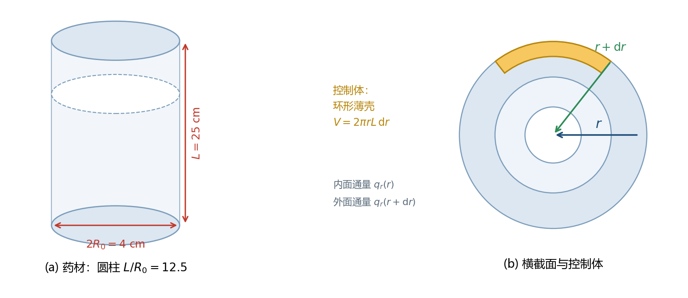

## 第 2 章　几何简化：三维问题怎么变成一维

### 2.1 物理对象

题目给的药材是圆柱形：长 $L=25$ cm $=0.25$ m，半径 $R_0=2$ cm $=0.02$ m。

用柱坐标 $(r,\theta,z)$ 描述：$z$ 沿轴向，$r$ 沿径向，$\theta$ 是绕轴的角度。温度一般应写成 $T(r,\theta,z,t)$——四个自变量，太难了。论文 §5.1 把它砍成 $T(r,t)$，理由是三条：

1. **轴对称**：药材是圆的，烘房送风沿轴向均匀，没有任何方向是特殊的，所以 $\theta$ 方向没有梯度，$\partial T/\partial\theta=0$，$\theta$ 这个自变量消失。
2. **轴向可忽略**：这个需要算一下，见下。
3. **横向尺寸小**：$R_0/L=2/25=0.08$，径向扩散距离短。

### 2.2 轴向到底能不能忽略：算一遍特征时间

特征时间是一个很好用的估算工具：**扩散距离的平方除以扩散系数**。

$$
\tau\sim\frac{(\text{距离})^2}{\text{扩散系数}} \tag{2.1}
$$

**径向**。热扩散系数（也叫导温系数）

$$
\alpha=\frac{k}{\rho c_p}=\frac{0.36}{820\times2600}=\frac{0.36}{2.132\times10^{6}}=1.689\times10^{-7}\ \mathrm{m^2/s} \tag{2.2}
$$

径向特征时间：

$$
\tau_R=\frac{R_0^2}{\alpha}=\frac{(0.02)^2}{1.689\times10^{-7}}=\frac{4.0\times10^{-4}}{1.689\times10^{-7}}=2369\ \mathrm{s}=39.5\ \mathrm{min} \tag{2.3}
$$

**轴向**。用全长 $L=0.25$ m：

$$
\tau_L=\frac{L^2}{\alpha}=\frac{0.0625}{1.689\times10^{-7}}=3.70\times10^{5}\ \mathrm{s}=4.28\ \mathrm{day} \tag{2.4}
$$

两者之比：

$$
\frac{\tau_L}{\tau_R}=\left(\frac{L}{R_0}\right)^2=12.5^2=156 \tag{2.5}
$$

::: key 与原文对照
论文 §5.1 现在写的是："轴向导热特征时间为 $L^2/\alpha=0.25^2/1.6886\times10^{-7}\approx3.70\times10^5$ s（约 4.3 天），径向为 $R_0^2/\alpha\approx2369$ s，两者之比为 $(L/R_0)^2=156$，即相差约 2.2 个数量级"。

- 径向的 $2369$ s 与式 (2.3) **完全一致**；
- 轴向的 $3.70\times10^5$ s 与式 (2.4) 的一致到三位有效数字 ✓
- 倍数比 156 与式 (2.5) 一致 ✓

**结论成立**：轴向时间尺度是径向的 156 倍，端面效应确实可以忽略，模型假设 1 成立。
:::

### 2.3 简化结果

于是所有未知量只依赖于 $r$ 和 $t$：

$$
T=T(r,t),\qquad C=C(r,t),\qquad 0\le r\le R(t),\ t\ge0 \tag{2.6}
$$

求解区域是一个**一维线段**（半径方向），这让后面的有限体积离散变得非常简单。

::: tip 这类算特征时间的手法值得记住
当你在建模时犹豫某个方向能否忽略，不要凭感觉，算两个特征时间比一下。$\tau\sim L^2/\alpha$ 这个公式在热传导、扩散、渗流中到处都用得上。
:::

\newpage

## 第 3 章　传热控制方程（论文式 (1)）

本节把论文式 (1)

$$
\rho(C)c_p(C)\frac{\partial T}{\partial t}=\frac{1}{r}\frac{\partial}{\partial r}\left(r\,k(C)\frac{\partial T}{\partial r}\right) \tag{1}
$$

从零推出来。全过程分 **8 步**，每一步只做一件事。

### 3.1 第 1 步：取控制体

在半径 $r$ 处，取一个**圆环形薄壳**：

- 内边界：半径 $r$
- 外边界：半径 $r+\mathrm{d}r$
- 轴向长度：$L$（整根药材的长度）

::: tip 为什么取而不是取？
因为几何是圆柱。如果取小方块，它的内外面不是等温面，还会有侧向的热流，方程会多出 $\theta$ 方向的项。取环壳的好处是：**内外两个面都是等温面**，热量只能沿 $r$ 方向进出，问题自然是一维的。
:::

这个壳层的体积（式 1.5 已经算过）：

$$
V_{\text{壳}}=2\pi rL\,\mathrm{d}r \tag{3.1}
$$

内表面积与外表面：

$$
A_{\text{内}}=2\pi rL,\qquad A_{\text{外}}=2\pi(r+\mathrm{d}r)L \tag{3.2}
$$

### 3.2 第 2 步：写出能量守恒这句话

论文的原话是："**壳层内能的时变率等于净导入的导热热流**"。翻成公式：

$$
\underbrace{\frac{\partial(\text{内能})}{\partial t}}_{\text{壳层里储存的热量变化多快}}=\underbrace{\text{内表面流入}-\text{外表面流出}}_{\text{净导入}} \tag{3.3}
$$

**壳层里的内能**是多少？内能 = 质量 × 比热 × 温度 = $(\rho V_{\text{壳}})\cdot c_p\cdot T$，所以

$$
\text{内能}=\rho c_p T\cdot 2\pi rL\,\mathrm{d}r \tag{3.4}
$$

于是式 (3.3) 的左边是

$$
\frac{\partial}{\partial t}\Big(\rho c_pT\cdot2\pi rL\,\mathrm{d}r\Big) \tag{3.5}
$$

::: warn 这里有一个的假设
严格的写法需要对整个乘积求导：

$$\frac{\partial(\rho c_pT)}{\partial t}=\rho c_p\frac{\partial T}{\partial t}+T\frac{\partial(\rho c_p)}{\partial t}$$

论文只保留了第一项，也就是默认 $\rho c_p$ 随时间的变化可以忽略。这在**本题**是合理的（干燥过程缓慢，且 $\rho c_p$ 的变化主要影响温度响应的快慢而非最终分布），但它确实是论文式 (1) 背后没有写出来的一条隐含假设。若被问到时，可以这样解释：失水导致单位体积热容从 $3.36\times10^6$ 降到约 $1.65\times10^6$ J/(m³·K)，是一个**缓慢单调**的变化，最快发生在干燥前期，而前期温度场本身变化更快，两类效应时间尺度不同。
:::

### 3.3 第 3 步：用 Fourier 定律写出两个面的热流

由式 (1.2)，径向热流密度 $q_r=-k\partial T/\partial r$。乘上各自面积：

$$
\text{内表面流入}=q_r(r)\cdot 2\pi rL=\left(-k\frac{\partial T}{\partial r}\right)_{r}\cdot2\pi rL \tag{3.6}
$$

$$
\text{外表面流出}=q_r(r+\mathrm{d}r)\cdot 2\pi(r+\mathrm{d}r)L=\left(-k\frac{\partial T}{\partial r}\right)_{r+\mathrm{d}r}\cdot2\pi(r+\mathrm{d}r)L \tag{3.7}
$$

::: ask 内表面为什么是流入、外表面为什么是流出？
因为我们约定 $q_r$ 的正方向是 $+r$（从轴心指向表面）。在 $r$ 处，正值 $q_r$ 表示热量**进入**壳层；在 $r+\mathrm{d}r$ 处，正值 $q_r$ 表示热量**离开**壳层。这正是流入减流出的形式。

这也是为什么论文写成 $-\left[q_r\cdot2\pi rL\right]_{r}^{r+\mathrm{d}r}$ ——那个 $[\cdot]_r^{r+\mathrm{d}r}$ 是的记号：

$$-\left[f\right]_r^{r+\mathrm{d}r}=-(f(r+\mathrm{d}r)-f(r))=f(r)-f(r+\mathrm{d}r)$$

也就是流入减流出，和我们的写法完全一致。
:::

### 3.4 第 4 步：泰勒展开

为了把外表面的量换算到内表面，用式 (1.18)。先处理**通量项**：

$$
\left(-k\frac{\partial T}{\partial r}\right)_{r+\mathrm{d}r}
=\left(-k\frac{\partial T}{\partial r}\right)_{r}
+\frac{\partial}{\partial r}\left(-k\frac{\partial T}{\partial r}\right)_{r}\mathrm{d}r
+O(\mathrm{d}r^2) \tag{3.8}
$$

再处理**面积因子**：

$$
2\pi(r+\mathrm{d}r)L=2\pi rL+2\pi L\,\mathrm{d}r \tag{3.9}
$$

### 3.5 第 5 步：代入，得到有限厚度的精确式

把式 (3.4)(3.6)(3.7) 代进式 (3.3)：

$$
\frac{\partial(\rho c_pT)}{\partial t}\,2\pi rL\,\mathrm{d}r
=\left(-k\frac{\partial T}{\partial r}\right)_{r}\!\!2\pi rL
-\left(-k\frac{\partial T}{\partial r}\right)_{r+\mathrm{d}r}\!\!2\pi(r+\mathrm{d}r)L \tag{3.10}
$$

现在把式 (3.8)(3.9) 代进右边第二项。记 $F=-k\partial T/\partial r$，则

$$
F(r+\mathrm{d}r)\cdot2\pi(r+\mathrm{d}r)L
=\Big(F+\frac{\partial F}{\partial r}\mathrm{d}r\Big)\big(2\pi rL+2\pi L\,\mathrm{d}r\big) \tag{3.11}
$$

展开（$F$ 是热流密度）：

$$
=F\cdot2\pi rL+\underbrace{F\cdot2\pi L\,\mathrm{d}r}_{\text{面积增量贡献}}+\underbrace{\frac{\partial F}{\partial r}\mathrm{d}r\cdot2\pi rL}_{\text{通量梯度贡献}}+\underbrace{\frac{\partial F}{\partial r}\mathrm{d}r\cdot2\pi L\,\mathrm{d}r}_{O(\mathrm{d}r^2)} \tag{3.12}
$$

代回式 (3.10)，第一项 $F\cdot2\pi rL$ 与左边的流入完全抵消：

$$
\frac{\partial(\rho c_pT)}{\partial t}\,2\pi rL\,\mathrm{d}r
=-\Big(F\cdot2\pi L\,\mathrm{d}r+\frac{\partial F}{\partial r}2\pi rL\,\mathrm{d}r\Big)+O(\mathrm{d}r^2) \tag{3.13}
$$

::: key 式 (3.12) 里这一项，就是圆柱几何的全部特殊性
在直角坐标里这一项不存在（门一样宽），此时式 (3.13) 会退化成 $\partial_t T\propto-\partial_x F$，也就是标准的 $\partial_x(k\partial_xT)$。圆柱里多出来的 $F\cdot2\pi L\mathrm{d}r$ 正是 §1.3 里说的通流面积变宽。
:::

### 3.6 第 6 步：两边同除 $2\pi L\,\mathrm{d}r$

$$
\frac{\partial(\rho c_pT)}{\partial t}\,r=-\Big(F+\frac{\partial F}{\partial r}r\Big) \tag{3.14}
$$

### 3.7 第 7 步：取极限 $\mathrm{d}r\to0$

式 (3.13) 残下的 $O(\mathrm{d}r^2)$ 除以 $\mathrm{d}r$ 后仍是 $O(\mathrm{d}r)$，令 $\mathrm{d}r\to0$ 后**严格为零**。于是式 (3.14) 两边都已经是有限量，不需要再取极限，直接得到：

$$
\rho c_p\frac{\partial T}{\partial t}=-\frac{1}{r}\Big(F+r\frac{\partial F}{\partial r}\Big) \tag{3.15}
$$

注意括号里的组合正好是一个乘积的导数：

$$
F+r\frac{\partial F}{\partial r}=\frac{1}{?}\ \cdots\qquad\text{更直接地：}\quad \frac{1}{r}\frac{\partial(rF)}{\partial r}=\frac{F}{r}+\frac{\partial F}{\partial r} \tag{3.16}
$$

两边乘 $r$ 核对一下：$\partial(rF)/\partial r=F+r\partial F/\partial r$ ✓。所以式 (3.15) 可以写成

$$
\rho c_p\frac{\partial T}{\partial t}=-\frac{1}{r}\frac{\partial(rF)}{\partial r} \tag{3.17}
$$

### 3.8 第 8 步：把 $F=-k\partial T/\partial r$ 代回去

$$
\rho c_p\frac{\partial T}{\partial t}=-\frac{1}{r}\frac{\partial}{\partial r}\left(r\cdot\Big(-k\frac{\partial T}{\partial r}\Big)\right)
=\frac{1}{r}\frac{\partial}{\partial r}\left(rk\frac{\partial T}{\partial r}\right) \tag{3.18}
$$

两个负号相消，与论文式 (1) **逐字一致** ∎

::: key 式 (1) 到手了
$$\rho(C)c_p(C)\frac{\partial T}{\partial t}=\frac{1}{r}\frac{\partial}{\partial r}\left(r\,k(C)\frac{\partial T}{\partial r}\right)$$

其中 $\rho,c_p,k$ 都写成含 $C$ 的形式，是因为题目附录 3、附录 4 把它们给成了含水率的函数（§7.1）。它们**不含 $r$ 和 $t$ 的显式依赖**，只是通过 $C(r,t)$ 间接依赖。
:::

### 3.9 物理意义与量纲检查

**物理意义**：左边是这一小块材料升温的快慢（热量存起来），右边是从内部导进来与导出去的热量之差（净流入）。没有热源项，是因为假设 3（无内热源）。

**量纲检查**（单位 m、s、kg、K）：

| 位置 | 表达式 | 单位 | 结果 |
|---|---|---|---|
| 左 | $\rho c_p\partial_tT$ | $\dfrac{\mathrm{kg}}{\mathrm{m^3}}\cdot\dfrac{\mathrm{J}}{\mathrm{kg\cdot K}}\cdot\dfrac{\mathrm{K}}{\mathrm{s}}$ | $\dfrac{\mathrm{W}}{\mathrm{m^3}}$ |
| 右 (内层) | $k\partial_rT$ | $\dfrac{\mathrm{W}}{\mathrm{m\cdot K}}\cdot\dfrac{\mathrm{K}}{\mathrm{m}}$ | $\dfrac{\mathrm{W}}{\mathrm{m^2}}$ |
| 右 (中层) | $r\cdot k\partial_rT$ | $\mathrm{m}\cdot\dfrac{\mathrm{W}}{\mathrm{m^2}}$ | $\dfrac{\mathrm{W}}{\mathrm{m}}$ |
| 右 (整体) | $\dfrac{1}{r}\partial_r(\cdot)$ | $\dfrac{1}{\mathrm{m}}\cdot\dfrac{\mathrm{W}}{\mathrm{m^2}}$ | $\dfrac{\mathrm{W}}{\mathrm{m^3}}$ |

两边都是 W/m³ ✓。**如果量纲对不上，一定是某一步抄错了。**

### 3.10 关于 $\rho(C)c_p(C)$ 的两个细节

**细节一：这里用 $\rho$ 而不是 $\rho_d$。** 因为内能是单位体积湿药材储存的热量，参照的是**湿体积**，所以用湿药材的密度 $\rho$。这与水分方程要用 $\rho_d$ 恰好相反，别记混。

**细节二：$\rho c_p$ 的量级。** 代附录 3 在 $C=2.55$：

$$
\rho=650+128\times2.55=976.4\ \mathrm{kg/m^3},\quad
c_p=1450+2736\times\frac{2.55}{3.55}=3415.3\ \mathrm{J/(kg\cdot K)}
$$

$$
\rho c_p=976.4\times3415.3=3.335\times10^{6}\ \mathrm{J/(m^3\cdot K)} \tag{3.19}
$$

意思是：把这 1 m³ 药材整体升高 1 °C 需要 3.3 MJ 的热量。作为对照，同体积的水需要 $1000\times4186=4.2$ MJ——药材的单位体积热容比水略小，符合含水多孔物料的直觉。

### 3.11 反过来验算：把式 (1) 写成通量形式

如果抛开上面的推导，直接对式 (1) 做，也应该回到 $-k\nabla^2T$ 的形式。练习一下（这一步能帮你确认自己真的看懂了那个 $\frac{1}{r}$）：

$$
\frac{1}{r}\frac{\partial}{\partial r}\left(rk\frac{\partial T}{\partial r}\right)
=\frac{k}{r}\frac{\partial T}{\partial r}+k\frac{\partial^2T}{\partial r^2}
=k\left(\frac{\partial^2T}{\partial r^2}+\frac{1}{r}\frac{\partial T}{\partial r}\right)
=k\,\nabla^2T \tag{3.20}
$$

（这里把 $k$ 当成常数才能这么写；若 $k$ 随 $C$ 变化，必须保留 $\partial_r(rk\partial_rT)$ 的形式，不能拆开。）括号里的 $\partial_{rr}T+\frac{1}{r}\partial_rT$ 就是**圆柱坐标下只含径向的拉普拉斯算子**。

::: tip 本章小结
| 步骤 | 做了什么 |
|---|---|
| 1 | 取环形壳层控制体，体积 $2\pi rL\mathrm{d}r$ |
| 2 | 内能时变率 = 净导入热流 |
| 3 | 用 Fourier 定律写两面的热流 |
| 4 | 泰勒展开把外表面换算到内表面 |
| 5 | 代入，抵消首项，留下两项 |
| 6 | 除以 $2\pi L\mathrm{d}r$ |
| 7 | 取极限，把两项合成 $\frac{1}{r}\partial_r(r\cdot)$ |
| 8 | 代回 $q_r=-k\partial_rT$，得到式 (1) |

**整章只有一个技巧**：把两个面的通量之差用泰勒展开变成一个导数。这个技巧在第 4 章、第 6 章会一模一样地再用两次。
:::
