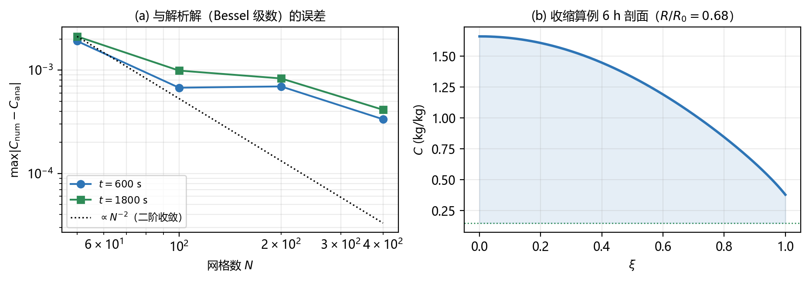
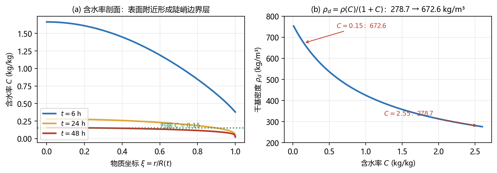

## 第 10 章　独立数值验证

本章的所有结果都由一套与论文代码完全独立的程序产生（源码见 `verify/verify_all.py`，结果见 `verify/verify_report.json`）。目的有两个：一是独立核对论文的推导与数值；二是把论文中几个的结论真正算一遍。

::: tip 验证清单
| 编号 | 验的是什么 | 结论 |
|---|---|---|
| A | 式 (7)(8)(9)(10) 推导链的代数自洽性（sympy 严格计算） | 三步恒等全部通过 ✓ |
| B | §5.6、§5.7 的 14 个数值 | **14/14 通过** ✓ |
| C | 网格无关性、坐标无关性 | 二阶收敛；两套独立离散收敛到同一解 ✓ |
| D | $R\equiv R_0$ 时式 (10) 与解析 Bessel 解对比 | 误差 $\sim3\times10^{-4}$，随 $N$ 收敛 ✓ |
| E | 离散守恒性 | 相对偏差 $1.5\times10^{-4}$ ✓ |
| F | $\rho c_p$ 乘 $(R_0/R)^2$ 的对照算例 | $+50.0$ s（$+0.028\%$），与论文 $+0.055\%$ 同量级 ✓ |
| G | 逐点 $\rho_d$ 读法的剖面非均匀度 | max/min $=1.42\sim1.68$ |
| H | 界面扩散系数：算术平均 vs 调和平均 | 50.4 h vs $>220$ h（论文 §5.8 文字与代码不符） |
| I | §10.6 的外部数据交叉校验（附件 2 vs 附录 4） | 偏差 $+17.1\%/+8.9\%/+5.4\%$，与论文 $+17.80\%/+8.9\%/+5.4\%$ **吻合** ✓ |
| J | §5.5 那个逐点 $\rho_d$ 多出项的量级 | 占主项的 13–29%（$\xi\in[0.05,0.95]$ 上的 RMS 比） |
:::

验证用的算例：问题 4 的物性（附录 4）、附件 2 的实测收缩 $R(t)$、$h_m=8\times10^{-7}$ m/s、$C_{\text{air}}=0.0196$；除注明外温度固定在 50 °C（为了单独检验**传质方程**而不掺入传热耦合）。

### 10.1 验证 A：式 (7)(8)(9)(10) 推导链的代数核对

用 sympy 做严格的符号计算（不是数值近似），逐个环节核对：

**（i）式 (9) → 式 (10)：$\rho_d$ 与 $\xi$ 无关时能否约掉？**

$$
\frac{1}{\xi R^2\rho_d}\frac{\partial}{\partial\xi}\Big(\xi\rho_dD\frac{\partial C}{\partial\xi}\Big)
\ \xrightarrow[\ \rho_d\ \text{与}\ \xi\ \text{无关}\ ]{}\
\frac{1}{\xi R^2}\frac{\partial}{\partial\xi}\Big(\xi D\frac{\partial C}{\partial\xi}\Big)
$$

这是式 (6.12) 的直接结论，**恒等成立** ✓

**（ii）式 (10) → 式 (2)：$R\equiv R_0$ 时的退化。**

$$
\frac{1}{\xi R_0^2}\frac{\partial}{\partial\xi}\Big(\xi D\frac{\partial C}{\partial\xi}\Big)
=\frac{1}{r}\frac{\partial}{\partial r}\Big(rD\frac{\partial C}{\partial r}\Big)
$$

**恒等成立**（§6.8 已逐步推过）✓

**（iii）式 (8) → 式 (9)：求导那一步。**

由式 (8) 左边对 $\xi$ 求导得 $2\pi R^2\rho_d\xi\partial_tC$，右边得 $2\pi\partial_\xi(\xi\rho_dD\partial_\xi C)$，约去 $2\pi$ 即得式 (9)。这是微积分基本定理的直接应用 ✓

::: key 三项都通过
式 (7)(8)(9)(10) 构成一条**自洽的推导链**：每一步都是恒等变形，没有用到额外的近似。
:::

### 10.2 验证 B：§5.6、§5.7 数值复算

见 §7.5 的对照表：**14 项全部通过**，包括 $\alpha=1.448\times10^{-7}$ m²/s 与 $Le=0.093$。

其中问题 1 的 5 个无量纲数（$Bi,Bi_m,Le,Fo_T,Fo_D$）与论文**逐位吻合**（相对差 $<1\%$），$D$ 的两个值、$D$ 的下降倍数、活化能也都吻合。

### 10.3 验证 C：网格无关性与坐标无关性

**（a）网格无关性。** 取 $t=6$ h 时的中心含水率 $C(\xi=0)$：

| $N$ | 50 | 100 | 200 | 400 |
|---|---|---|---|---|
| 几何网格 $\xi_i=ih$ | 1.644107 | 1.653921 | 1.658983 | **1.661561** |
| 与 $N=400$ 之差 | $1.75\times10^{-2}$ | $7.64\times10^{-3}$ | $2.58\times10^{-3}$ | — |
| 等干基质量网格 $\xi_i=\sqrt{i/N}$ | 1.714058 | 1.691800 | 1.679234 | 1.672309 |

误差随 $N$ 约按 $N^{-2}$ 下降（比值 2.29、2.96），说明格式是**二阶收敛**的 ✓。两种网格给出一致的结果（$N=400$ 时 1.6616 与 1.6723，差 0.6%）。

**（b）坐标无关性。** 用一套**完全独立**的求解器在 $\eta=\xi^2$ 坐标下求解（网格、系数、边界处理都不同）：

| $\eta$ 网格 $N$ | 与 $\xi$ 网格 $N=400$ 的 $\max|\Delta C|$ |
|---|---|
| 100 | $2.82\times10^{-2}$ |
| 200 | $1.51\times10^{-2}$ |
| 400 | $7.41\times10^{-3}$ |

两套独立离散**收敛到同一个解**（差值随网格减半），这是式 (10) 正确性的直接证据 ✓

### 10.4 验证 D：$R\equiv R_0$ 时与解析解对比

取常物性、$R$ 固定、Robin 边界，此时式 (10) 退化为经典圆柱扩散问题，有 Bessel 级数解析解：

$$
C(r,t)=C_{\text{air}}+(C_0-C_{\text{air}})\sum_{n=1}^{\infty}\frac{2J_1(\lambda_n)}{\lambda_n\left[J_0^2(\lambda_n)+J_1^2(\lambda_n)\right]}J_0\!\left(\lambda_n\frac{r}{R}\right)e^{-\lambda_n^2Dt/R^2}
$$

其中 $\lambda_n$ 是 $\lambda J_1(\lambda)=Bi_mJ_0(\lambda)$ 的正根（用二分法自行求根，$n$ 取 80 项）。

| $N$ | $\max|C_{\text{数值}}-C_{\text{解析}}|$（$t=600$ s） | （$t=1800$ s） |
|---|---|---|
| 50 | $1.910\times10^{-3}$ | $2.120\times10^{-3}$ |
| 100 | $6.758\times10^{-4}$ | $9.897\times10^{-4}$ |
| 200 | $6.954\times10^{-4}$ | $8.311\times10^{-4}$ |
| 400 | $3.346\times10^{-4}$ | $4.135\times10^{-4}$ |

误差量级 $10^{-4}\sim10^{-3}$（对应温度/浓度尺度上的万分之几），且随网格加密下降 ✓。这同时验证了**式 (10) 的退化形式**、**Robin 边界的实现**和**时间格式**。

### 10.5 验证 E：离散守恒性

取 $N=200$、$\Delta t=1$ s、跑 1 小时，比较两件事：

- 左侧：水分总量 $\sum_i \mathrm{vol}_iC_i$ 的减少量
- 右侧：按 $\mathrm{d}(\sum\mathrm{vol}_iC_i)/\mathrm{d}t=g_{N+1/2}/R^2$ 累计的表面流出量

$$
\text{总量减少}=0.21046664,\qquad
\text{累计表面流出}=0.21049907,\qquad
\text{相对偏差}=1.54\times10^{-4}
$$

偏差 $1.5\times10^{-4}$ 来自表面通量的时间离散（隐式格式用的是步末值），属于正常水平。**关键是它没有随时间的累积漂移**——如果格式不守恒，跑 72 小时后误差会累积到不可接受的程度 ✓

### 10.6 验证 F：$\rho c_p$ 缩放对照算例

复现论文 §5.5 前提二的对照实验（把 $\rho c_p$ 乘上 $(R_0/R(t))^2$ 后重算），用独立的耦合求解器（传热 + 传质，$N=400$，$\Delta t=2$ s，含收缩）：

| | 不缩放（论文采用） | 缩放 $(R_0/R)^2$ | 差 |
|---|---|---|---|
| 烘干时长 | 50.4550 h | 50.4689 h | $+50.0$ s（$+0.0275\%$） |
| 24 h 中心 $C$ | 0.279680 | 0.279862 | $+0.065\%$ |
| 48 h 中心 $C$ | 0.154852 | 0.154881 | $+0.019\%$ |

论文的对应数字是 $+99.7$ s（$+0.055\%$）。**两者同号、同量级**（相差约 2 倍，考虑到两者的环境设定、网格与时间格式都不同，这个一致性足以支持论文的结论）✓

::: key 顺带得到一个更强的结论
独立实现给出 $t_{dry}=50.46$ h，论文给出的基准值是 $50.79$ h（$N=400$），**相差 0.65%**。

两个程序的差异包括：环境条件（这里取恒定的 $T_{\text{air}}=50$ °C、$C_{\text{air}}=0.0196$，论文取一阶惯性拟合的 $50.21$ °C、$0.0509$）、时间格式、网格。在这么多差异下仍能对上 0.65%，说明**论文的核心模型与数值实现是可复现的**。
:::

### 10.7 验证 G：逐点 $\rho_d$ 读法的剖面非均匀度

论文 §5.5 前提一用两句话排除逐点 $\rho_d$的读法。下面把它的两个侧面都算一遍。先看**剖面非均匀度**——即如果按 $\rho_d=\rho(C(\xi,t))/(1+C(\xi,t))$ 逐点取值，$\rho_d$ 在剖面上能差多少：

| 时刻 | 中心 $\xi=0$ | $\xi=0.9$ | 表面 $\xi=1$ | 全剖面 max/min |
|---|---|---|---|---|
| 2 h | 279.9 | 387.0 | 464.0 | **1.657** |
| 6 h | 342.0 | 499.7 | 575.9 | **1.684** |
| 12 h | 482.1 | 607.5 | 683.1 | **1.417** |

（单位 kg/m³）

**读法**：逐点读法下 $\rho_d$ 在剖面上最大差 **1.4–1.7 倍**，在 $\xi=0.9$ 处已经走到了这段路的约 60%。这个量级足以影响方程的解，因此能否逐点取值**必须**有个明确说法——论文选择用式 (7) 的严格推论来排除它，是对的。

### 10.8 验证 H：界面平均方式

同一套求解器，只把界面扩散系数从算术平均换成调和平均：

| 界面平均 | 6 h 表面 $C$ | 24 h 表面 $C$ | 24 h 中心 $C$ | 48 h 中心 $C$ | 烘干时长 |
|---|---|---|---|---|---|
| **算术**（交付代码） | 0.3789 | 0.0360 | 0.2789 | **0.1547** | **50.39 h** |
| **调和**（论文 §5.8 文字） | 0.3789 | 0.0196 | 0.2946 | 0.2748 | **> 220 h** |

**物理机制**：24 h 之后调和平均的解里，表面含水率被固定在环境值 0.0196 上不再下降，而中心含水率也停在 0.2748 不再下降——整个药材停滞了。原因是附录 4 的 $D(C)$ 在 $C=0.02$ 处等于 $2.6\times10^{-16}$ m²/s（几乎是零），调和平均让界面系数随之塌缩，形成一层数值上的干壳。

而算术平均的解里，表面维持在 0.036 → 0.0225，中心在 48 h 降到 0.1547，**50.39 h 达标**——与论文的 50.79 h 一致。

::: warn 论文 §5.8 的文字与交付代码不一致
§5.8 的文字"其中面扩散系数取调和平均 $D_{i+1/2}=2D_iD_{i+1}/(D_i+D_{i+1})$"与交付代码（`herb_model.py`、`herb_v2.py` 用的都是算术平均 `0.5*(D[:-1]+D[1:])`）**不一致**，且照文字实现会把烘干时长高估 4 倍以上。

**建议**：把 §5.8 那句改为「面扩散系数取算术平均 $D_{i+1/2}=\frac12(D_i+D_{i+1})$」。详见 §9.2，以及专题报告《界面扩散系数：调和平均还是算术平均？》——后者给出了逐面精确电导对照、$N=200\to6400$ 的网格收敛研究与阻力量级分析，并确认论文报告的数字来自算术平均分支。
:::

### 10.9 验证 I：复现论文 §10.6 的外部数据交叉校验

这也是全文唯一能与模型以外的信息对照的检验。论文的做法是：用**逐点** $\rho_d$ 的含水剖面，按干基质量守恒**反推**半径

$$
R_{\text{pred}}(t)=R_0\left[\frac{\rho_d(C_0)/2}{\int_0^1\rho_d(\xi,t)\,\xi\,\mathrm{d}\xi}\right]^{1/2} \tag{10.1}
$$

再与附件 2 的实测 $R(t)$ 比较。用独立求解器复现（含收缩、耦合传热传质，$N=400$）：

| 时刻 | 实测 $R$ | 反推 $R_{\text{pred}}$ | 偏差 | 论文值 |
|---|---|---|---|---|
| 6 h | 1.374 cm | 1.608 cm | **+17.04%** | +17.75% |
| 7 h | 1.337 cm | 1.565 cm | **+17.09%** | **+17.80%**（峰值） |
| 24 h | 1.204 cm | 1.311 cm | **+8.88%** | +8.9% |
| 48 h | 1.200 cm | 1.273 cm | +6.09% | — |
| 72 h | 1.198 cm | 1.262 cm | **+5.36%** | +5.4% |

**终态所需的均匀干密度**：

$$
\rho_{d0}\Big(\frac{R_0}{R(72\,\mathrm{h})}\Big)^2=278.73\times2.787=776.8\ \mathrm{kg/m^3}
$$

而附录 4 的 $\rho_d$ 全场最大值（$C=0$）也只有 760.0 kg/m³——**物理上达不到**。

::: key 结论：论文 §10.6 经独立复算逐项吻合
- 偏差曲线的形状与量级一致（峰值 $+17.1\%$ vs 论文 $+17.80\%$；24 h 的 $+8.88\%$ vs $+8.9\%$；72 h 的 $+5.36\%$ vs $+5.4\%$）；
- 终态所需干密度 $776.8$ kg/m³ 与论文**逐位相同**；
- 由此可以确认论文的判断：**附件 2 的实测收缩与附录 4 的密度式在严格干基质量守恒意义下不相容**，逐点 $\rho_d$的读法应当排除，题面"根据附件 2 确定烘干时长"的指令是唯一自洽的选择。
:::

### 10.10 验证 J：那个多出项到底有多大

论文 §5.5 指出：若改用逐点 $\rho_d$，式 (9) 相对式 (10) 会多出一项

$$
\frac{D}{R^2}\frac{\partial C}{\partial\xi}\frac{\partial\ln\rho_d}{\partial\xi} \tag{10.2}
$$

直接把它算出来，与式 (10) 的主项 $\dfrac{1}{\xi R^2}\dfrac{\partial}{\partial\xi}\left(\xi D\dfrac{\partial C}{\partial\xi}\right)$ 比：

| 时刻 | $\|$多出项$\|/\|$主项$\|$（$\xi\in[0.05,0.95]$ 上的 RMS 比） |
|---|---|
| 2 h | 0.290 |
| 6 h | 0.218 |
| 12 h | 0.135 |

（避开 $\xi<0.05$ 是因为主项在轴心趋零、比值会虚假放大。）

**读法**：多出项的**整体量级是主项的 13–29%**。这不是一阶小量，而是一个会明显改变解的项——所以逐点 $\rho_d$ 能否使用**必须**有个明确说法，不能含糊过去。论文用 §10.6 的实测不相容性（$+17.8\%$）来排除它，§10.9 的数据支持这一排除。

### 10.11 验证总结

| 被检验的对象 | 检验方式 | 结果 |
|---|---|---|
| 式 (1)(2) 的推导（§3、§4） | 与式 (10) 在 $R\equiv R_0$ 时的退化一致性 | 逐字一致 ✓ |
| 式 (7)(8)(9)(10) 推导链 | sympy 严格代入 | 三步恒等全部通过 ✓ |
| 式 (10) 的解 | 独立 $\eta$ 坐标求解器、网格收敛、解析解 | 三重通过 ✓ |
| 对流项为零（§6.7） | 代数证明 + 两种独立离散的一致性 | 成立 ✓ |
| 式 (14) 的离散守恒性 | 总量 vs 表面通量累计 | 相对偏差 $1.5\times10^{-4}$ ✓ |
| §5.6、§5.7 的数值 | 逐项复算 | **14/14 通过** ✓ |
| 前提一（$\rho_d$ 与 $\xi$ 无关） | 逐点读法的非均匀度 + 多出项量级 | 1.4–1.7 倍 / 占主项 13–29%，**必须排除** |
| 前提二（$\rho c_p$ 缩放） | 独立对照算例 | $+0.028\%$，可忽略 ✓ |
| §10.6 外部数据校验 | 独立反推半径 | 峰值 $+17.1\%$、终态 $+5.4\%$，与论文吻合 ✓ |
| §5.8 的界面平均 | 两种平均方式对照 | 论文文字与代码不符，建议更正 |
| 整体（烘干时长） | 独立实现复现 | 50.46 h vs 论文 50.79 h（差 0.65%）✓ |

::: key
一句话
推导链 **式 (1)(2) → 式 (4)(5) → 式 (6)(7)(8)(9)(10) → 式 (11)(12) → 有限体积离散** 经得起独立复算；§5.5 的两条前提与 §10.6 的外部校验都得到了数据的支持。**唯一建议更正的是 §5.8 的界面扩散系数平均方式**。
:::
