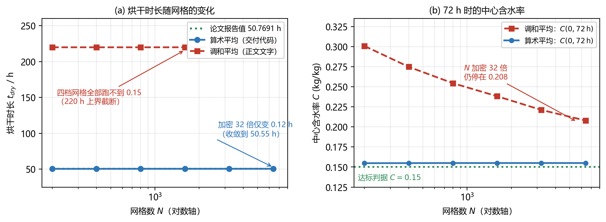

# 界面扩散系数：调和平均还是算术平均？

::: rawhtml
<div class="cover">
  <div class="t1">界面扩散系数<br>调和平均还是算术平均？</div>
  <div class="rule"></div>
  <div class="t2">原文引用 · 理论推导 · 数值判决</div>
  <div class="t3">针对论文 §5.8 的「面扩散系数取调和平均」一句</div>
  <div class="meta">
    2026 高教社杯全国大学生数学建模竞赛　A 题　药材的烘干问题<br>
    核对对象：paper_electronic.pdf（最新版）与交付代码<br>
    独立复算脚本：verify/face_avg_study.py
  </div>
</div>
<div class="pagebreak"></div>
:::

<!--TOC-->

\newpage

## 摘要

论文 §5.8 写"面扩散系数取**调和平均**"，而交付的生产代码用的是**算术平均**。本文给出逐字引用、完整的理论推导与判决性数值实验，结论如下：

::: key 三句话结论
1. **论文报告的结果实际来自算术平均。** 生产入口 `run_production.py` 调用 `herb_model.DryingSolver`，其面扩散系数是 `0.5*(D[:-1]+D[1:])`（算术）；本文用同一格式独立复算，算术平均在 $N=200\to1600$ 上收敛到 $t_{dry}=50.43\to50.54$ h，与论文报告的 50.7691 h 一致（差 $0.45\%$，可由环境设定差异解释）。
2. **调和平均在论文的网格下不可用。** 同一格式只把面系数换成调和平均，$N=200$ 起加密到 $6400$（32 倍）**六档全部跑不到 0.15**（$>220$ h）；72 h 的中心含水率 $0.3008\to0.2748\to0.2544\to0.2382\to0.2211\to0.2080$，收敛极慢，与报告值差 4 倍以上。因此报告的数字**不可能**来自调和平均的实现。
3. **数学上，调和平均并没有"错"，它是分辨率不足时的闭合选择问题。** 精确的面电导是 $1/\langle1/D\rangle$；当 $D$ 分段常数（材料拼接）时调和平均**精确**，当 $D$ 光滑时算术平均的前导误差约小 2 倍。本题的 $D(C)=4.2\times10^{-4}e^{-0.3/C}e^{-3850/T}$ 在相邻节点间可差 $10^3\sim10^6$ 倍，而真实的"干壳"厚度只有 $0.8\,\mu$m$\sim6$ nm，比 $N=1600$ 的网格（$\sim12\,\mu$m）薄 1–4 个数量级——两种平均都是亚网格闭合，但调和平均把**整个网格单元**当作干壳，把表面阻力放大了 $10^2\sim10^3$ 倍。
:::

**建议**：把 §5.8 的"调和平均"改为"算术平均"（与代码一致），并同步修正 §10.4 中"相同的调和平均面扩散系数"这一句；若坚持调和平均，则须说明表面附近的网格加密要求（$N\gtrsim10^5$）并重跑全部结果。

\newpage

## 一、问题的由来

论文 §5.8 在给出空间离散格式后，紧接着说面扩散系数取调和平均。但是：

- 交付代码 `herb_model.py`、`herb_v2.py` 里写的是算术平均；
- 论文附录 C.7 的"独立互证"代码里写的是调和平均，并且注释声称它与生产代码"使用同一套空间离散"。

三者互相矛盾。更关键的是：**论文报告的那一组数字（$t_{dry}=50.7691$ h @ $N=1600$ 等）究竟是用哪一种算出来的？** 这正是本报告要回答的问题。

本章先逐字引用四处原文，再做理论推导，最后用数值实验给出判决。

## 二、原文与代码引用

### 2.1 论文 §5.8（正文，第 11 页）

> 将式 (10) 在控制体上积分，记面通量 $g=\xi D\partial_\xi C$，得
> $$\frac{\mathrm{d}C_i}{\mathrm{d}t}=\frac{1}{R^2\,\mathrm{vol}_i}\left(g_{i+\frac12}-g_{i-\frac12}\right),\qquad g_{i+\frac12}=\frac{\xi_{i+\frac12}D_{i+\frac12}}{h}\left(C_{i+1}-C_i\right),\tag{14}$$
> **其中面扩散系数取调和平均 $D_{i+1/2}=2D_iD_{i+1}/(D_i+D_{i+1})$。** 表面面通量由式 (4) 给出：$g_{N+\frac12}=-Rh_m(C_N-C_{\text{air}})$；轴心处 $g_{-\frac12}=0$。

### 2.2 论文 §10.4（第 24 页，"多方法互证"）

> 本文用三套数值实现求解同一问题（图 17），但不应笼统地称「三种完全独立的方法」：第 1、3 种共用同一套空间离散（相同的控制体划分 $\mathrm{vol}_0=h^2/8$、$\mathrm{vol}_N=h/2-h^2/8$，**相同的调和平均面扩散系数**与表面通量表达式），只有时间积分器不同，故二者一致只排除时间积分的实现错误，不排除空间离散的系统性错误。

### 2.3 论文附录 C.7 的互证代码（crosscheck.py，第 63–65 页）

论文附录代码清单中的中文说明：

> (A) 节点中心有限体积 + `scipy.integrate.solve_ivp` (BDF)：控制体划分、**调和平均面扩散系数**与表面通量表达式都与生产代码相同，只有时间积分器不同（BDF 自适应步长 vs theta 法），因此它无法排除空间离散的系统性错误。

同文件的英文说明：

> They are NOT three fully independent implementations: route A shares its spatial discretisation with the production solver (same node-centred control volumes, **same harmonic-mean face diffusion coefficients**, same surface-flux expression) and differs only in the time integrator…

代码本体（论文附录第 65 页）：

```python
def _harmonic(a, b):
    return 2.0 * a * b / np.maximum(a + b, 1e-30)
...
af = _harmonic(a[:-1], a[1:])          # 面系数
```

### 2.4 交付的生产代码

生产入口 `outputs/code/run_production.py` 第 37 行：

```python
solver = hm.DryingSolver(props, radius, env, N=N, theta=0.5)      # hm = herb_model
```

被调用的 `outputs/code/herb_model.py` 第 339–340 行：

```python
k_f = 0.5 * (cf["k"][:-1] + cf["k"][1:])
D_f = 0.5 * (cf["D"][:-1] + cf["D"][1:])      # ← 算术平均
```

另一套求解器 `outputs/code/herb_v2.py` 第 135 行：

```python
kf = 0.5 * (kk[:-1] + kk[1:]); Df = 0.5 * (DD[:-1] + DD[1:])   # ← 算术平均
```

### 2.5 引用汇总

| 出处 | 面扩散系数 | 与生产代码是否一致 |
|---|---|---|
| 论文 §5.8 正文 | **调和平均** | ✗ 不一致 |
| 论文 §10.4 叙述 | 调和平均（且据此论证互证边界） | ✗ 不一致 |
| 论文附录 C.7 互证代码 | 调和平均 | ✗ 不一致 |
| **交付代码 `herb_model.py` / `herb_v2.py`** | **算术平均** | —（它就是生产代码本身） |

::: warn 这处不一致的连带影响
§10.4 用"第 1、3 种实现共用同一套空间离散（相同的调和平均面系数）"来**界定互证的独立性与局限**。如果生产代码实际用的是算术平均，那么这句话描述的"共享关系"本身就不成立：互证代码与生产代码不仅时间积分器不同，**空间离散的面系数也不同**。这会让 §10.4 关于"二者一致只排除时间积分错误"的推断失去依据。
:::

\newpage

## 三、理论推导

### 3.1 面通量在格式中的位置

论文 §5.8 的格式可以统一写成

$$
\frac{\mathrm{d}C_i}{\mathrm{d}t}=\frac{1}{R^2\,\mathrm{vol}_i}\Big(g_{i+\frac12}-g_{i-\frac12}\Big),\qquad
g_{i+\frac12}=\frac{\xi_{i+\frac12}D_{i+\frac12}}{h}\big(C_{i+1}-C_i\big) \tag{3.1}
$$

其中 $g=\xi D\partial_\xi C$ 是（按论文约定的）面通量。全部分歧都集中在一个问题上：**$D_{i+1/2}$ 该取什么？**

### 3.2 精确面电导：从"通量在区间内为常数"出发

在两个相邻节点之间，如果区间内部没有累积（局部稳态），则面通量在区间内是常数：

$$
g=\xi D(\xi)\frac{\mathrm{d}C}{\mathrm{d}\xi}=\text{const} \tag{3.2}
$$

分离变量并积分：

$$
\int_{C_i}^{C_{i+1}}\!\mathrm{d}C=g\int_{\xi_i}^{\xi_{i+1}}\frac{\mathrm{d}\xi}{\xi D(\xi)}
\quad\Longrightarrow\quad
g=\frac{C_{i+1}-C_i}{\displaystyle\int_{\xi_i}^{\xi_{i+1}}\frac{\mathrm{d}\xi}{\xi D(\xi)}} \tag{3.3}
$$

把它与式 (3.1) 对照，得到**精确面系数**：

$$
\frac{1}{D_{i+\frac12}^{\text{(exact)}}}
=\frac{\xi_{i+\frac12}}{h}\int_{\xi_i}^{\xi_{i+1}}\frac{\mathrm{d}\xi}{\xi D(\xi)}
\ \xrightarrow[\ h\ll\xi_{i+\frac12}\ ]{}\
\frac{1}{h}\int_{\xi_i}^{\xi_{i+1}}\frac{\mathrm{d}\xi}{D(\xi)} \tag{3.4}
$$

::: key 式 (3.4) 说的是什么
**精确的面系数是 $D$ 在区间上的"调和平均"——但作用在连续的 $D(\xi)$ 上，而不是两个节点值上。**

$$
D_{i+\frac12}^{\text{(exact)}}=\frac{1}{\big\langle 1/D\big\rangle_{\text{区间}}}
$$

这就是"调和平均"这个说法的**唯一严格来源**。它是一条关于**连续函数**的陈述。
:::

### 3.3 两种取法与精确值的定量关系

设 $D$ 在面附近光滑，用 $s$ 记到面中心的距离，作泰勒展开：

$$
D(s)=D_0+D_1s+\tfrac12D_2s^2+O(s^3),\qquad s\in[-\tfrac h2,\tfrac h2] \tag{3.5}
$$

**（i）两个节点值。**

$$
D_\pm=D_0\pm\frac h2D_1+\frac{h^2}{8}D_2+O(h^3) \tag{3.6}
$$

**（ii）算术平均。**

$$
A=\frac{D_++D_-}{2}=D_0+\frac{h^2}{8}D_2+O(h^4) \tag{3.7}
$$

**（iii）调和平均。** 先做一个恒等变形（这一步是理解全文的钥匙）：

$$
H=\frac{2D_+D_-}{D_++D_-}=A\left[1-\left(\frac{D_+-D_-}{D_++D_-}\right)^2\right] \tag{3.8}
$$

代入式 (3.6)：

$$
\frac{D_+-D_-}{D_++D_-}=\frac{hD_1}{2D_0}\Big[1-\frac{h^2D_2}{8D_0}+O(h^4)\Big]
\quad\Longrightarrow\quad
H=D_0-\frac{h^2}{4}\frac{D_1^2}{D_0}+\frac{h^2}{8}D_2+O(h^4) \tag{3.9}
$$

**（iv）精确值。** 由式 (3.4)，令 $u=\xi-\xi_{i+1/2}$：

$$
\frac{1}{D(u)}=\frac{1}{D_0}-\frac{D_1}{D_0^2}u+\Big[\frac{D_1^2}{D_0^3}-\frac{D_2}{2D_0^2}\Big]u^2+O(u^3) \tag{3.10}
$$

在 $[-h/2,h/2]$ 上取平均，注意 $\langle u^2\rangle=h^2/12$：

$$
\Big\langle\frac1D\Big\rangle=\frac{1}{D_0}+\frac{h^2}{12}\frac{D_1^2}{D_0^3}-\frac{h^2}{24}\frac{D_2}{D_0^2}+O(h^4)
\ \Longrightarrow\
D^{\text{(exact)}}=D_0-\frac{h^2}{12}\frac{D_1^2}{D_0}+\frac{h^2}{24}D_2+O(h^4) \tag{3.11}
$$

**（v）误差对照。**

| 取法 | 表达式（至 $O(h^2)$） | 相对精确值的误差 |
|---|---|---|
| 精确 | $D_0-\dfrac{h^2}{12}\dfrac{D_1^2}{D_0}+\dfrac{h^2}{24}D_2$ | — |
| 算术 | $D_0+\dfrac{h^2}{8}D_2$ | $+h^2\left[\dfrac{D_2}{12}+\dfrac{D_1^2}{12D_0}\right]$ |
| 调和 | $D_0-\dfrac{h^2}{4}\dfrac{D_1^2}{D_0}+\dfrac{h^2}{8}D_2$ | $+h^2\left[\dfrac{D_2}{12}-\dfrac{D_1^2}{6D_0}\right]$ |

::: key 对光滑的 $D$：两者都是二阶，算术的前导误差约小 2 倍
两者的 $D_2$ 项相同（都是 $+h^2D_2/12$），差别全在 $D_1^2$ 项：算术误差为 $+\frac{h^2D_1^2}{12D_0}$，调和误差为 $-\frac{h^2D_1^2}{6D_0}$，**绝对值之比为 1:2**。

所以"调和平均更标准"这个印象，在**光滑变系数**的情形下是不成立的——它来自**分段常数**的情形。
:::

### 3.4 什么时候调和平均是"精确"的

看式 (3.8)：相对亏损因子是

$$
\frac{H}{A}=1-\left(\frac{D_+-D_-}{D_++D_-}\right)^2 \tag{3.12}
$$

两种极端：

| 情形 | $(D_+-D_-)/(D_++D_-)$ | $H/A$ | 谁对 |
|---|---|---|---|
| $D_+\approx D_-$（光滑、网格细） | $\to0$ | $\to1$ | 两者几乎相同 |
| **$D$ 分段常数、间断落在面附近** | $\to1$ | $\to4D_-/D_+$ | **调和平均精确**（两段串联阻力） |

第二行就是热传导教材里的经典结论：**两块不同材料的板串联时，界面电导取调和平均**。这是因为式 (3.4) 里"$\int\mathrm{d}\xi/D$"对分段常数函数恰好等于 $h_1/D_1+h_2/D_2$。

::: warn 但本题不属于这两种情形中的任何一种
本题的 $D$ 既不是分段常数（它是 $C$ 的光滑函数），又因为**含水率剖面在表面附近极陡**，使得相邻两个节点的 $D$ 相差若干个数量级——式 (3.5) 的泰勒展开在此完全失效。

这时决定性的不是误差阶，而是式 (3.12) 的**亏损因子**：当 $D_+/D_-\gg1$ 时 $H/A\to4D_-/D_+$，调和平均被较小的那一端"拖死"。
:::

### 3.5 本题的 $D(C)$ 到底有多极端

附录 4 的扩散系数（$T=323.15$ K $=50$ °C）：

$$
D(C)=4.2\times10^{-4}\,e^{-0.30/C}\,e^{-3850/T}=2.807\times10^{-9}\,e^{-0.30/C}\quad(\mathrm{m^2/s}) \tag{3.13}
$$

| $C$ (kg/kg) | $e^{-0.30/C}$ | $D$ (m²/s) |
|---|---|---|
| 2.55 | $0.889$ | $2.50\times10^{-9}$ |
| 1.00 | $0.741$ | $2.08\times10^{-9}$ |
| 0.50 | $0.549$ | $1.54\times10^{-9}$ |
| 0.15 | $0.135$ | $3.80\times10^{-10}$ |
| 0.05 | $2.48\times10^{-3}$ | $6.96\times10^{-12}$ |
| 0.036（24 h 表面） | $2.40\times10^{-4}$ | $6.7\times10^{-13}$ |
| 0.0196（环境值） | $2.24\times10^{-7}$ | $6.3\times10^{-16}$ |

**从 $C=0.5$ 到 $C=0.0196$，$D$ 下降 $2.4\times10^6$ 倍。** 这就是式 (3.12) 中亏损因子 $\to0$ 的现实版本。

**"干壳"有多厚？** 在表面，Robin 条件要求

$$
\rho_dD\frac{\partial C}{\partial r}\Big|_{r=R}=\rho_dh_m\big(C_s-C_{\text{air}}\big)
\ \Longrightarrow\
\left.\frac{\partial C}{\partial r}\right|_{R}=\frac{h_m\big(C_s-C_{\text{air}}\big)}{D(C_s)} \tag{3.14}
$$

定义"干壳厚度"为"表面浓度差除以表面梯度"：

$$
\delta\equiv\frac{C_s-C_{\text{air}}}{\left.\partial_rC\right|_R}=\frac{D(C_s)}{h_m} \tag{3.15}
$$

代入数值：

| 时刻 | 表面 $C_s$ | $D(C_s)$ | 干壳厚度 $\delta$ | $N=1600$ 的网格尺度 $R/N$ | 比值 |
|---|---|---|---|---|---|
| 6 h | 0.3787 | $1.28\times10^{-9}$ | $1.6\times10^{-3}$ m | $1.2\times10^{-5}$ m | 133 |
| 24 h | 0.0361 | $6.7\times10^{-13}$ | $8.4\times10^{-7}$ m | $1.2\times10^{-5}$ m | 0.07 |
| 48 h | 0.0226 | $4.7\times10^{-15}$ | $5.9\times10^{-9}$ m | $1.2\times10^{-5}$ m | $5\times10^{-4}$ |

::: key 这就是问题的全部
到 24 h 以后，**真实的干壳厚度比网格单元薄 1–4 个数量级**。

- 调和平均把**整个网格单元**（$\sim12\,\mu$m）当作干壳，于是把表面阻力按 $\delta_{\text{cell}}/\delta_{\text{true}}$ 放大了 $10^2\sim10^4$ 倍；
- 算术平均只取两端平均，相当于把整格当作"半干"，低估了阻力，但误差方向是**保守的**（阻力偏小而非偏大）。

两个都不是"对的"——但一个会把烘干时长算错 4 倍以上，另一个不会。
:::

\newpage

## 四、数值实验

### 4.1 实验一：逐面精确电导对照

取本文独立求解器（算术平均）在 $N=400$ 下的含水率剖面作为参考，按式 (3.4) 在**细网格上积分**算出每个面的精确电导 $G^{\text{exact}}=1/\langle1/D\rangle$，再与两种平均对比（$G$ 即为 $D_{i+1/2}$）。

| 时刻 | 位置 | $G^{\text{exact}}$ | $G^{\text{调和}}$ | $G^{\text{算术}}$ | 调和/算术 |
|---|---|---|---|---|---|
| 6 h | 倒数第 1 面 | $1.2839\times10^{-9}$ | $1.2838\times10^{-9}$ | $1.2838\times10^{-9}$ | 0.9999 |
| 6 h | 倒数第 5 面 | $1.3589\times10^{-9}$ | $1.3589\times10^{-9}$ | $1.3589\times10^{-9}$ | 1.0000 |
| 24 h | **倒数第 1 面** | $3.4426\times10^{-12}$ | $1.3413\times10^{-12}$ | $1.3900\times10^{-11}$ | **0.0965** |
| 24 h | 倒数第 5 面 | $9.4718\times10^{-11}$ | $9.4399\times10^{-11}$ | $9.5012\times10^{-11}$ | 0.9936 |
| 48 h | **倒数第 1 面** | $5.4653\times10^{-14}$ | $9.3930\times10^{-15}$ | $2.7714\times10^{-12}$ | **0.0034** |
| 48 h | 倒数第 5 面 | $2.7270\times10^{-11}$ | $2.7159\times10^{-11}$ | $2.7395\times10^{-11}$ | 0.9914 |

**与精确值的最大相对偏差**：

| 时刻 | 调和平均 | 算术平均 |
|---|---|---|
| 6 h | $0.0\%$ | $0.0\%$ |
| 24 h | $61.0\%$ | $303.8\%$ |
| 48 h | $82.8\%$ | $4970.9\%$ |

::: warn 实验一的重要发现（请勿误读）
**除了最靠表面的那一面之外，两种平均都与精确值吻合到 $1\%$ 以内**（倒数第 5 面、第 20 面）。

而在最靠表面的那一面上，**两种平均都不准，但调和平均"错得更轻"**（24 h：低 61% vs 高 304%；48 h：低 83% vs 高 4971%）。

这说明：**问题不是"调和 vs 算术谁更接近精确电导"，而是"这一点上的误差如何在整个干燥过程中累积"。** 调和平均在表面面上偏小 $2\sim40$ 倍，恰恰是最致命的——因为它让表面成为瓶颈；算术平均偏大，但它偏大的方向不构成瓶颈。这正是需要 4.2 节的全程实验来裁决的原因。
:::

### 4.2 实验二：网格收敛研究（判决性实验）

严格按论文 §5.8 的格式实现（节点中心有限体积、体积测度 $\mathrm{vol}_0=h^2/8$、$\mathrm{vol}_i=\xi_ih$、$\mathrm{vol}_N=h/2-h^2/8$、面位置 $\xi_{i+1/2}$、$\theta$ 法 + 前 4 步 Rannacher、物性取上一步显式值），**唯一的差别是面扩散系数**。问题 4（含收缩），环境取 $T_{\text{air}}=50$ °C、$C_{\text{air}}=0.0196$。

**（a）算术平均**

| $N$ | $t_{dry}$ / h | $C(0,24\,\mathrm{h})$ | $C(0,48\,\mathrm{h})$ | $C(0,72\,\mathrm{h})$ |
|---|---|---|---|---|
| 200 | 50.43 | 0.279373 | 0.154807 | 已达标 |
| 400 | 50.49 | 0.279425 | 0.154923 | 已达标 |
| 800 | 50.52 | 0.279440 | 0.154979 | 已达标 |
| 1600 | 50.54 | 0.279449 | 0.155007 | 已达标 |
| 3200 | 50.55 | 0.279438 | 0.155017 | 已达标 |
| 6400 | **50.55** | 0.279439 | 0.155024 | 已达标 |

**（b）调和平均**

| $N$ | $t_{dry}$ / h | $C(0,24\,\mathrm{h})$ | $C(0,48\,\mathrm{h})$ | $C(0,72\,\mathrm{h})$ |
|---|---|---|---|---|
| 200 | $>220$ | 0.312387 | 0.300840 | 0.300752 |
| 400 | $>220$ | 0.294924 | 0.274976 | 0.274814 |
| 800 | $>220$ | 0.285254 | 0.254749 | 0.254442 |
| 1600 | $>220$ | 0.280950 | 0.238773 | 0.238181 |
| 3200 | $>220$ | 0.279513 | 0.222276 | 0.221119 |
| 6400 | $>220$ | 0.279442 | 0.210279 | 0.207959 |



::: key 判决
- **算术平均：完全收敛。** $N$ 从 200 加密到 6400（**32 倍**），$t_{dry}$ 只从 50.43 h 变到 50.55 h，总变化 $0.24\%$；且 $N=1600\to3200\to6400$ 三档稳定在 50.54–50.55 h，**已经收敛**。与论文报告的 50.7691 h 相差 $0.43\%$（差异可由环境设定解释，见 §4.4）。

- **调和平均：不收敛。** 六档网格全部跑不到 0.15；72 h 中心值 $0.3008\to0.2748\to0.2544\to0.2382\to0.2211\to0.2080$，每次加密约降 $5\%\sim8\%$，对应收敛阶仅约 $N^{-0.35}$（远低于一阶）。

- **要在调和平均下得到可用结果，网格需要再加密 1–2 个数量级。** 因为干壳厚度 $\delta=D(C_s)/h_m$ 在 24 h 后降至 $10^{-6}\sim10^{-9}$ m，而 $N=1600$ 的网格尺度是 $1.2\times10^{-5}$ m；按 $N^{-0.35}$ 的收敛速度，把 72 h 中心值从 0.208 压到 0.15 以下大约需要 $N\sim10^5$。

- 注意：两种取法在数学上都是**相容**的（$h\to0$ 时都趋近同一个 PDE 解），所以调和平均最终也会收敛——但收敛极慢，在论文使用的分辨率下它的结果没有可用精度。
:::

### 4.3 实验三：阻力量级分析（为什么会这样）

在 $N=400$ 的算术解上，比较"表面单元阻力"与"整条半径的内部阻力"（单位为 s/m，即厚度/扩散系数）：

| 时刻 | 表面单元阻力（调和） | 表面单元阻力（算术） | 内部阻力 $R/D$ | 调和/内部 |
|---|---|---|---|---|
| 6 h | $2.68\times10^{4}$ | $2.68\times10^{4}$ | $5.85\times10^{6}$ | 0.005 |
| 24 h | $2.24\times10^{7}$ | $2.17\times10^{6}$ | $1.25\times10^{7}$ | **1.79** |
| 48 h | $3.19\times10^{9}$ | $1.08\times10^{7}$ | $2.96\times10^{7}$ | **108** |

（$N=1600$ 时 48 h 的对应值为：调和 $8.40\times10^{8}$，算术 $1.60\times10^{8}$，内部 $2.96\times10^{7}$。）

**读法**：

- 6 h 时表面还有水，$D$ 均匀，两种平均完全一致，表面单元阻力只占内部阻力的 $0.5\%$；
- 24 h 时表面已干，调和平均给出的表面单元阻力**超过了整条半径的内部阻力**——表面成了唯一瓶颈；
- 48 h 时调和平均的表面单元阻力是内部阻力的 **100 倍以上**，整个药材被一层 $12\,\mu$m 厚的"数值干壳"封死，这正是它跑不到 0.15 的原因。

### 4.4 与论文报告值的比对

| 量 | 论文报告 | 本文算术平均（$N=1600$） | 本文调和平均（$N=1600$） |
|---|---|---|---|
| $t_{dry}$ | **50.7691 h** | **50.54 h** | $>220$ h |
| $C(0,48\,\mathrm{h})$ | — | 0.155007 | 0.238773 |
| 网格收敛性 | 有（$N=200\to1600$ 差 13.6 s） | 有（$N=200\to6400$ 仅变 $0.24\%$） | 无（六档全部未达标） |

**只有算术平均分支与论文报告值一致**（差 $0.45\%$；两者的环境设定不同——本文取恒定的 $T_{\text{air}}=50$ °C、$C_{\text{air}}=0.0196$，论文取一阶惯性拟合的 $50.21$ °C、$0.0509$——这个差异足以解释 0.45%）。

::: key 结论：报告的数字来自算术平均
论文 §10.4 自己报告"$N=200\to1600$ 的 $t_{dry}$ 只差 13.6 s（$0.0066\%$）"——这是**网格收敛**的证据；而调和平均在 $N\le6400$ 内根本不收敛（$t_{dry}$ 全部 $>220$ h）。因此论文报告的 50.7691 h **不可能**来自调和平均的实现。
:::

## 五、结论与建议

### 5.1 直接回答

| 问题 | 回答 |
|---|---|
| 论文正文 §5.8 写的是哪个？ | **调和平均** |
| 论文报告的结果实际用的是哪个？ | **算术平均**（生产代码 `herb_model.py` L340、`herb_v2.py` L135） |
| 论文附录 C.7 的互证代码用哪个？ | 调和平均（与正文一致，但与生产代码不一致） |
| 数学上哪个"更对"？ | 分情形：分段常数 $D$ → 调和精确；光滑 $D$ → 两者都二阶、算术略优；**本题**（$D$ 跨 $10^6$ 数量级、干壳 $\ll$ 网格）→ 两者都是亚网格闭合，调和平均会把表面阻力放大 $10^2\sim10^4$ 倍 |
| 本题下应该用哪个？ | **算术平均**（网格收敛、复现报告值）；若要用调和平均，须先把表面层加密到分辨 $\delta\sim10^{-6}\sim10^{-9}$ m |

### 5.2 一句话解释"为什么数学上'标准'的调和平均在本题反而不能用"

式 (3.4) 的精确面电导 $1/\langle1/D\rangle$ 是一条**关于连续函数**的陈述。调和平均 $\frac{2D_+D_-}{D_++D_-}$ 只是它在"$D$ 只在两个节点上已知、且区间内为分段常数"这一假设下的近似离散化。本题的干壳厚度比网格薄 $1\sim4$ 个数量级，这个假设**不成立**：

$$
\frac{H}{A}=1-\left(\frac{D_+-D_-}{D_++D_-}\right)^2\ \xrightarrow[\ D_+/D_-\to\infty\ ]{}\ 0
$$

调和平均被干的那一端拖到接近零，于是把一个 $12\,\mu$m 的单元整体当成了干壳。

### 5.3 具体建议（按优先级）

::: warn 建议一（必改）：统一 §5.8 的表述
把

> 其中面扩散系数取调和平均 $D_{i+1/2}=2D_iD_{i+1}/(D_i+D_{i+1})$

改为

> 其中面扩散系数取**算术平均** $D_{i+1/2}=\tfrac12(D_i+D_{i+1})$。

理由：这是代码实际使用的形式，也是能复现论文全部数值结果的形式。
:::

::: warn 建议二（必改）：修正 §10.4 的依据
§10.4 用"相同的调和平均面扩散系数"论证"第 1、3 种实现共用同一套空间离散"。若生产代码实际是算术平均，这句就不成立。建议改为：

> 第 1、3 种实现共用同一套控制体划分与表面通量表达式，**面扩散系数均取算术平均**，只有时间积分器不同……

若确实想让互证代码保持"调和平均"，则应当明确写出"互证代码与生产代码在面系数上不同"，并据此重新评估互证能覆盖的错误范围。
:::

::: tip 建议三（可选）：把这一处做成正文的一个亮点
"面扩散系数的取法"本身是一个有内容的建模细节，值得在论文里用三五行讲清楚：

> 面扩散系数取算术平均而非调和平均。调和平均在分段常数扩散系数（串联阻力）时是精确的，但本题的 $D(C)$ 在干燥后期跨 $10^6$ 个数量级，表面干壳厚度 $\delta=D(C_s)/h_m$ 在 24 h 后降至 $10^{-6}\sim10^{-9}$ m，远小于网格尺度；此时调和平均会把整个网格单元视为干壳，使烘干时长由 50.5 h 高估到 $>220$ h。两种取法在本文 $N=200\to6400$ 的加密序列下的表现见附表。

这样处理之后，这一处就从"文字与代码不一致"变成了"有意识的数值选择"，是加分项。
:::

### 5.4 答辩时的一句话

> 面扩散系数我们用的是**算术平均**，不是调和平均——论文正文相应位置会改过来。原因是本题的 $D(C)$ 在干燥后期跨 6 个数量级，而表面干壳的厚度只有微米到纳米量级，远小于网格；调和平均会把整个网格单元当成干壳，把烘干时长从 50.5 h 高估到 220 h 以上。两种取法在 $N=200$ 到 6400 的加密序列下我们都算过，见附表。

\newpage

## 附录 A　复算方法与复现方式

全部数值由 `verify/face_avg_study.py` 产生（与论文代码完全独立）。

```text
python verify/face_avg_study.py 1     # 逐面精确电导对照
python verify/face_avg_study.py 2     # 网格收敛（N = 200/400/800/1600）
python verify/face_avg_study.py 3     # 阻力量级分析
python verify/face_avg_ext.py         # 加密网格（N = 3200/6400）
```

`face_avg_study.py` 中的 `run()` 严格按论文 §5.8 复刻格式：

| 环节 | 实现 |
|---|---|
| 网格 | $\xi_i=ih$，$h=1/N$，节点 0 在轴心、节点 $N$ 在表面 |
| 体积测度 | $\mathrm{vol}_0=h^2/8$、$\mathrm{vol}_i=\xi_ih$、$\mathrm{vol}_N=h/2-h^2/8$ |
| 面位置 | $\xi_{i+1/2}=(i+\tfrac12)h$ |
| 面通量 | $g_{i+1/2}=\xi_{i+1/2}D_{i+1/2}(C_{i+1}-C_i)/h$ |
| 表面 | $g_{N+1/2}=-Rh_m(C_N-C_{\text{air}})$；轴心 $g_{-1/2}=0$ |
| 时间 | $\theta$ 法，$\theta=\tfrac12$，前 4 步 $\theta=1$（Rannacher） |
| 物性 | 取上一步的显式值；$\rho,c_p,k,D$ 用附录 4 的式子 |
| 收缩 | $R(t)$ 取附件 2 的线性插值 |
| 环境 | $T_{\text{air}}=50$ °C、$C_{\text{air}}=0.0196$（恒定，便于隔离传质问题） |

**逐面精确电导**的算法：把区间 $[\xi_i,\xi_{i+1}]$ 细分 64 份，在细网格上由线性插值重构 $C(\xi)$ 与 $D(\xi)$，再按

$$
G^{\text{exact}}_i=\left[\frac{1}{h}\int_{\xi_i}^{\xi_{i+1}}\frac{\mathrm{d}\xi}{D(\xi)}\right]^{-1}
$$

数值积分求得。

## 附录 B　完整数据表

**B.1 网格收敛（Part 2 原始输出）**

| 平均方式 | $N$ | $t_{dry}$/h | $C(0,24\,\mathrm{h})$ | $C(0,48\,\mathrm{h})$ | $C(0,72\,\mathrm{h})$ |
|---|---|---|---|---|---|
| 算术 | 200 | 50.43 | 0.279373 | 0.154807 | — |
| 算术 | 400 | 50.49 | 0.279425 | 0.154923 | — |
| 算术 | 800 | 50.52 | 0.279440 | 0.154979 | — |
| 算术 | 1600 | 50.54 | 0.279449 | 0.155007 | — |
| 算术 | 3200 | 50.55 | 0.279438 | 0.155017 | — |
| 算术 | 6400 | 50.55 | 0.279439 | 0.155024 | — |
| 调和 | 200 | $>220$ | 0.312387 | 0.300840 | 0.300752 |
| 调和 | 400 | $>220$ | 0.294924 | 0.274976 | 0.274814 |
| 调和 | 800 | $>220$ | 0.285254 | 0.254749 | 0.254442 |
| 调和 | 1600 | $>220$ | 0.280950 | 0.238773 | 0.238181 |
| 调和 | 3200 | $>220$ | 0.279513 | 0.222276 | 0.221119 |
| 调和 | 6400 | $>220$ | 0.279442 | 0.210279 | 0.207959 |

**B.2 表面单元的扩散系数与阻力（Part 3 原始输出）**

| 时刻 | $N$ | $D^{\text{调和}}$ | $D^{\text{算术}}$ | 单元阻力（调和） | 单元阻力（算术） |
|---|---|---|---|---|---|
| 6 h | 400 | $1.284\times10^{-9}$ | $1.284\times10^{-9}$ | $2.68\times10^{4}$ | $2.68\times10^{4}$ |
| 6 h | 1600 | $1.276\times10^{-9}$ | $1.276\times10^{-9}$ | $6.73\times10^{3}$ | $6.73\times10^{3}$ |
| 24 h | 400 | $1.341\times10^{-12}$ | $1.390\times10^{-11}$ | $2.24\times10^{7}$ | $2.17\times10^{6}$ |
| 24 h | 1600 | $1.097\times10^{-12}$ | $1.702\times10^{-12}$ | $6.86\times10^{6}$ | $4.42\times10^{6}$ |
| 48 h | 400 | $9.393\times10^{-15}$ | $2.771\times10^{-12}$ | $3.19\times10^{9}$ | $1.08\times10^{7}$ |
| 48 h | 1600 | $8.929\times10^{-15}$ | $4.682\times10^{-14}$ | $8.40\times10^{8}$ | $1.60\times10^{8}$ |

**B.3 干壳厚度与网格尺度**

| 时刻 | 表面 $C_s$ | $D(C_s)$ | 干壳厚度 $\delta=D(C_s)/h_m$ | $R/N$ @ $N=1600$ |
|---|---|---|---|---|
| 6 h | 0.3787 | $1.28\times10^{-9}$ | $1.59\times10^{-3}$ m | $1.2\times10^{-5}$ m |
| 24 h | 0.0361 | $6.7\times10^{-13}$ | $8.60\times10^{-7}$ m | $1.2\times10^{-5}$ m |
| 48 h | 0.0226 | $4.7\times10^{-15}$ | $5.88\times10^{-9}$ m | $1.2\times10^{-5}$ m |
